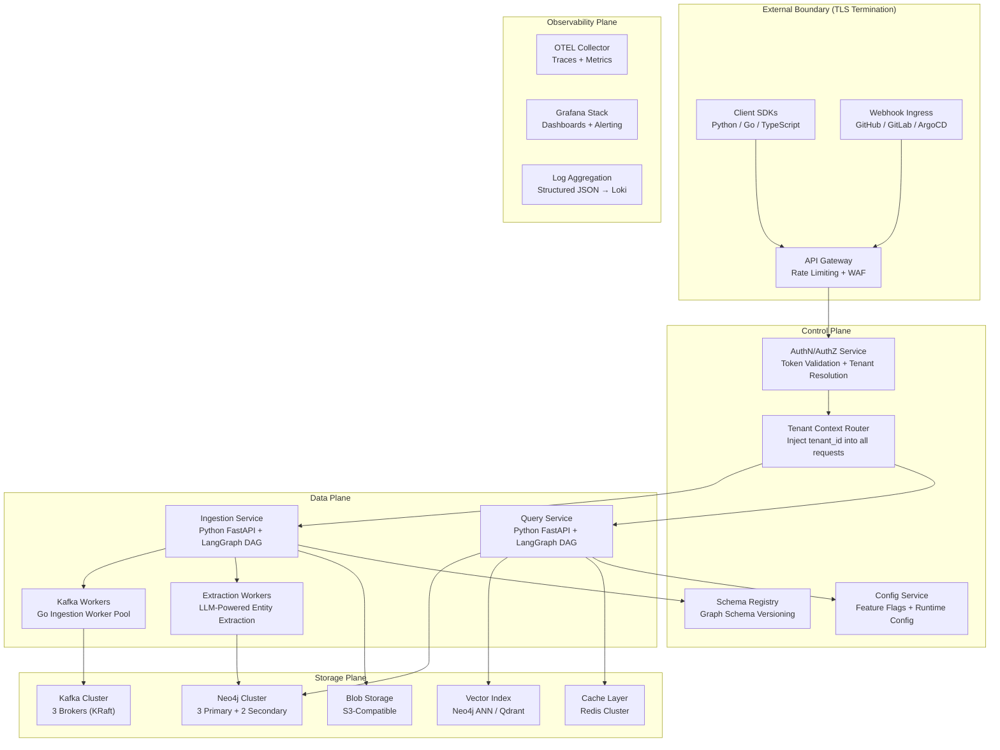
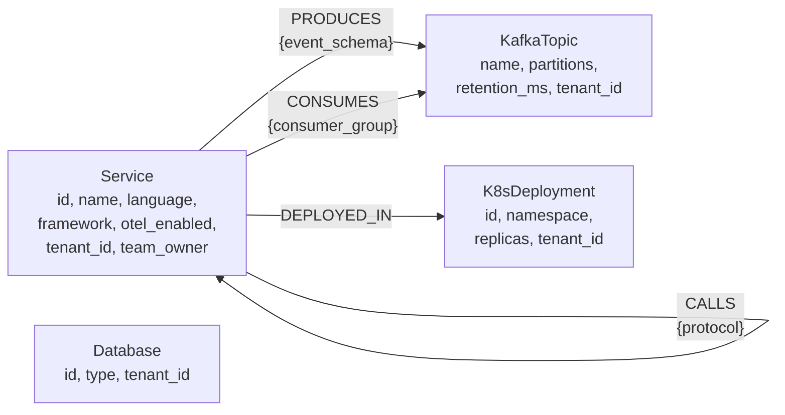
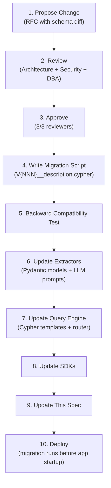
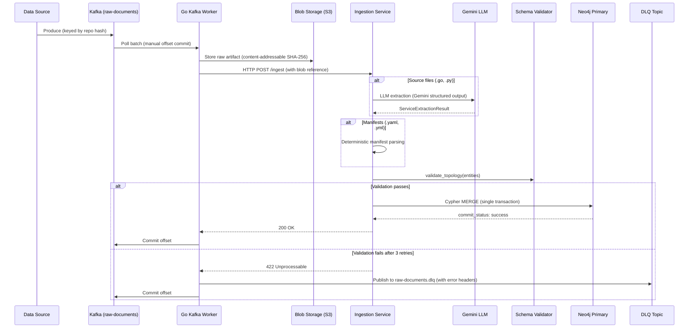
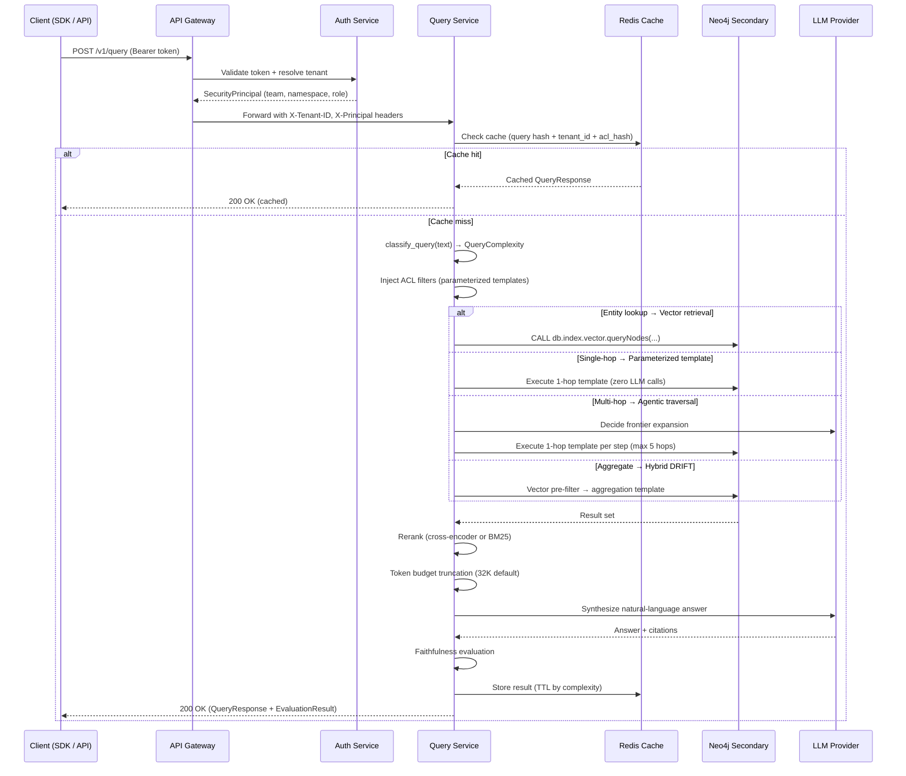
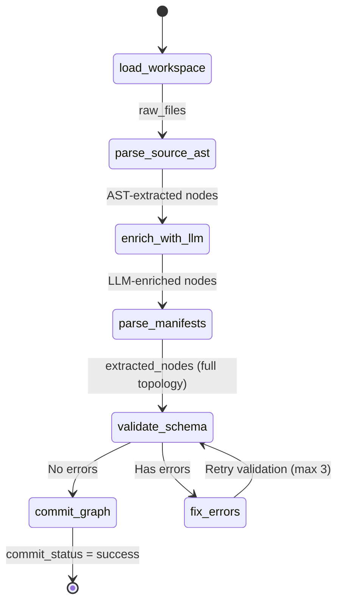
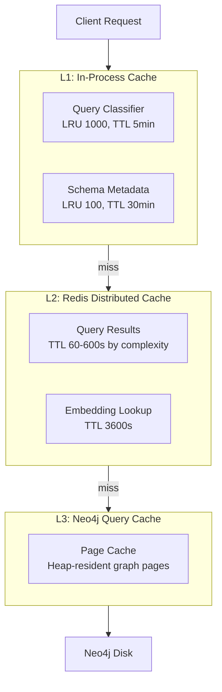
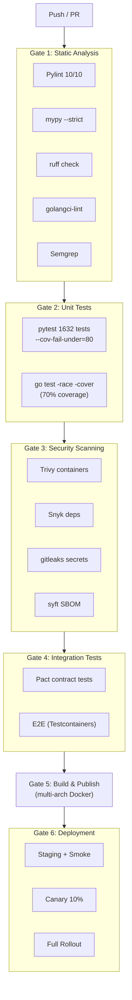
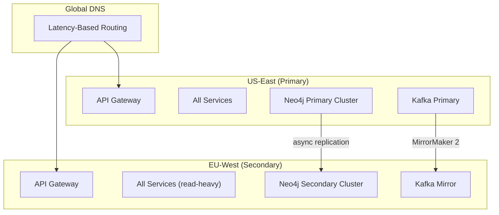
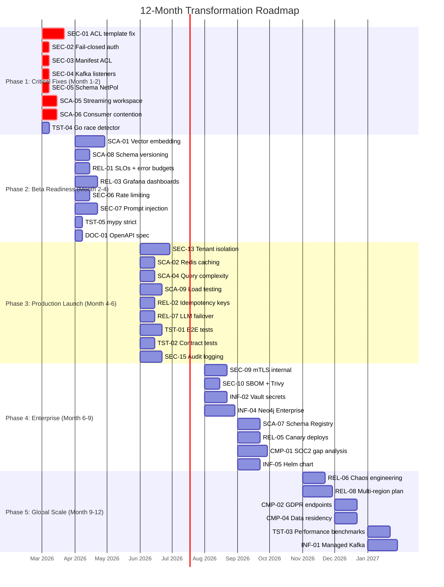

# GraphRAG Architect — Definitive System Specification

> **Status:** Canonical | **Version:** 1.0.0 | **Classification:** Internal — Confidential
> **Maintainer:** Architecture Team | **Last Updated:** 2026-02-26
> **Supersedes:** `docs/prd/*`, `docs/rfc/*`, `docs/architecture/01_SYSTEM_DESIGN.md`, `docs/architecture/02_DATA_DICTIONARY.md`, `docs/architecture/03_ENTERPRISE_ARCHITECTURE_SPEC.md`

This is the single source of truth for GraphRAG Architect. All prior PRD, RFC, and architecture documents are superseded. Changes to this specification require the RFC process defined in [Section 17.1](#171-rfc-process).

---

## Table of Contents

1. [Executive Summary](#1-executive-summary)
2. [Strategic Context](#2-strategic-context)
3. [Scope](#3-scope)
4. [System Architecture](#4-system-architecture)
5. [Data Model](#5-data-model)
6. [Data Flows](#6-data-flows)
7. [Core Use Cases](#7-core-use-cases)
8. [Functional Requirements](#8-functional-requirements)
9. [Non-Functional Requirements & SLOs](#9-non-functional-requirements--slos)
10. [Security Architecture](#10-security-architecture)
11. [Scalability & Performance](#11-scalability--performance)
12. [Storage Strategy](#12-storage-strategy)
13. [API Surface & Extensibility](#13-api-surface--extensibility)
14. [Observability](#14-observability)
15. [Reliability & Incident Response](#15-reliability--incident-response)
16. [Developer Experience & CI/CD](#16-developer-experience--cicd)
17. [Governance](#17-governance)
18. [Deployment Topology](#18-deployment-topology)
19. [Production Readiness](#19-production-readiness)
20. [Transformation Roadmap](#20-transformation-roadmap)
21. [Risk Register](#21-risk-register)
22. [Economics](#22-economics)
23. [Open Questions](#23-open-questions)
24. [Appendices](#24-appendices)

---

## 1. Executive Summary

**GraphRAG Architect** is an enterprise-grade infrastructure topology intelligence platform. It builds a queryable knowledge graph from distributed systems artifacts — source code, Kubernetes manifests, Kafka topic schemas, and database configurations — and answers multi-hop architectural questions through **Hybrid VectorCypher Retrieval**.

The system follows a three-stage pipeline adapted from the GraphRAG paradigm:

1. **Graph-Based Indexing** — Async ingestion via Kafka, Go worker pools, and LLM-powered entity extraction into a typed property graph in Neo4j.
2. **Graph-Guided Retrieval** — Hybrid routing that selects between vector similarity search, parameterized Cypher templates, and agentic multi-hop traversals based on query complexity classification.
3. **Graph-Enhanced Generation** — LLM synthesis over retrieved subgraphs, producing natural-language answers grounded in the knowledge graph topology with faithfulness evaluation.

This is not a general-purpose enterprise search engine. It is purpose-built for infrastructure topology reasoning — failure propagation, blast radius estimation, dependency auditing, and backpressure analysis across distributed systems at scale.

**Mission:** Reduce mean-time-to-understanding (MTTU) for distributed system topology from hours of manual trace-following to seconds of natural-language querying.

---

## 2. Strategic Context

### 2.1 Target Audience

| Persona | Need |
|---|---|
| **Platform Engineering** | Topology visibility across 50+ microservices; automated dependency mapping from code and manifests |
| **Site Reliability Engineering** | Incident root-cause analysis via multi-hop failure propagation queries; blast radius estimation before deployments |
| **Architecture Review Boards** | Change impact assessment; protocol and schema auditing across service boundaries |
| **Security Engineering** | Cross-service data flow auditing; identification of unauthenticated communication paths |
| **Developer Experience** | Natural-language queries against infrastructure topology without requiring Cypher or graph expertise |

### 2.2 Strategic Moat

The platform's defensibility rests on three interlocking advantages:

**Hybrid VectorCypher Retrieval.** Unlike pure-vector RAG systems that retrieve disconnected chunks, the platform combines vector similarity search (for entity disambiguation) with typed Cypher graph traversals (for structural reasoning). This is the only architecture capable of answering questions like "If the auth-service fails, which Kafka topics experience backpressure and what consumer groups are affected?" Academic validation: Practical GraphRAG (arXiv:2507.03226, 2025) demonstrates 4-15% improvement over vector-only baselines on multi-hop retrieval tasks. HetaRAG (arXiv:2509.21336, 2025) confirms that fusing heterogeneous data stores outperforms any single retrieval modality.

**Domain-Specific Graph Schema.** The graph schema is purpose-built for infrastructure topology: `Service`, `Database`, `KafkaTopic`, `K8sDeployment` as first-class node types with typed relationships (`CALLS`, `PRODUCES`, `CONSUMES`, `DEPLOYED_IN`). This enables deterministic extraction (LLM prompts tuned for infrastructure artifacts), typed traversals (query routing exploits schema semantics), and permission modeling (ACLs map to `team_owner` and `namespace_acl` properties). Generic knowledge graph tools require customers to design their own ontology — this ships with one.

**Async Ingestion at Kafka Scale.** The Go worker pool + Kafka pipeline processes infrastructure artifacts at 10,000+ documents/minute with at-least-once delivery semantics and zero-loss DLQ fault tolerance. This is a continuous ingestion pipeline that keeps the knowledge graph synchronized with the evolving codebase.

### 2.3 Competitive Differentiation

| Dimension | graphrag-architect | Microsoft GraphRAG | Neo4j Bloom | ServiceNow CMDB | Backstage | Cortex |
|---|---|---|---|---|---|---|
| **Purpose** | Infrastructure topology intelligence | General-purpose document RAG | Graph visualization | IT asset management | Developer portal / catalog | Internal developer portal |
| **Graph Construction** | Automated LLM extraction from code + manifests | Automated from documents (general) | Manual or import | Manual entry / discovery agents | Manual YAML registration | Manual YAML + API |
| **Query Model** | Hybrid VectorCypher with agentic traversal | Hierarchical community search (Leiden) | Visual exploration | CMDB queries (ServiceNow QL) | Catalog search | Catalog search |
| **Multi-Hop Reasoning** | Native (Cypher traversal with LLM synthesis) | Community-level summarization | Manual traversal | Limited (flat relationships) | None | None |
| **Ingestion Model** | Continuous Kafka pipeline (at-least-once) | Batch indexing | N/A | Agent-based discovery | Git push hooks | Git push hooks |
| **Infrastructure Awareness** | Native (K8s, Kafka, service mesh) | None (domain-agnostic) | None (generic graph) | Partial (CMDB schema) | Service catalog only | Service catalog only |
| **Access Control** | Graph-aware RBAC (ACL on nodes + edge traversal) | Document-level ACL | Neo4j native roles | ServiceNow ACL | None (catalog is public) | Team-based visibility |

### 2.4 Market Positioning

**Category: Infrastructure Intelligence as a Service (IIaaS)**

| Segment | Company Size | Pain Point | Willingness to Pay |
|---|---|---|---|
| **Platform Engineering Teams** | 200-5,000 engineers | Cannot visualize or query cross-service dependencies at scale | High — directly reduces incident MTTR |
| **Enterprise Architecture** | 5,000+ engineers | Architecture documentation is perpetually stale | High — automated topology mapping replaces manual diagramming |
| **Regulated Industries** | Any (finance, healthcare) | Compliance requires demonstrable understanding of data flows | Very High — regulatory pressure creates urgency |
| **Cloud Migration Programs** | Any | Need to understand legacy system topology before migration | High — time-bounded, high-urgency use case |

### 2.5 Platform Evolution Strategy

| Phase | Timeline | Character |
|---|---|---|
| **Phase 1** (Current) | 2026 H1 | Purpose-built tool: ingest infrastructure artifacts, answer topology questions |
| **Phase 2-3** | 2026 H2-2027 H1 | Extensible platform: custom extractors (Terraform, Helm, Pulumi), custom query strategies, custom sinks/sources |
| **Phase 4-5** | 2027 H2-2030 | Ecosystem and standard: marketplace, portable graph schema format (analogous to OpenTelemetry), cross-organization federation |

### 2.6 Multi-Year Roadmap

| Year | Quarter | Milestone | Key Deliverables |
|---|---|---|---|
| **2026** | Q1 | Audit Remediation + Beta | Fix audit findings, vector embedding pipeline, basic SLOs |
| | Q2 | Production Launch | Multi-tenant logical isolation, API versioning, load testing, Grafana dashboards |
| | Q3 | Enterprise Hardening | Physical tenant isolation, SDK (Python + Go + TypeScript), plugin architecture |
| | Q4 | SOC2 + Scale | SOC2 Type II audit, Neo4j Infinigraph evaluation, multi-region planning |
| **2027** | Q1 | Multi-Region GA | Active-passive deployment, cross-region replication, tenant affinity routing |
| | Q2 | Real-Time CDC | Streaming topology updates via Neo4j CDC, WebSocket subscriptions |
| | Q3 | Marketplace Launch | Community extractor registry, integration marketplace, developer documentation portal |
| | Q4 | Federation Protocol | Cross-organization graph federation, privacy-preserving query routing |
| **2028-2030** | — | Industry Standard | Open-source graph schema specification, CNCF sandbox submission, cloud marketplace listings, expansion to application dependency, data lineage, and security posture graphs |

### 2.7 Success Metrics

| Metric | Year 1 Target | Year 3 Target |
|---|---|---|
| Ingested Repositories | 50 (beta customers) | 10,000 (SaaS) |
| Graph Nodes Under Management | 50,000 | 50,000,000 |
| Monthly Active Queries | 10,000 | 10,000,000 |
| Query Accuracy (human-evaluated) | 85% | 95% |
| Mean Time to Understanding (MTTU) | < 30 seconds | < 10 seconds |
| Uptime SLA | 99.9% | 99.99% |
| Customer NPS | > 40 | > 60 |
| SOC2 Compliance | Type I | Type II (annual) |

---

## 3. Scope

### 3.1 In-Scope (Phase 1)

| Capability | Implementation Status |
|---|---|
| Async document ingestion via Kafka → Go worker pool → Python orchestrator | Dispatcher + DLQ handler implemented (`workers/ingestion/internal/`) |
| LLM-powered entity extraction: 4 node types, 4 edge types | `ServiceExtractor` + Pydantic models implemented (`orchestrator/app/extraction_models.py`) |
| Knowledge graph storage in Neo4j with unique constraints and secondary indexes | Cypher schema implemented (`orchestrator/app/schema_init.cypher`) |
| LangGraph ingestion DAG with schema validation and correction loop | `StateGraph` compiled (`orchestrator/app/graph_builder.py`) |
| Dead Letter Queue fault tolerance with zero message loss | DLQ handler implemented (`workers/ingestion/internal/dlq/handler.go`) |
| Hybrid query routing: vector search, Cypher traversals, agentic multi-hop | Implemented (`orchestrator/app/query_engine.py`, `query_classifier.py`) |
| OpenTelemetry instrumentation across Go and Python components | Implemented (`orchestrator/app/observability.py`, `workers/ingestion/internal/telemetry/`) |
| FastAPI HTTP interface: `/health`, `/metrics`, `/ingest`, `/query` | Implemented (`orchestrator/app/main.py`) |
| Parameterized Cypher query templates with ACL enforcement | Implemented (`orchestrator/app/query_templates.py`) |
| Agentic graph traversal for multi-hop queries | Implemented (`orchestrator/app/agentic_traversal.py`) |
| Context token budget management and reranking | Implemented (`orchestrator/app/context_manager.py`, `reranker.py`) |
| RAG faithfulness evaluation | Implemented (`orchestrator/app/rag_evaluator.py`) |
| Tombstone-based stale edge cleanup | Implemented (`orchestrator/app/neo4j_client.py`, `node_sink.py`) |
| Streaming ingestion pipeline (bounded-memory chunks) | Implemented (`orchestrator/app/graph_builder.py`, `workspace_loader.py`) |
| Graph-native structural embeddings (Node2Vec) | Implemented (`orchestrator/app/graph_embeddings.py`) |
| Semantic graph partitioning (Leiden community detection) | Implemented (`orchestrator/app/semantic_partitioner.py`) |
| Decoupled vector store (Neo4j native + Qdrant backends) | Implemented (`orchestrator/app/vector_store.py`) |
| Physical tenant isolation (multi-tier) | Implemented (`orchestrator/app/tenant_isolation.py`) |

### 3.2 Out-of-Scope

| Exclusion | Rationale |
|---|---|
| Runtime APM / live metrics collection | Solved by Datadog, Grafana, Prometheus. This system operates on static artifacts, not live telemetry. |
| CI/CD pipeline execution or deployment automation | Orthogonal concern. Integrate via API consumers, not native features. |
| Cost optimization / FinOps analysis | Different data model and query patterns. |
| User-facing dashboards or visualization | Phase 1 is API-only. Visualization is a consumer of the API, not a core capability. |
| Real-time streaming topology updates | Phase 1 is batch ingestion. Streaming CDC from Neo4j is a Phase 2 consideration. |

---

## 4. System Architecture

### 4.1 Architectural Planes

The architecture is organized into four planes, each with distinct responsibilities and trust boundaries.



### 4.2 Trust Boundaries

| Boundary | From | To | Enforcement |
|---|---|---|---|
| TB-1 | Internet | API Gateway | TLS 1.3 termination, WAF rules, rate limiting (token bucket per IP) |
| TB-2 | API Gateway | Auth Service | mTLS, request signing, CORS enforcement |
| TB-3 | Auth Service | Data Plane | Security principal injection via request header (`X-Tenant-ID`, `X-Principal`) |
| TB-4 | Data Plane | Neo4j | Bolt TLS, connection pooling, Cypher validation (read-only for queries) |
| TB-5 | Data Plane | LLM Provider | HTTPS, prompt sanitization, output schema validation, token budget enforcement |
| TB-6 | Data Plane | Kafka | SASL/SCRAM authentication, TLS encryption, ACL per topic |

### 4.3 Component Decomposition

**Current State (2 Deployable Services):**

1. **Python Orchestrator** (`orchestrator/`): FastAPI application containing both the LangGraph ingestion DAG and query DAG, LLM extraction, Neo4j client, access control, tenant isolation, and observability. 62 Python modules, 125 test files, 1,632 tests.
2. **Go Ingestion Workers** (`workers/ingestion/`): Kafka consumer with dispatcher, forwarding processor, DLQ handler, AST processor, blob forwarding, rate limiter, deduplication, outbox, healthz, and metrics server.

**Target State (6 Logical Services):**

| Service | Language | Responsibility | Scaling Axis |
|---|---|---|---|
| **API Gateway** | Envoy / Kong | TLS termination, rate limiting, routing, WAF | Horizontal (stateless) |
| **Auth Service** | Python | Token validation, tenant resolution, principal injection | Horizontal (stateless, cached) |
| **Ingestion Service** | Python | Ingestion DAG orchestration, schema validation, manifest parsing | Horizontal (per Kafka partition) |
| **Query Service** | Python | Query classification, retrieval routing, LLM synthesis | Horizontal (per concurrent query) |
| **Graph Service** | Python | Neo4j operations, Cypher generation, circuit breaker, connection pooling | Vertical (connection pool bound) |
| **Kafka Workers** | Go | Kafka consumption, dispatching, DLQ handling, HTTP forwarding | Horizontal (per Kafka partition) |

**Migration Strategy (Incremental):**

1. Phase 1 (Current): Monolithic orchestrator.
2. Phase 2: Extract Auth Service as a sidecar (Envoy ext_authz filter).
3. Phase 3: Split Ingestion and Query into separate deployments from the same codebase (feature flags control which endpoints are active per deployment).
4. Phase 4: Extract Graph Service when Neo4j connection pooling becomes a bottleneck.

### 4.4 Technology Stack

| Layer | Technology | Purpose |
|---|---|---|
| Core Orchestration | Python 3.12, FastAPI, LangGraph | Ingestion DAG, query DAG, HTTP API |
| High-Throughput Ingestion | Go 1.24, franz-go | Kafka consumer, dispatcher, DLQ handler |
| Knowledge Graph | Neo4j 5.26 (Community dev / Enterprise prod) | Property graph storage, Cypher traversals |
| Event Bus | Apache Kafka (KRaft) | Async document ingestion pipeline |
| LLM Providers | Google Gemini (extraction), Anthropic Claude (complex synthesis) | Entity extraction, Cypher generation, answer synthesis |
| Vector Search | Neo4j native vector index (< 50K nodes) / Qdrant (at scale) | Embedding-based entity disambiguation |
| Observability | OpenTelemetry, Prometheus, Grafana | Traces, metrics, dashboards |
| Container Orchestration | Kubernetes | Production deployment, HPA |

---

## 5. Data Model

### 5.1 Schema Design Principles

| Principle | Rationale |
|---|---|
| **Directed edges** | All relationships carry semantic direction: `(A)-[:CALLS]->(B)` means A depends on B. Traversal direction matters for failure propagation and blast radius analysis. |
| **Idempotent upserts** | Every node label has a `UNIQUE` constraint on its primary key. Cypher `MERGE` on that key ensures repeated ingestion of the same artifact produces identical graph state. |
| **Anti-super-node** | No single node should accumulate > 10,000 edges. If a service or topic reaches this threshold, introduce intermediate "ServiceGroup" or "TopicPartition" nodes to distribute fan-out. |
| **Native property types** | All properties use Neo4j native types (`STRING`, `INTEGER`, `BOOLEAN`). No serialized JSON in properties. Complex structures are modeled as separate nodes with relationships. |
| **Schema-first extraction** | Pydantic models define the canonical schema. LLM extraction targets these models via `with_structured_output()`. The graph schema is derived from code, not the reverse. |
| **Mandatory tenant isolation** | `tenant_id` is a required, non-empty field on all node types. Enforced by Pydantic validation, Neo4j constraints, and query-time parameterized templates. |
| **Source code exclusion** | Full source code text is stored in S3 blob storage, not in graph properties. Graph nodes hold only extracted metadata and an `s3_uri_ref` pointer. |

### 5.2 Node Types

#### 5.2.1 `:Service`

Represents a discrete microservice, API, or application component identified during LLM extraction from source code.

**Source:** `ServiceNode` in `orchestrator/app/extraction_models.py`

| Property | Neo4j Type | Constraint | Description |
|---|---|---|---|
| `id` | `STRING` | `UNIQUE` | Stable identifier derived from service name + repository. Primary merge key. |
| `tenant_id` | `STRING` | `NOT NULL` | Mandatory tenant identifier. |
| `name` | `STRING` | — | Human-readable service name (e.g., `auth-service`, `order-api`). |
| `language` | `STRING` | `INDEXED` | Primary programming language (`go`, `python`, `java`, `typescript`). |
| `framework` | `STRING` | `INDEXED` | Web/RPC framework (`fastapi`, `gin`, `spring-boot`, `express`). |
| `opentelemetry_enabled` | `BOOLEAN` | — | Whether the service has OpenTelemetry instrumentation detected in source. |
| `team_owner` | `STRING` | — | Team that owns this service (for ACL filtering). |
| `namespace_acl` | `LIST<STRING>` | — | Namespaces with access to this service. |

#### 5.2.2 `:Database`

Represents a database instance or cluster that services connect to for persistent storage.

**Source:** `DatabaseNode` in `orchestrator/app/extraction_models.py`

| Property | Neo4j Type | Constraint | Description |
|---|---|---|---|
| `id` | `STRING` | `UNIQUE` | Stable identifier (e.g., `users-db-postgresql`). Primary merge key. |
| `tenant_id` | `STRING` | `NOT NULL` | Mandatory tenant identifier. |
| `type` | `STRING` | — | Database engine: `postgresql`, `mysql`, `redis`, `mongodb`, `dynamodb`, `cassandra`. |

#### 5.2.3 `:KafkaTopic`

Represents a Kafka topic extracted from broker configurations, producer/consumer annotations in source code, or infrastructure manifests.

**Source:** `KafkaTopicNode` in `orchestrator/app/extraction_models.py`

| Property | Neo4j Type | Constraint | Description |
|---|---|---|---|
| `name` | `STRING` | `UNIQUE` | Fully qualified topic name (e.g., `order-events`, `user-updates.dlq`). Primary merge key. |
| `tenant_id` | `STRING` | `NOT NULL` | Mandatory tenant identifier. |
| `partitions` | `INTEGER` | — | Number of partitions. Determines maximum consumer parallelism. |
| `retention_ms` | `INTEGER` | — | Message retention period in milliseconds. `604800000` = 7 days. |

#### 5.2.4 `:K8sDeployment`

Represents a Kubernetes Deployment resource extracted from YAML manifests.

**Source:** `K8sDeploymentNode` in `orchestrator/app/extraction_models.py`

| Property | Neo4j Type | Constraint | Description |
|---|---|---|---|
| `id` | `STRING` | `UNIQUE` | `<namespace>/<deployment-name>` (e.g., `payments/order-api`). Primary merge key. |
| `tenant_id` | `STRING` | `NOT NULL` | Mandatory tenant identifier. |
| `namespace` | `STRING` | — | Kubernetes namespace. Used for blast radius scoping. |
| `replicas` | `INTEGER` | — | Desired replica count from the Deployment spec. |

#### 5.2.5 `:K8sPod` (Forward-Declared)

Constraint exists in schema DDL for future implementation. Pydantic model pending.

| Property | Neo4j Type | Constraint | Description |
|---|---|---|---|
| `id` | `STRING` | `UNIQUE` | `<namespace>/<pod-name>`. Primary merge key. |

Expected future properties: `namespace`, `node_name`, `status`, `restart_count`.

### 5.3 Relationship Types

#### 5.3.1 `-[:CALLS]->`

| Aspect | Value |
|---|---|
| **Direction** | `(Service)-[:CALLS]->(Service)` |
| **Semantics** | Source service initiates a request to target service. Direction encodes dependency: if A calls B, then A depends on B. |
| **Multiplicity** | MULTI — a service pair may have multiple `CALLS` edges with different protocols. |
| **Properties** | `protocol: STRING` — Communication protocol: `http`, `grpc`, `graphql`, `thrift`. |

#### 5.3.2 `-[:PRODUCES]->`

| Aspect | Value |
|---|---|
| **Direction** | `(Service)-[:PRODUCES]->(KafkaTopic)` |
| **Semantics** | The service is a Kafka producer for the target topic. |
| **Multiplicity** | SIMPLE — one edge per (service, topic) pair. |
| **Properties** | `event_schema: STRING` — Schema identifier (e.g., `OrderCreatedEvent`, `avro:com.org.UserUpdated`). |

#### 5.3.3 `-[:CONSUMES]->`

| Aspect | Value |
|---|---|
| **Direction** | `(Service)-[:CONSUMES]->(KafkaTopic)` |
| **Semantics** | The service is a Kafka consumer for the target topic. |
| **Multiplicity** | SIMPLE — one edge per (service, topic, consumer_group) triple. |
| **Properties** | `consumer_group: STRING` — Kafka consumer group ID. |

#### 5.3.4 `-[:DEPLOYED_IN]->`

| Aspect | Value |
|---|---|
| **Direction** | `(Service)-[:DEPLOYED_IN]->(K8sDeployment)` |
| **Semantics** | The service runs inside the target Kubernetes Deployment. |
| **Multiplicity** | SIMPLE — a service is deployed in exactly one Deployment at a given point in time. |
| **Properties** | None. The relationship itself is the data. |

### 5.4 Schema Visualization



### 5.5 Constraints and Indexes (Complete DDL)

From `orchestrator/app/schema_init.cypher`:

```cypher
-- Uniqueness constraints (primary keys)
CREATE CONSTRAINT service_id IF NOT EXISTS FOR (s:Service) REQUIRE s.id IS UNIQUE;
CREATE CONSTRAINT database_id IF NOT EXISTS FOR (d:Database) REQUIRE d.id IS UNIQUE;
CREATE CONSTRAINT topic_name IF NOT EXISTS FOR (t:KafkaTopic) REQUIRE t.name IS UNIQUE;
CREATE CONSTRAINT k8s_deploy_id IF NOT EXISTS FOR (k:K8sDeployment) REQUIRE k.id IS UNIQUE;
CREATE CONSTRAINT k8s_pod_id IF NOT EXISTS FOR (p:K8sPod) REQUIRE p.id IS UNIQUE;

-- Tenant isolation constraints (NOT NULL)
CREATE CONSTRAINT service_tenant FOR (s:Service) REQUIRE s.tenant_id IS NOT NULL;
CREATE CONSTRAINT database_tenant FOR (d:Database) REQUIRE d.tenant_id IS NOT NULL;
CREATE CONSTRAINT topic_tenant FOR (t:KafkaTopic) REQUIRE t.tenant_id IS NOT NULL;
CREATE CONSTRAINT deployment_tenant FOR (k:K8sDeployment) REQUIRE k.tenant_id IS NOT NULL;

-- Secondary indexes (query acceleration)
CREATE INDEX service_lang_idx IF NOT EXISTS FOR (s:Service) ON (s.language);
CREATE INDEX service_framework_idx IF NOT EXISTS FOR (s:Service) ON (s.framework);

-- Fulltext index (text search path)
CREATE FULLTEXT INDEX service_name_index IF NOT EXISTS FOR (n:Service) ON EACH [n.name];

-- Vector index (target state)
CREATE VECTOR INDEX service_embedding IF NOT EXISTS
  FOR (s:Service) ON (s.embedding)
  OPTIONS {indexConfig: {`vector.dimensions`: 768, `vector.similarity_function`: 'cosine'}};
```

### 5.6 Schema Governance

**Schema Change Workflow:**



**Schema versioning:** `SchemaVersion` meta-node in Neo4j tracks applied migrations. Scripts live in `migrations/` as `V{NNN}__{description}.cypher`. Idempotent (`IF NOT EXISTS`).

**Backward Compatibility Rules:**

| Change | Backward Compatible | Requires |
|---|---|---|
| Add optional property to existing node | Yes | Migration script only |
| Add NOT NULL constraint | No | Backfill + 2-phase deploy |
| Add new node label | Yes | Migration + extractor update |
| Add new relationship type | Yes | Migration + query engine update |
| Remove property | No | 2-version deprecation + migration |
| Rename property | No | 2-version deprecation (add new, deprecate old, remove old) |
| Change property type | No | 2-version migration (add new, backfill, deprecate old) |

### 5.7 Aggregate Model

Expected cardinality per ingestion batch:

| Entity Type | Expected Range | Notes |
|---|---|---|
| `ServiceNode` | 5–200 | Bounded by repository size |
| `DatabaseNode` | 1–20 | Typically fewer unique database instances |
| `KafkaTopicNode` | 5–100 | Bounded by Kafka cluster configuration |
| `K8sDeploymentNode` | 5–200 | One per service in typical K8s deployments |
| `CallsEdge` | 10–1,000 | Grows quadratically with service count in dense graphs |
| `ProducesEdge` | 5–200 | Bounded by topic count |
| `ConsumesEdge` | 5–200 | Bounded by topic and consumer group count |
| `DeployedInEdge` | 5–200 | 1:1 with services in typical configurations |

---

## 6. Data Flows

### 6.1 Ingestion Pipeline (Write Path)



**Delivery Guarantees:**

| Stage | Guarantee |
|---|---|
| Kafka Producer → Topic | At-least-once (idempotent producer: `enable.idempotence=true`) |
| Topic → Go Consumer | At-least-once (manual offset commit after processing) |
| Go Worker → Python | At-least-once (HTTP retry on 5xx) |
| Python → Neo4j | Idempotent (Cypher `MERGE` on unique constraints) |
| End-to-end | Effectively-once (at-least-once delivery + idempotent writes) |

**Kafka Message Schema:**

```json
{
  "key": "<repository-hash>",
  "value": {
    "file_path": "services/auth/main.go",
    "content": "<base64-encoded file content>",
    "source_type": "source_code | k8s_manifest | kafka_schema",
    "repository": "github.com/org/repo",
    "commit_sha": "abc123",
    "tenant_id": "tenant-456"
  },
  "headers": {
    "traceparent": "00-<trace-id>-<span-id>-01",
    "content-type": "application/json"
  }
}
```

### 6.2 Query Pipeline (Read Path)



**Query Routing Classification:**

| Query Type | Route | Mechanism | LLM Calls |
|---|---|---|---|
| Entity lookup | Vector | ANN search via configurable vector store | 0 (template) + 1 (synthesis) |
| Single-hop relationship | 1-Hop Template | Parameterized Cypher with allowlisted relationship type | 0 + 1 |
| Multi-hop traversal | Agentic Traversal | Incremental 1-hop LLM-guided traversal. Max 5 hops, 50 visited nodes. | 1-5 (routing) + 1 (synthesis) |
| Aggregate/analytical | Hybrid DRIFT | Vector pre-filter → parameterized aggregation template | 0 + 1 |

**Cache TTL Strategy:**

| Query Complexity | Cache TTL | Rationale |
|---|---|---|
| Entity lookup (vector) | 60 seconds | Entity metadata changes infrequently |
| Single-hop relationship | 120 seconds | Relationship changes require new ingestion |
| Multi-hop traversal | 300 seconds | Complex traversals are expensive; topology is relatively stable |
| Aggregate/analytical | 600 seconds | Aggregations are the most expensive and least time-sensitive |

### 6.3 LangGraph Ingestion DAG



**IngestionState Schema:**

| Field | Type | Description |
|---|---|---|
| `directory_path` | `str` | Root directory of the workspace being ingested |
| `raw_files` | `List[Dict[str, str]]` | `[{"path": "...", "content": "..."}]` loaded from workspace |
| `extracted_nodes` | `List[Any]` | Mixed list of Pydantic node and edge model instances |
| `extraction_errors` | `List[str]` | Validation error messages from schema check |
| `validation_retries` | `int` | Number of validation retry attempts so far |
| `commit_status` | `str` | Terminal state: `"success"` or `"failed"` |
| `extraction_checkpoint` | `Dict[str, str]` | Checkpoint data for resumable extraction |
| `skipped_files` | `List[str]` | Files skipped during workspace loading |
| `tenant_id` | `str` | Tenant identifier for multi-tenant ingestion |

**DAG Node Implementations:**

| Node | Description |
|---|---|
| `load_workspace` | Recursively reads directory into `raw_files` via streaming chunks. Memory: O(chunk_size). |
| `parse_source_ast` | AST-based extraction of services, calls, and structure from source code. CPU-bound AST parsing delegated to Go via `/extract-ast`. |
| `enrich_with_llm` | Async `ServiceExtractor.extract_all()` via Gemini for LLM enrichment. Semaphore-gated concurrency. |
| `parse_manifests` | Extracts `K8sDeploymentNode`, `KafkaTopicNode` from YAML manifests deterministically. |
| `validate_schema` | Pydantic validation of all extracted models. Conditional routing on errors. |
| `fix_errors` | LLM re-extraction with error context (max 3 retries before DLQ routing). |
| `commit_graph` | Neo4j `MERGE` via async driver session with circuit breaker. Tombstone-based stale edge cleanup. |

---

## 7. Core Use Cases

### UC-1: Cross-Service Failure Propagation Analysis

**Trigger:** "If the `auth-service` fails, what downstream services are impacted?"

**Mechanism:** Traverses `CALLS` edges via variable-length Cypher patterns. Bidirectional BFS for shortest failure paths. Returns the ordered cascade of affected services with hop distance.

```cypher
MATCH path = (root:Service {name: $name, tenant_id: $tid})-[:CALLS*1..5]->(downstream:Service)
WHERE ALL(n IN nodes(path) WHERE n.tenant_id = $tid)
RETURN downstream.name, length(path) AS hops
ORDER BY hops
```

### UC-2: Automated Topology Mapping

**Trigger:** Ingestion of a new codebase, Kubernetes namespace, or Kafka cluster configuration.

**Mechanism:** The LangGraph ingestion DAG processes raw files through `ServiceExtractor` (Gemini), extracting all 4 node types and 4 edge types, committed to Neo4j via idempotent MERGE operations.

### UC-3: Kafka Backpressure Impact Analysis

**Trigger:** "If topic `order-events` experiences consumer lag, which services are affected?"

```cypher
MATCH (producer:Service)-[:PRODUCES]->(t:KafkaTopic {name: $topic, tenant_id: $tid})<-[:CONSUMES]-(consumer:Service)
WHERE producer.tenant_id = $tid AND consumer.tenant_id = $tid
OPTIONAL MATCH (consumer)-[:CALLS*1..3]->(transitive:Service)
WHERE transitive.tenant_id = $tid
RETURN producer.name, consumer.name, collect(DISTINCT transitive.name) AS transitive_impact
```

### UC-4: Kubernetes Blast Radius Estimation

**Trigger:** "What is the blast radius of redeploying the `payments` namespace?"

```cypher
MATCH (d:K8sDeployment {namespace: $ns, tenant_id: $tid})<-[:DEPLOYED_IN]-(s:Service)
WHERE s.tenant_id = $tid
OPTIONAL MATCH (s)-[:CALLS*1..3]->(impacted:Service)
WHERE impacted.tenant_id = $tid AND NOT (impacted)-[:DEPLOYED_IN]->(:K8sDeployment {namespace: $ns})
RETURN s.name AS directly_affected, collect(DISTINCT impacted.name) AS transitive_impact
```

### UC-5: Service Protocol Audit

**Trigger:** "Which services communicate via gRPC vs REST/HTTP?"

```cypher
MATCH (a:Service {tenant_id: $tid})-[c:CALLS]->(b:Service {tenant_id: $tid})
RETURN c.protocol, count(*) AS edge_count, collect([a.name, b.name]) AS pairs
ORDER BY edge_count DESC
```

### UC-6: Database Dependency Mapping

**Trigger:** "Which services depend on the `users-db` PostgreSQL instance, and what events do they produce?"

```cypher
MATCH (db:Database {id: $db_id, tenant_id: $tid})<-[:WRITES_TO]-(s:Service {tenant_id: $tid})
OPTIONAL MATCH (s)-[p:PRODUCES]->(t:KafkaTopic {tenant_id: $tid})
RETURN s.name, s.language, t.name AS topic, p.event_schema
```

---

## 8. Functional Requirements

### FR-1: Async Document Ingestion

| Property | Specification |
|---|---|
| **Transport** | Apache Kafka, topic `raw-documents` |
| **Consumer** | Go worker using franz-go (`github.com/twmb/franz-go/pkg/kgo`) |
| **Processing** | Dispatcher fans out to N goroutines from a shared buffered channel |
| **Forwarding** | `ForwardingProcessor` HTTP POSTs deserialized payloads to the Python orchestrator |
| **Delivery Semantics** | At-least-once. Manual offset commit after successful forwarding. |
| **Partition Strategy** | Keyed by `hash(tenant_id + repository_hash)` for per-repo ordering guarantees |
| **Implementation** | `workers/ingestion/internal/dispatcher/dispatcher.go`, `processor/processor.go` |

### FR-2: LLM Entity Extraction

| Property | Specification |
|---|---|
| **LLM Provider** | Google Gemini via `langchain-google-genai` (default: `gemini-2.0-flash`, overridable to `gemini-2.5-pro`) |
| **Input Filtering** | Static filter on file extensions (`.go`, `.py` for source; `.yaml`, `.yml` for manifests) |
| **Batching** | Greedy bin-packing by estimated token budget (`len(content) // 4`) |
| **Concurrency** | Semaphore-gated async extraction (`asyncio.Semaphore`, default 5, target 15-20) |
| **Output Schema** | Pydantic models: `ServiceNode`, `DatabaseNode`, `KafkaTopicNode`, `K8sDeploymentNode`, `CallsEdge`, `ProducesEdge`, `ConsumesEdge`, `DeployedInEdge` |
| **Deduplication** | By `ServiceNode.id` across batches |
| **Retry** | Exponential backoff via `tenacity` on `ResourceExhausted` and `ServiceUnavailable` |
| **Implementation** | `orchestrator/app/llm_extraction.py`, `extraction_models.py` |

### FR-3: Knowledge Graph Persistence

| Property | Specification |
|---|---|
| **Write Strategy** | Cypher `MERGE` on unique key properties |
| **Idempotency** | Guaranteed by unique constraints. Repeated ingestion produces identical graph state. |
| **Schema Enforcement** | 5 uniqueness constraints, 4 tenant NOT NULL constraints, 2 secondary indexes |
| **Driver** | `neo4j` Python driver v6.1 with async session support |
| **Transaction Scope** | One transaction per ingestion batch. Rollback on partial failure. |
| **Implementation** | `orchestrator/app/graph_builder.py`, `neo4j_client.py` |

### FR-4: Hybrid Query Routing

| Property | Specification |
|---|---|
| **Router** | LangGraph `StateGraph` with conditional edges classifying query type |
| **Vector Path** | Entity disambiguation via configurable vector store (Neo4j native or Qdrant). Parameterized template with `$tenant_id`. |
| **Graph Path** | Multi-hop queries via agentic traversal agent. Each hop uses parameterized template. Max 5 hops, 50 visited nodes. |
| **Hybrid Path** | DRIFT-inspired: vector pre-filter narrows candidate nodes, then Cypher aggregation on filtered subgraph. |
| **Synthesis** | LLM produces natural-language answer grounded in retrieved subgraph context. |
| **Implementation** | `orchestrator/app/query_engine.py`, `query_classifier.py`, `query_models.py` |

### FR-5: Schema Validation with Correction Loop

| Property | Specification |
|---|---|
| **Validation** | Post-extraction Pydantic model validation on all node and edge types |
| **Error Routing** | `route_validation` conditional edge in LangGraph DAG |
| **Correction** | `fix_extraction_errors` node re-invokes LLM with error context |
| **Max Iterations** | 3 correction cycles before routing to DLQ |
| **Implementation** | `orchestrator/app/graph_builder.py` |

### FR-6: Dead Letter Queue Fault Tolerance

| Property | Specification |
|---|---|
| **Trigger** | Job fails after `MaxRetries` attempts (configurable, default 3) |
| **DLQ Topic** | `raw-documents.dlq` |
| **Error Metadata** | Original message key/value, error string, attempt count, timestamp, source partition/offset in Kafka headers |
| **Handler** | Dedicated goroutine draining a buffered `Result` channel to a `DeadLetterSink` interface |
| **Offset Commit** | Kafka offset committed even on DLQ routing to prevent consumer stall |
| **Implementation** | `workers/ingestion/internal/dlq/handler.go`, `dispatcher/dispatcher.go` |

### FR-7: Access Control

| Property | Specification |
|---|---|
| **Model** | Zanzibar-inspired relationship-based access control |
| **RBAC** | Roles: `admin` (full access, bypass ACL), `writer` (trigger ingestion within team), `reader` (query within ACL scope), `auditor` (audit logs only) |
| **ABAC** | Attributes: `team_owner`, `namespace_acl` on graph nodes, `tenant_id` mandatory |
| **Ingestion-Time** | Permission metadata indexed as properties on graph nodes during extraction |
| **Query-Time** | Parameterized Cypher templates with `$tenant_id`, `$team`, `$namespaces`, `$is_admin` — no runtime string manipulation |
| **Edge Traversal** | `ALL(n IN nodes(path) WHERE ...)` pattern ensures ACL on every node in a traversal path |
| **Implementation** | `orchestrator/app/access_control.py`, `query_templates.py` |

### FR-8: Observability

| Property | Specification |
|---|---|
| **Python** | `opentelemetry-instrumentation-fastapi` auto-instrumentation. Manual spans on LangGraph node transitions and Neo4j transactions. |
| **Go** | Manual span creation via `go.opentelemetry.io/otel/trace`. Spans on Kafka consume, dispatch, process, DLQ routing. |
| **Correlation** | Trace context propagated via Kafka message headers (`traceparent`). Spans linked across Go → HTTP → Python. |
| **Export** | `BatchSpanProcessor`, OTLP exporter. Production: 10% head-based sampling + 100% error/latency tail-based. |
| **Metrics** | Kafka consumer lag, ingestion batch duration, Neo4j transaction latency, LLM extraction duration, DLQ routing rate. |
| **Implementation** | `orchestrator/app/observability.py`, `workers/ingestion/internal/telemetry/telemetry.go` |

### FR-9: Physical Tenant Isolation

| Property | Specification |
|---|---|
| **Mandatory Field** | `tenant_id: str` required on all 4 node types. Pydantic `Field(..., min_length=1)`. |
| **Database Constraint** | Neo4j `IS NOT NULL` constraint on `tenant_id` for every node label. |
| **Standard Tier** | Logical: `WHERE tenant_id = $tid` on all queries. Shared Neo4j database. |
| **Enterprise Tier** | Physical: dedicated Neo4j composite database per tenant. `TenantAwareDriverPool.get_driver(tenant_id)`. |
| **Sovereign Tier** | Dedicated Neo4j cluster, dedicated Kafka topic prefix, per-tenant encryption keys. |
| **Request Context** | `TenantContext` dataclass threaded through all request handlers, resolved from JWT `tenant_id` claim. |
| **Implementation** | `orchestrator/app/tenant_isolation.py`, `extraction_models.py`, `neo4j_pool.py`, `main.py` |

### FR-10: Parameterized Query Templates

| Property | Specification |
|---|---|
| **Template Catalog** | `vector_search`, `single_hop` (per relationship type), `multi_hop` (bounded depth), `aggregate`. All include `$tenant_id`. |
| **ACL Enforcement** | `$is_admin`, `$team`, `$namespaces` baked into every template. No runtime Cypher string manipulation. |
| **Relationship Allowlist** | `{"CALLS", "PRODUCES", "CONSUMES", "DEPLOYED_IN"}`. Invalid types raise `ValueError`. |
| **Depth Bounds** | `min(int(max_depth), 5)` with integer casting. |
| **Dynamic Fallback** | LLM Cypher generation behind `ALLOW_DYNAMIC_CYPHER=false` feature flag (disabled by default). |
| **Implementation** | `orchestrator/app/query_templates.py`, `query_engine.py` |

### FR-11: Context Token Budget and Reranking

| Property | Specification |
|---|---|
| **Token Budget** | `max_context_tokens: int = 32_000` configurable. |
| **Token Estimation** | `len(text) // 4` (consistent with ingestion batching). |
| **Reranking** | `RerankerProtocol` with `CrossEncoderReranker` (production), `BM25Reranker` (fast fallback), `NoopReranker` (testing). |
| **Pipeline** | candidates → rerank → token budget truncation → LLM synthesis. |
| **Max Results** | Hard cap of 50 candidates post-reranking. |
| **Implementation** | `orchestrator/app/context_manager.py`, `reranker.py`, `query_engine.py` |

### FR-12: Faithfulness-Based RAG Evaluation

| Property | Specification |
|---|---|
| **Context Relevance** | Cosine similarity between query embedding and retrieved context. |
| **Answer Faithfulness** | LLM-as-judge verifies every claim is supported by retrieved context. Citation coverage ratio (0.0–1.0). |
| **Answer Groundedness** | For each cited entity, verify existence via targeted Cypher. Grounding ratio (0.0–1.0). |
| **Hallucination Detection** | Flag claims referencing entities not in retrieved context. |
| **Output Model** | `EvaluationResult` Pydantic model with per-metric scores and `ungrounded_claims: List[str]`. |
| **Implementation** | `orchestrator/app/rag_evaluator.py`, `query_engine.py`, `query_models.py` |

### FR-13: Decoupled Vector Store

| Property | Specification |
|---|---|
| **Protocol** | `VectorStore` with `search(query_embedding, top_k, tenant_id) → List[ScoredCandidate]` and `upsert(node_id, embedding, metadata)`. |
| **Backends** | `neo4j` (default for < 50K nodes, uses native vector index), `qdrant` (for scale). Selectable via `VECTOR_STORE_BACKEND`. |
| **Linking** | Vector store entries keyed by `{node_id, label, tenant_id}`. |
| **Query Path** | Vector search returns candidate IDs → Cypher uses `WHERE n.id IN $candidate_ids AND n.tenant_id = $tid`. |
| **Ingestion Path** | `commit_to_neo4j` also upserts embeddings to the configured vector store. |
| **Implementation** | `orchestrator/app/vector_store.py`, `neo4j_client.py`, `query_engine.py` |

### FR-14: Streaming Ingestion Pipeline

| Property | Specification |
|---|---|
| **Chunk Processing** | `graph_builder.py` processes one chunk at a time. Memory: O(chunk_size) not O(total_files). |
| **Pipeline** | `StreamingIngestionPipeline` reads from `load_directory_chunked()` as a generator. Each chunk: AST parse → LLM extract → validate → commit. |
| **Progress Tracking** | `ExtractionCheckpoint` tracks per-chunk progress for resumable ingestion. |
| **Go AST Extraction** | CPU-bound AST parsing delegated to Go workers via `/extract-ast`. |
| **Memory Bound** | `WORKSPACE_MAX_BYTES` (100MB) and `MAX_FILE_SIZE_BYTES` (1MB) enforced per-chunk. |
| **Implementation** | `orchestrator/app/graph_builder.py`, `workspace_loader.py`, `workers/ingestion/internal/processor/ast_processor.go` |

### FR-15: Agentic Graph Traversal

| Property | Specification |
|---|---|
| **Traversal Agent** | LangGraph sub-graph with state: `visited_nodes`, `frontier`, `accumulated_context`, `remaining_hops`. |
| **Step Logic** | Each step: LLM decides frontier expansion → execute 1-hop parameterized template → add results to context → decide continue or synthesize. |
| **Hard Limits** | `max_hops=5`, `max_visited=50`, `token_budget=32_000`. |
| **Template Usage** | Each hop uses parameterized templates from FR-10 (no dynamic Cypher). |
| **Routing** | Primary strategy for MULTI_HOP queries. |
| **Implementation** | `orchestrator/app/agentic_traversal.py`, `query_engine.py` |

### FR-16: Tombstone-Based Edge Cleanup

| Property | Specification |
|---|---|
| **Tombstoning** | Edges not seen in current run marked `tombstoned_at = <timestamp>` rather than deleted. |
| **Query Filtering** | All read queries include `WHERE r.tombstoned_at IS NULL`. |
| **Async Reaper** | Background worker processes tombstones in batches (100 at a time). |
| **TTL** | `TOMBSTONE_TTL_DAYS` (default 7) — tombstoned edges older than this are permanently deleted. |
| **Lock Avoidance** | Reaper batches are small, independent transactions. No large write locks. |
| **Implementation** | `orchestrator/app/neo4j_client.py`, `node_sink.py`, `graph_builder.py` |

### FR-17: Graph-Native Structural Embeddings

| Property | Specification |
|---|---|
| **Algorithm** | Node2Vec biased random walks. Parameters: `walk_length=80`, `num_walks=10`, `p=1.0`, `q=0.5`. |
| **Output** | 128-dimensional structural embedding per node, stored alongside text embeddings in vector store. |
| **Hybrid Retrieval** | Query retrieval combines text similarity + structural similarity via weighted sum. |
| **Trigger** | Runs as background job after ingestion commits. Re-computed incrementally on topology changes. |
| **Implementation** | `orchestrator/app/graph_embeddings.py` |

### FR-18: Semantic Graph Partitioning

| Property | Specification |
|---|---|
| **Algorithm** | Leiden community detection. Hierarchical communities with configurable resolution. |
| **Output** | `community_id: str` property assigned to each node. Community hierarchy stored as metadata. |
| **Query Routing** | Multi-hop queries scoped to community first, then drill into specific nodes. Reduces traversal search space. |
| **Physical Mapping** | Communities can map to Neo4j composite database shards for physical isolation at scale. |
| **Implementation** | `orchestrator/app/semantic_partitioner.py` |

---

## 9. Non-Functional Requirements & SLOs

### 9.1 Performance Targets

**Ingestion Latency (NFR-1):**

| Metric | Target |
|---|---|
| End-to-end (Kafka produce → Neo4j commit), p50 | < 500 ms |
| End-to-end, p99 | < 2 s |
| Kafka transport, p99 | < 5 ms |
| LLM extraction per batch, p50 | < 3 s |
| LLM extraction per batch, p99 | < 8 s |

**Query Response Time (NFR-2):**

| Metric | Target |
|---|---|
| Vector-only entity lookup, p50 / p99 | < 200 ms / < 500 ms |
| Multi-hop Cypher traversal (no LLM), p50 / p99 | < 150 ms / < 500 ms |
| Full agentic query (Cypher + LLM synthesis), p50 / p99 | < 1 s / < 3 s |

**Throughput (NFR-3):**

| Metric | Target |
|---|---|
| Sustained ingestion throughput | >= 10,000 documents/minute |
| Concurrent query capacity with SLA compliance | >= 100 concurrent requests |
| Kafka consumer throughput per partition | >= 12,000 messages/second |

**Horizontal Scaling Triggers (NFR-4):**

| Trigger | Threshold | Action |
|---|---|---|
| Kafka consumer lag | > 1,000 messages sustained 60s | Scale Go workers +1 (max 10) |
| LangGraph DAG queue depth | > 50 pending jobs 30s | Scale orchestrator +1 (max 5) |
| Neo4j read latency p99 | > 500 ms sustained 120s | Add Neo4j secondary read replica |
| CPU utilization (Go workers) | > 80% sustained 60s | Scale Go workers +1 |

**Availability (NFR-5):**

| Metric | Target |
|---|---|
| Uptime SLA | 99.9% (43.8 min/month downtime budget) |
| Recovery Time Objective (RTO) | < 5 min |
| Recovery Point Objective (RPO) | 0 (zero message loss via DLQ + at-least-once delivery) |

**Data Consistency (NFR-7):**

| Aspect | Model |
|---|---|
| Ingestion pipeline | Eventual consistency (async Kafka → Go → Python → Neo4j converges). |
| Graph reads (single primary) | Strong consistency via causal consistency bookmarks. |
| Cross-replica reads | Eventual consistency (replica lag typically < 1s). |
| Idempotency | Guaranteed by Cypher `MERGE` on unique-constrained properties. |

### 9.2 Service Level Indicators

Following Google SRE's equation: `SLI = good events / valid events × 100%`

| SLI Name | Good Event | Valid Event | Measurement Point |
|---|---|---|---|
| **Ingestion Availability** | HTTP 2xx response to `/ingest` | Any HTTP response (excluding 4xx) | FastAPI middleware |
| **Query Availability** | HTTP 2xx response to `/query` | Any HTTP response (excluding 4xx) | FastAPI middleware |
| **Query Latency (Vector)** | Response in < 500ms | Any successful vector query | OTEL span `query.vector_retrieve` |
| **Query Latency (Graph)** | Response in < 3s | Any successful graph/hybrid query | OTEL span `query.cypher_retrieve` |
| **Ingestion Freshness** | Kafka produce to Neo4j commit < 10s | Any successfully ingested document | End-to-end trace duration |
| **DLQ Rate** | Messages NOT routed to DLQ | All messages consumed from `raw-documents` | `1 - (dlq_routed / total_consumed)` |

### 9.3 Service Level Objectives

| SLI | SLO | Error Budget (30 days) |
|---|---|---|
| Ingestion Availability | 99.9% | 43.2 minutes |
| Query Availability | 99.95% | 21.6 minutes |
| Query Latency (Vector) p99 < 500ms | 99.5% of requests | 0.5% may exceed |
| Query Latency (Graph) p99 < 3s | 99.0% of requests | 1% may exceed |
| Ingestion Freshness p99 < 10s | 99.0% of documents | 1% may exceed |
| DLQ Rate | 99.99% | ~4.3 messages per 43,200 |

### 9.4 SLO Burn Rate Alerting

Multi-window burn rate alerts detect SLO violations early without triggering on transient spikes:

| Alert | Burn Rate | Long Window | Short Window | Severity |
|---|---|---|---|---|
| Fast burn (immediate impact) | 14.4x | 1 hour | 5 minutes | P1 (PagerDuty) |
| Slow burn (degradation) | 6x | 6 hours | 30 minutes | P1 (PagerDuty) |
| Moderate burn (trend) | 3x | 1 day | 2 hours | P2 (Slack) |
| Low burn (chronic) | 1x | 3 days | 6 hours | P3 (Ticket) |

### 9.5 Error Budget Policy

| Budget Remaining | State | Actions |
|---|---|---|
| > 50% | **Green** | Normal development velocity. Feature work prioritized. |
| 25%–50% | **Yellow** | Reliability improvements added to sprint. No risky deployments. |
| 5%–25% | **Orange** | Feature development paused. Reliability-only. No deploys without SRE approval. |
| < 5% | **Red** | Deployment freeze. Incident-level response. Postmortem for every error. |
| Exhausted | **Black** | Extended freeze until budget replenishes. Executive escalation. |

---

## 10. Security Architecture

### 10.1 Threat Model (STRIDE)

| Threat | Attack Vector | Severity | Remediation |
|---|---|---|---|
| **Spoofing** | Forged auth tokens when `AUTH_TOKEN_SECRET` is empty | HIGH | Fail-closed: reject all requests when secret is not configured |
| **Tampering** | Malicious Cypher injection via LLM-generated queries | HIGH | Parameterized Cypher templates; eliminate string interpolation |
| **Repudiation** | No audit trail for admin operations | MEDIUM | Immutable audit log (who, what, when, from where) |
| **Information Disclosure** | Source code content accessible via graph queries | MEDIUM | Source content in blob storage only; graph stores metadata |
| **Denial of Service** | Unbounded query complexity (O(d^k) traversals) | HIGH | Query complexity estimation + timeout enforcement + EXPLAIN cost limits |
| **Elevation of Privilege** | ACL bypass via subquery or CASE expression edge cases | CRITICAL | Replace all runtime Cypher manipulation with parameterized templates |

### 10.2 OWASP LLM Top 10 (2025) Defenses

| OWASP ID | Vulnerability | Defense |
|---|---|---|
| LLM01 | Prompt Injection | Input sanitization (strip injection patterns), output schema validation, sandboxed extraction |
| LLM02 | Sensitive Information Disclosure | Pre-extraction secret scanning (regex for API keys, passwords, tokens), post-extraction PII filtering, log redaction |
| LLM03 | Supply Chain | SBOM generation (CycloneDX), dependency signature verification, periodic Trivy/Snyk scanning |
| LLM04 | Data and Model Poisoning | Anomaly detection on extraction output, human-in-the-loop for high-risk repos, extraction confidence scoring |
| LLM05 | Improper Output Handling | Cypher validator (read-only allowlist), parameterize all user-influenced values |
| LLM06 | Excessive Agency | LLMs produce structured data only (Pydantic or Cypher strings), never execute arbitrary actions |
| LLM07 | System Prompt Leakage | Validate prompts contain no credentials, API keys, or internal URLs |
| LLM08 | Vector/Embedding Weaknesses | Embedding provenance tracking, input validation on source data, access control on vector queries |
| LLM09 | Misinformation | Citation tracking: every synthesized claim must reference a specific graph entity/relationship |
| LLM10 | Unbounded Consumption | Per-tenant rate limiting, query cost estimation, LLM token budget per request |

### 10.3 Data Classification

| Classification | Examples | Handling |
|---|---|---|
| **Public** | API schema, health endpoint, docs | No restrictions |
| **Internal** | Graph topology metadata, query patterns, usage metrics | Encrypted in transit. Requires authentication. |
| **Confidential** | Source code content, manifests, extraction prompts | Encrypted at rest and in transit. Requires authorization + audit logging. Redact from logs. |
| **Restricted** | Auth token secrets, Neo4j credentials, LLM API keys, tenant encryption keys | Envelope encryption via KMS. Stored in Vault only. Never logged. Requires privileged role + MFA. |

### 10.4 Encryption Design

**In-Transit:**

| Channel | Protocol | Minimum |
|---|---|---|
| Client → API Gateway | TLS 1.3 | Let's Encrypt / ACM |
| API Gateway → Services | mTLS | TLS 1.3, internal CA (cert-manager) |
| Service → Neo4j | Bolt+TLS | TLS 1.2 |
| Service → Kafka | SASL/SCRAM + TLS | TLS 1.2 |
| Service → LLM Provider | HTTPS | TLS 1.3 |
| Service → Redis | TLS | TLS 1.2 |

**At-Rest:**

| Storage | Encryption | Key Management | Rotation |
|---|---|---|---|
| Neo4j (disk) | AES-256 (EBS) | AWS KMS CMK | Annual |
| Kafka (disk) | AES-256 (EBS) | AWS KMS CMK | Annual |
| Blob Storage (S3) | AES-256-GCM (SSE-KMS) | Per-tenant KMS key | Annual |
| Redis (in-memory) | N/A (ephemeral) | N/A | N/A |
| K8s Secrets | Envelope encryption (etcd) | KMS plugin | On rotation |

**Enterprise Envelope Encryption:** Per-tenant KMS master keys. DEKs generated per write batch, encrypted with tenant's master key, stored alongside ciphertext. Enables per-tenant key rotation without re-encrypting the entire graph.

### 10.5 Access Control

**Auth Token Format (JWT-compatible claims, HMAC-SHA256 signed):**

```json
{
  "sub": "user-123",
  "tenant_id": "tenant-456",
  "team": "platform-eng",
  "namespaces": ["production", "staging"],
  "role": "reader",
  "iat": 1708700000,
  "exp": 1708703600
}
```

**Fail-closed enforcement:** When `AUTH_TOKEN_SECRET` is not configured, all requests are rejected with `AuthConfigurationError`.

**Parameterized ACL Templates (replacing regex injection):**

All user-influenced values are parameters (`$tenant_id`, `$team`, `$namespaces`, `$is_admin`). Relationship types validated against allowlist before safe string formatting (Neo4j does not support parameterized relationship types). Depth bounds validated as integers with hard cap of 5.

### 10.6 Tenant Isolation

| Tier | Isolation | Implementation |
|---|---|---|
| **Standard** | Logical | `tenant_id` on all nodes; mandatory `WHERE` in all templates; shared Neo4j database |
| **Enterprise** | Physical | Dedicated Neo4j composite database per tenant; `TenantAwareDriverPool` routes to tenant-specific driver; separate Kafka topic prefix |
| **Sovereign** | Infrastructure | Dedicated Neo4j cluster; dedicated Kafka cluster; dedicated K8s namespace; per-tenant encryption keys |

### 10.7 Compliance

**SOC2 Type II Control Mapping:**

| SOC2 Criterion | Control | Status |
|---|---|---|
| CC6.1 Logical access security | RBAC with team/namespace scoping | Implemented (audit fixes required) |
| CC6.2 Authentication mechanisms | HMAC-SHA256 tokens with TTL | Implemented (fail-closed fix required) |
| CC6.3 Authorization enforcement | Parameterized Cypher ACL templates | Implemented |
| CC6.6 External threat mitigation | WAF, rate limiting, TLS | Partially (WAF, rate limiting pending) |
| CC7.1 Monitoring and detection | OTEL tracing, Prometheus metrics, alert rules | Partially (dashboards pending) |
| CC7.2 Security event monitoring | Audit logging | Not implemented |
| CC8.1 Change management | Git, CI/CD, PR reviews | Implemented |
| A1.1 Availability commitments | 99.9% SLA, RTO < 5 min, RPO = 0 | Defined (not yet measured) |
| PI1.1 Processing integrity | Schema validation, idempotent writes, DLQ | Implemented |

**GDPR:**

| Requirement | Implementation |
|---|---|
| Right to Access (Art. 15) | `GET /v1/tenants/{tenant_id}/data-export` — JSON-LD export |
| Right to Erasure (Art. 17) | `DELETE /v1/tenants/{tenant_id}` — full purge (graph, blob, Kafka, cache) |
| Data Minimization (Art. 5) | Source code in blob storage; graph stores only extracted metadata |
| Data Residency | Tenant assigned to region at provisioning. All writes route to assigned region. Cross-region queries blocked for restricted tenants. |

### 10.8 Audit Logging

**Audit Event Schema:**

```json
{
  "event_id": "uuid-v7",
  "timestamp": "2026-02-23T10:30:00.000Z",
  "event_type": "query.execute",
  "tenant_id": "tenant-456",
  "principal": {"user_id": "user-123", "team": "platform-eng", "role": "reader", "ip_address": "203.0.113.42"},
  "resource": {"type": "graph_query", "cypher_hash": "sha256:abc...", "complexity": "entity_lookup"},
  "outcome": {"status": "success", "result_count": 15, "duration_ms": 142},
  "context": {"trace_id": "abc123...", "span_id": "def456...", "user_agent": "graphrag-sdk-python/1.0.0"}
}
```

**Auditable Events:** `auth.token_issued`, `auth.token_validated`, `auth.token_rejected`, `query.execute`, `ingest.commit`, `ingest.dlq_routed`, `admin.tenant_created`, `admin.tenant_deleted`, `admin.schema_migrated`, `admin.config_changed`, `security.acl_bypass_attempt`.

**Storage:** Structured JSON → OTEL log exporter → Loki. 1-year retention (SOC2). Immutable (append-only). Hash-chained to detect tampering. Auditor role only access.

---

## 11. Scalability & Performance

### 11.1 Scale Factor Analysis

**Current System Profile:**

| Metric | Value | Source |
|---|---|---|
| LLM extraction concurrency | 5 (asyncio.Semaphore) | `config.py` |
| Token budget per batch | 200,000 tokens | `config.py` |
| Kafka consumer workers | 4 goroutines | `dispatcher.go` |
| Max query results | 100 | `query_models.py` |
| Circuit breaker | 3 failures → open, 30s recovery | `circuit_breaker.py` |
| File size limit | 1 MB per file | `workspace_loader.py` |
| Pod memory limit (orchestrator) | 2 Gi | K8s deployment |

**Breaking Points by Scale:**

| Scale | Nodes | Key Bottlenecks | Required Mitigations |
|---|---|---|---|
| **1x** (~500 nodes) | Comfortable | None | — |
| **10x** (~5K nodes) | LLM concurrency, Neo4j write contention, query latency approaching SLO | Increase concurrency to 15-20, Neo4j write batching (100/tx), Cypher depth limits |
| **100x** (~50K nodes) | Orchestrator OOM, Neo4j lock contention, Kafka rebalances, O(d^k) traversals | Streaming workspace loading, write partitioning by label, EXPLAIN cost estimation, Redis caching, non-blocking Go ack |
| **1000x** (~5M nodes) | Neo4j single-instance limit, traversal explosion, Kafka partition starvation, LLM cost ($37.5K/reindex), embedding index size (15 GB) | Neo4j composite databases / Infinigraph, Leiden community detection, 64+ partitions, fine-tuned OSS model, external vector DB |

### 11.2 Sharding Strategy

| Scale | Strategy | Implementation |
|---|---|---|
| < 50K nodes | Single database | No sharding |
| 50K–500K | Composite databases (per-tenant) | `USE graph.tenant_123 MATCH ...` |
| 500K–5M | Infinigraph property sharding | Graph topology on graph shard; properties on N property shards |
| > 5M | Federation | Multiple Neo4j clusters. Tenant-to-cluster assignment. API-level fan-out. |

**Kafka Partitioning:** `hash(tenant_id + repository_hash) % partition_count`. Formula: `max(16, num_consumer_pods * 3)`.

**Cache Sharding:** Redis Cluster with hash-slot-based sharding. Key prefix `{tenant_id}:` for tenant-scoped operations.

### 11.3 Caching Architecture



**Cache Invalidation:**

| Event | Scope | Mechanism |
|---|---|---|
| Ingestion commit | Tenant-level query cache | `cache:invalidate:{tenant_id}` via Redis pub/sub |
| Schema migration | Global query cache | Flush all keys |
| ACL change | User-level query cache | Invalidate by affected ACL hash |
| Embedding re-index | Changed nodes | Key-level invalidation by node ID |

**Hit Rate Targets:** Query classifier > 90%, query result (vector) > 60%, query result (graph) > 40%, embedding lookup > 80%.

### 11.4 Query Complexity Control

| Control | Limit | Enforcement |
|---|---|---|
| Max path depth | `*1..5` (configurable per tenant) | `cypher_validator.py` |
| Max result set | 1,000 nodes | `LIMIT $max_results` injected |
| Query timeout | 30 seconds | Neo4j driver session config |
| Max OPTIONAL MATCH | 3 per query | Static analysis |
| Max UNION clauses | 2 per query | Static analysis |
| EXPLAIN cost estimation | 100,000 estimated rows | Preemptive rejection (HTTP 422) |

**Traversal Mitigations:** Bidirectional BFS (reduce O(d^k) to O(2·d^(k/2))), Leiden community pre-computation (scope traversals to communities), materialized path summaries for frequent patterns, `apoc.path.expandConfig` with `maxLevel` and `limit`.

### 11.5 Capacity Planning

**Neo4j Memory:** `heap_gb = (nodes × 500B + rels × 300B) / 1e9 × 3`

| Graph Size | Nodes | Relationships | Estimated Heap |
|---|---|---|---|
| Small | 5,000 | 10,000 | 4 GB minimum |
| Medium | 50,000 | 100,000 | 4-8 GB recommended |
| Large | 500,000 | 1,000,000 | 4-8 GB recommended |
| XL | 5,000,000 | 10,000,000 | 16-32 GB recommended |

**Orchestrator Pods:** `num_pods = ceil(concurrent_queries / queries_per_pod)`

**Go Worker Pods:** `num_pods = ceil(msgs_per_second / (goroutines × rate_per_goroutine))`

### 11.6 Load Testing

| Scenario | Tool | Success Criteria |
|---|---|---|
| Ingestion throughput | Custom Kafka producer (Go) | >= 10,000 docs/min, zero DLQ |
| Query latency (vector) | k6 | p50 < 200ms, p99 < 500ms, 100 VUs |
| Query latency (graph) | k6 | p50 < 1s, p99 < 3s, 50 VUs |
| Mixed workload | k6 + Kafka producer | Query p99 < 5s during ingestion burst |
| Spike test | k6 ramping VUs | 0 → 500 users in 30s, zero 5xx |
| Soak test | k6 constant | 100 users 24h, no memory leaks |

---

## 12. Storage Strategy

### 12.1 Neo4j

| Aspect | Development | Production | Enterprise |
|---|---|---|---|
| Edition | Community 5.26 | Enterprise 5.26 | Enterprise 5.26+ (Infinigraph) |
| Topology | Single instance | 3 primary + 2 secondary | 3 primary + N secondary per region |
| Write Path | Single writer | Raft consensus (2/3 quorum) | Raft + property sharding |
| Read Path | Same instance | Route to secondaries | Route to nearest secondary (region-aware) |
| Storage | Local volume | EBS gp3 (3000 IOPS) | EBS io2 (tuned IOPS) |
| Backup | None | Daily online backup to S3 | Continuous incremental + cross-region |
| Connection Pool | 10 | 50 per orchestrator pod | 100 per service pod |
| Plugins | APOC | APOC | APOC |

### 12.2 Kafka

| Aspect | Development | Production |
|---|---|---|
| Mode | KRaft single-node | KRaft 3-broker cluster |
| Topics | `raw-documents`, `raw-documents.dlq` | Same + `graph-events` (CDC), `schema-changes` |
| Partitions | 1 per topic | Keyed by `tenant_id:repository_hash` (16+) |
| Replication | 1 | 3 (min.insync.replicas=2) |
| Retention | Default (168h) | `raw-documents`: 72h, DLQ: 720h, `graph-events`: 168h |
| Schema | Unvalidated JSON | Confluent Schema Registry (Avro) |
| Auth | None | SASL/SCRAM-SHA-512 |
| Encryption | None | TLS 1.3 |

### 12.3 Vector Index

| Aspect | Current State | Target State |
|---|---|---|
| Implementation | Neo4j fulltext index (Lucene) | Neo4j native vector index (HNSW) + Qdrant at scale |
| Dimensions | N/A | 768 (Gemini) or 1536 (OpenAI) |
| Similarity | BM25 text scoring | Cosine similarity |
| Update Strategy | Immediate (on MERGE) | Async: extract → embed → upsert (content-hash skip for unchanged) |

### 12.4 Blob Storage

Raw artifacts in S3-compatible storage for re-extraction, audit trail, and Kafka decoupling.

Key format: `s3://{bucket}/{tenant_id}/{repository_hash}/{file_path_hash}`

### 12.5 Cache Layer (Redis)

| Aspect | Specification |
|---|---|
| Topology | 3-node Redis Cluster (1 primary + 2 replicas) |
| Key Format | `query:{tenant_id}:{sha256(query_text + acl_hash)}` |
| Eviction | LRU with TTL (varies by query complexity) |
| Max Memory | 2 GB per node |
| Invalidation | On graph write: tenant-scoped cache invalidation |

### 12.6 Embedding Lifecycle

**Pipeline:** Entity extraction → content hash (SHA-256) → graph commit → (async) change detection → embedding generation → vector store upsert.

**Content-Addressable:** Each node stores `content_hash`. Embedding pipeline only regenerates when hash changes (85-90% skip rate on incremental updates).

**Multi-Property Embedding:** Concatenation of key properties per node type:
- `Service`: `"{name} {language} {framework}"`
- `KafkaTopic`: `"{name} partitions={partitions} retention={retention_ms}ms"`
- `Database`: `"{id} type={type}"`
- `K8sDeployment`: `"{id} namespace={namespace} replicas={replicas}"`

**Hybrid Fusion:** Vector search + graph traversal results combined via Reciprocal Rank Fusion (RRF).

**Re-Index Triggers:** Entity property change (single node), embedding model upgrade (full re-index, off-peak), new entity type (new type only), extraction prompt change (re-extract from blob, then re-embed).

---

## 13. API Surface & Extensibility

### 13.1 API Design Principles

1. **Resources, Not Operations.** `POST /v1/query` is the sole exception — queries are ephemeral computations.
2. **Envelope Responses.** Standard wrapper: `{data, meta: {request_id, api_version, processing_time_ms, trace_id}, pagination: {cursor, has_more, total_count}}`.
3. **RFC 7807 Errors.** Problem Details with `type`, `title`, `status`, `detail`, `trace_id`, `extensions`.
4. **Idempotency by Default.** Write operations accept `Idempotency-Key` header.
5. **Cursor-Based Pagination.** Opaque cursors for consistent results under concurrent writes.

### 13.2 API Endpoints

| Endpoint | Method | Auth | Description |
|---|---|---|---|
| `/v1/health` | GET | None | Health check with component status |
| `/v1/health/ready` | GET | None | Readiness probe (Neo4j + Kafka) |
| `/v1/health/live` | GET | None | Liveness probe |
| `/v1/ingest` | POST | Required | Submit documents for ingestion |
| `/v1/ingest/{job_id}` | GET | Required | Check ingestion job status |
| `/v1/query` | POST | Required | Execute a natural-language query |
| `/v1/graph/entities` | GET | Required | List graph entities (paginated, filtered) |
| `/v1/graph/entities/{id}` | GET | Required | Get entity and its relationships |
| `/v1/graph/entities/{id}/neighbors` | GET | Required | Get N-hop neighbors |
| `/v1/graph/schema` | GET | Required | Current graph schema |
| `/v1/graph/stats` | GET | Required | Node/edge counts per type |
| `/v1/graph/cypher` | POST | Admin | Execute raw Cypher (read-only, audit-logged) |
| `/v1/tenants/{tenant_id}` | GET | Admin | Tenant metadata |
| `/v1/tenants/{tenant_id}/repositories` | GET | Required | Ingested repositories |
| `/v1/tenants/{tenant_id}/data-export` | GET | Admin | GDPR data export |
| `/v1/tenants/{tenant_id}` | DELETE | Admin | GDPR erasure |
| `/v1/admin/schema/versions` | GET | Admin | Applied schema versions |
| `/v1/admin/schema/migrate` | POST | Admin | Apply a schema migration |
| `/v1/webhooks` | POST | Required | Register webhook callbacks |

### 13.3 API Versioning

| Guarantee | Duration |
|---|---|
| No breaking changes within a major version | Indefinite |
| Deprecation notice before removal | 12 months minimum |
| Two major versions supported simultaneously | Always |
| Migration guide published | At least 3 months before sunset |

**Allowed within a major version:** New optional params, new response fields, new endpoints, new enum values, increased numeric limits. **Prohibited:** Removing/renaming fields, changing types, changing semantics, adding required params.

### 13.4 SDK Strategy

Auto-generated from OpenAPI 3.1 spec via `openapi-generator-cli`. Three SDKs: Python (`graphrag-python`, PyPI), Go (`graphrag-go`, Go Module Proxy), TypeScript (`graphrag-ts`, NPM).

Design: Thin clients (transport, auth, retries, serialization), type-safe, async-first, configurable exponential backoff on 429/503, `traceparent` injection.

### 13.5 Plugin Architecture

Three extension axes:

| Extension | Interface | Registration |
|---|---|---|
| **Extractor Plugins** | `EntityExtractor(ABC)` with `supported_extensions`, `entity_types`, `extract()`, `validate()` | Phase 1: compiled-in. Phase 2: PyPI entry points. Phase 3: WASM sandbox. |
| **Query Strategy Plugins** | `QueryStrategy(ABC)` with `name`, `classification_patterns`, `retrieve()` | LangGraph node registration |
| **Sink Plugins** | `DeadLetterSink` interface (Go) | Go entry point config |

### 13.6 Rate Limiting

| Tier | Queries/min | Ingestion docs/min | Concurrent connections |
|---|---|---|---|
| Community | 60 | 100 | 5 |
| Team | 600 | 1,000 | 50 |
| Enterprise | 6,000 | 10,000 | 500 |
| Platform | Custom | Custom | Custom |

Token bucket per tenant at API Gateway. Burst: 2x per-minute limit for 10-second window (for CI/CD batch pushes). Headers: `X-RateLimit-Limit`, `X-RateLimit-Remaining`, `X-RateLimit-Reset`.

### 13.7 Integration Standards

**Webhooks:** HMAC-SHA256 signed payloads. Events: `ingestion.completed`, `ingestion.failed`, `schema.migrated`.

**CI/CD:** GitHub Actions (`push` → `POST /v1/ingest`), ArgoCD (post-sync hook), GitLab CI (pipeline completion), Terraform Cloud (run completion via plugin).

**Event Streaming (Phase 3):** Graph change events published to `graph-events` Kafka topic for real-time dashboard updates and downstream sync.

---

## 14. Observability

### 14.1 Metrics Framework

**RED Metrics (per endpoint):**

| Metric | Type | Labels |
|---|---|---|
| `http_requests_total` | Counter | `method`, `endpoint`, `status`, `tenant_id` |
| `http_request_duration_seconds` | Histogram | `method`, `endpoint`, `tenant_id` |

**USE Metrics (per resource):**

| Metric | Type | Labels |
|---|---|---|
| `neo4j_connection_pool_active` | Gauge | `pool_name` |
| `neo4j_transaction_duration_seconds` | Histogram | `operation` (read/write) |
| `kafka_consumer_lag_messages` | Gauge | `topic`, `partition`, `consumer_group` |
| `llm_request_duration_seconds` | Histogram | `provider`, `model`, `operation` |
| `llm_request_tokens_total` | Counter | `provider`, `model`, `direction` (input/output) |
| `llm_request_errors_total` | Counter | `provider`, `model`, `error_type` |
| `circuit_breaker_state` | Gauge | `dependency` (0=closed, 1=half-open, 2=open) |
| `cache_hits_total` / `cache_misses_total` | Counter | `cache_layer`, `tenant_id` |

**Business Metrics:**

| Metric | Type | Labels |
|---|---|---|
| `documents_ingested_total` | Counter | `source_type`, `tenant_id` |
| `entities_extracted_total` | Counter | `entity_type`, `tenant_id` |
| `graph_nodes_total` / `graph_relationships_total` | Gauge | `label`/`type`, `tenant_id` |
| `queries_executed_total` | Counter | `complexity`, `retrieval_path`, `tenant_id` |
| `dlq_messages_total` | Counter | `topic`, `error_type`, `tenant_id` |

**Cardinality Control:** Label allowlist, tenant-aggregated defaults, Prometheus `metric_relabel_configs` (10,000 series/metric cap), recording rules for pre-aggregation.

### 14.2 Distributed Tracing

**Span Naming:** `{component}.{operation}` (e.g., `kafka.poll`, `dag.extract_batch`, `neo4j.transaction`, `query.classify`).

**Required Span Attributes:**

| Attribute | Type | Example |
|---|---|---|
| `service.name` | string | `orchestrator`, `ingestion-worker` |
| `tenant.id` | string | `tenant-456` |
| `graphrag.query.complexity` | string | `multi_hop` |
| `graphrag.llm.model` | string | `gemini-2.0-flash` |
| `graphrag.llm.tokens.input` / `output` | int | `1500` / `800` |
| `graphrag.entities.count` | int | `42` |

**Sampling:** Dev/Staging: 100%. Production: 10% head-based + 100% tail-based for errors and latency > SLO threshold (via `ErrorForceExportProcessor`).

**Baggage Propagation:** W3C Baggage header: `tenant_id`, `plan_tier`, `region`.

### 14.3 Logging

**Format:** Structured JSON with `timestamp`, `level`, `logger`, `service`, `instance`, `tenant_id`, `trace_id`, `span_id`, `message`, `error`, `context`.

**Sensitive Data Handling:** Auth tokens: never logged (use hash). Source code: never in full (path + size only). Cypher: hash only in production. LLM prompts/responses: never in production. Credentials/API keys: never logged.

**Pipeline:** Application (JSON) → OTEL Log Exporter → Loki + stdout → Fluent Bit DaemonSet → Loki → Grafana.

**Retention:** 30 days (application logs), 90 days (metrics, Prometheus TSDB / Grafana Mimir), 1 year (audit logs, SOC2 requirement).

**Observability SLAs (NFR-8):**

| Metric | Target |
|---|---|
| Mean Time to Detection (MTTD) | < 5 min for ingestion pipeline failures |
| Mean Time to Recovery (MTTR) | < 15 min for automated recovery scenarios |
| Trace sampling (errors) | 100% — every failed request fully traced |
| Trace sampling (success, production) | 10% |
| Log retention | 30 days (structured JSON, OTLP export) |
| Metric retention | 90 days |
| Alerting channels | PagerDuty (P1: DLQ rate > 10/min), Slack (P2: latency SLA breach) |

### 14.4 Alerting

**Current Alerts (8):**

| Alert | Severity | Trigger |
|---|---|---|
| `HighDLQRate` | Critical | DLQ rate > 10/min for 1 min |
| `DLQSinkFailure` | Critical | DLQ sink error > 0 for 1 min |
| `HighConsumerLag` | Warning | Lag > 1000 for 60s |
| `SlowBatchProcessing` | Warning | p99 > 2s for 5 min |
| `SlowQueryResponse` | Warning | p99 > 3000ms for 5 min |
| `Neo4jDown` | Critical | Health check fails 1 min |
| `KafkaBrokerDown` | Critical | < 2 brokers healthy 2 min |
| `OrchestratorHighErrorRate` | Warning | 5xx rate > 5% for 5 min |

**Target Additional Alerts:**

| Alert | Priority | Condition |
|---|---|---|
| `SLOFastBurn` | P1 | Query availability burn rate > 14.4x (1h) |
| `SLOSlowBurn` | P2 | Burn rate > 6x (6h) |
| `LLMProviderDown` | P2 | LLM error rate > 50% for 5 min |
| `CacheHitRateLow` | P3 | Hit rate < 20% for 30 min |
| `CircuitBreakerOpen` | P2 | Any breaker OPEN > 2 min |
| `GraphSizeAnomaly` | P3 | Node count +50% in 1 hour |
| `CertificateExpiry` | P4 | TLS cert expires within 30d |
| `DiskUsageHigh` | P3 | Neo4j/Kafka disk > 80% |

**Fatigue Prevention:** Inhibition rules (child suppressed when parent fires), grouping, silence windows for maintenance, max 1 notification per alert per 15 min.

### 14.5 Grafana Dashboards

| Dashboard | Audience | Key Panels |
|---|---|---|
| **Service Overview** | Eng, Management | Request rate, error rate, latency percentiles, SLO burn rate, error budget |
| **Ingestion Pipeline** | SRE, Backend | Kafka lag, batch duration, DLQ rate, entities extracted |
| **Query Performance** | SRE, Backend | Latency by complexity, cache hit rate, Neo4j query time |
| **Neo4j Health** | SRE, DBA | Connection pool, transaction duration, page cache, disk |
| **Kafka Health** | SRE | Broker status, partition count, consumer lag, throughput |
| **LLM Provider** | Backend | Request rate, latency, error rate, token usage, cost estimate |
| **Tenant Overview** | Product, Support | Per-tenant query volume, ingestion volume, error rate, graph size |
| **SLO Status** | Management, SRE | Compliance, budget remaining, burn rate trend |

---

## 15. Reliability & Incident Response

### 15.1 Failure Isolation

**Bulkhead Pattern (per-tenant):**

| Resource | Isolation |
|---|---|
| LLM API calls | Per-tenant rate limiter (token bucket) |
| Neo4j connections | Per-tenant connection pool partition |
| Kafka throughput | Per-tenant topic partitioning |
| Query concurrency | Per-tenant semaphore |
| Cache memory | Per-tenant key prefix with proportional allocation |

**Circuit Breaker Matrix:**

| Dependency | Strategy |
|---|---|
| Neo4j | Per-tenant circuit breaker + per-region fallback. 3 failures → open, 30s half-open. |
| LLM Provider | Circuit breaker + provider failover (Gemini → Claude → local model). |
| Kafka | Circuit breaker on DLQ sink + dead letter file fallback. |
| Blob Storage | Circuit breaker + local file buffer. |
| Redis Cache | Circuit breaker + bypass (query without cache on failure). |

**Timeout Budget:**

| Request Type | Total | Auth | Cache | Retrieval | LLM Synthesis | Neo4j Write |
|---|---|---|---|---|---|---|
| Query (vector) | 2s | 50ms | 50ms | 500ms | 1s | N/A |
| Query (agentic) | 10s | 50ms | 50ms | 3s (×3) | 2s | N/A |
| Ingestion | 30s | 50ms | N/A | N/A | 8s | 5s |

**Fault Tolerance Matrix:**

| Failure | Handling |
|---|---|
| Go worker crash | Kafka offset uncommitted → message redelivered → at-least-once preserved |
| Neo4j write failure | Circuit breaker (half-open 30s) → DLQ with error context |
| LLM rate limit | Exponential backoff with jitter (tenacity, max 5 retries) → DLQ |
| LLM outage | Same retry → DLQ for manual reprocessing |
| Kafka broker failure | KRaft leader election → producers retry (idempotent delivery) |
| Python orchestrator OOM | K8s restart → Kafka message redelivered |
| SIGTERM (graceful shutdown) | Go: context cancellation + `sync.WaitGroup` drain → no message loss |

### 15.2 Disaster Recovery

| Metric | Target | Mechanism |
|---|---|---|
| RPO | 0 (zero data loss) | Kafka 3x replication + Neo4j Raft consensus + S3 durability |
| RTO | < 5 minutes | K8s pod auto-restart + Neo4j leader election (< 30s) |
| RGO | Per-tenant | Tenant-scoped backup and restore from blob storage |

**Backup Strategy:**

| Component | Method | Frequency | Retention |
|---|---|---|---|
| Neo4j | `neo4j-admin database backup` | Every 6 hours | 30 days |
| Kafka | 3x topic replication + MirrorMaker for DR | Continuous | Per retention policy |
| Blob Storage | S3 cross-region replication | Continuous | Indefinite |
| Redis | No backup (ephemeral) | N/A | Rebuild on start |
| Config | Git-versioned K8s manifests | On change | Indefinite |

### 15.3 Incident Response

**Severity Levels:**

| Severity | Definition | Response Time | Communication |
|---|---|---|---|
| SEV-1 | Complete outage or data loss | 5 min | Page on-call, bridge call, status page |
| SEV-2 | Major feature degradation | 15 min | Slack alert, status page |
| SEV-3 | Minor feature degradation | 1 hour | Slack alert, Jira ticket |
| SEV-4 | Cosmetic or edge case | 24 hours | Jira ticket |

**On-Call:** Primary + secondary rotation (weekly). Follow-the-sun with multi-region. Escalation to engineering manager if no ack in 10 min.

**Postmortem:** Blameless, within 48h for SEV-1/2. Template includes: summary, impact (users affected, SLO budget consumed), timeline, root cause, contributing factors, resolution, action items (Jira-tracked), lessons learned, detection gap analysis.

---

## 16. Developer Experience & CI/CD

### 16.1 Local Development

**Target: `make dev` for full environment:**

```makefile
dev: dev-infra dev-python dev-go

dev-infra:
    docker compose up -d
    # Wait for Neo4j + Kafka health checks

dev-python:
    cd orchestrator && source .venv/bin/activate && uvicorn app.main:app --reload --port 8000

dev-go:
    cd workers/ingestion && go run ./cmd/main.go

test: test-lint test-python test-go
```

**Dev Containers / Codespaces:** `.devcontainer/devcontainer.json` with Python 3.12, Go 1.24, Docker-in-Docker, forwarded ports (8000, 7474, 7687, 9092).

### 16.2 CI/CD Pipeline (6 Gates)



All gates blocking. No deployment without all gates green.

### 16.3 Test Strategy

| Layer | Count | Coverage Target | Infrastructure |
|---|---|---|---|
| Unit Tests | 1,632 Python, 177 Go | Python 80%, Go 70%, 100% on security-critical paths | In-process mocks |
| Contract Tests | ~15 | Go worker ↔ Python orchestrator HTTP API | Pact |
| Integration Tests | ~30 | Component interactions with real Neo4j + Kafka | Testcontainers |
| E2E Tests | ~10 | Full pipeline (Kafka → Go → Python → Neo4j → query) | Testcontainers |
| Performance Tests | Per-release | No regression > 10% (Go bench), SLO thresholds (k6) | k6 + custom Kafka producer |
| Security Tests | Per-PR | SAST (Semgrep), DAST (OWASP ZAP against staging) | CI + staging |

### 16.4 Static Analysis

**Python:** Pylint (10/10 required), mypy (`--strict`), ruff, Semgrep (custom Cypher injection rules).

**Go:** golangci-lint (errcheck, govet, staticcheck, gocritic, gofmt, goimports, misspell, prealloc, bodyclose, contextcheck, nilerr), `go test -race`.

**Infrastructure:** kubeval (K8s manifests), conftest (OPA policies), hadolint (Dockerfiles).

### 16.5 Release Governance

**Versioning:**

| Component | Scheme | Example |
|---|---|---|
| API | URL-path | `/v1/`, `/v2/` |
| Platform | SemVer | `1.2.3` |
| Docker images | SemVer + SHA | `1.2.3-abc1234` |
| Graph schema | Sequential | `V001`, `V002` |
| SDKs | SemVer (independent) | `1.0.0` |
| Infra configs | CalVer | `2026.02.23` |
| Helm chart | SemVer | `1.0.0` |

**Release Process:** Feature branch → PR (Gates 1-4) → merge to main → tag RC → staging deploy + smoke/load → approval (Tech Lead + SRE) → canary 10% (1h) → gradual 50% → 100% → GA tag.

**Rollback:** Automatic on p99 latency > 2x baseline or error rate > 5% (< 5 min). Manual for data corruption (< 30 min). Expedited hotfix for CVEs (< 4 hours).

**Changelog:** Automated from conventional commits (`feat:`, `fix:`, `perf:`, `security:`, `breaking:`).

---

## 17. Governance

### 17.1 RFC Process

**RFC required for:** New service/component, graph schema changes, API contract changes, new external dependency, security boundary changes, data flow changes, cross-component changes (3+), cost implications > $1K/month.

**RFC lifecycle:** Draft → In Review → Approved/Rejected/Revision → Implementing → Completed.

**Review requirements:**

| Scope | Reviewers | Threshold |
|---|---|---|
| Single component | 2 (owning + adjacent team) | 2/2 |
| Cross-component | 3 (1 per affected team) | 2/3 |
| Architecture/Schema | 3 + Architecture Lead | 3/3 |
| Security | 3 + Security Engineer | 3/3 |

RFCs live in `docs/rfc/`. Sequential numbering: RFC-001 through RFC-009 occupied. New RFCs start at RFC-010.

### 17.2 Deprecation Policy

| Component | Notice | Sunset | Total |
|---|---|---|---|
| API version | 12 months | 3 months | 15 months |
| API endpoint | 6 months | 3 months | 9 months |
| SDK method | 6 months | 3 months | 9 months |
| Graph property | 2 schema versions | 1 schema version | 3 schema versions |
| Plugin interface | 6 months | 3 months | 9 months |

Communication: `Sunset` + `Deprecation` response headers, SDK deprecation warnings, changelog section, documentation banner, email notifications (12, 6, 1 month before sunset).

### 17.3 Contribution Guidelines

**Python:** No inline comments, self-documenting names, all functions typed (mypy strict), Pylint 10/10, no `# pylint: disable` without RFC, Pydantic for data contracts, frozen dataclasses for config.

**Go:** Idiomatic (gofmt, govet, golangci-lint), interfaces for all external deps, functional options (`WithXxx`), error wrapping (`fmt.Errorf("context: %w", err)`), context propagation, no global mutable state.

**Commits:** Conventional format: `<type>(<scope>): <subject>`.

**PRs:** All CI gates pass, tests for new functionality (TDD), docs updated, 1+ CODEOWNER approval, no unresolved comments, squash on merge.

### 17.4 Decision Framework

| Decision Type | Authority | Process |
|---|---|---|
| Bug fix | Individual engineer | PR (1 approval) |
| Feature within architecture | Team lead | PR (CODEOWNER approval) |
| New component/service | Architecture Lead | RFC (2/3) |
| Graph schema change | Architecture Lead + DBA | RFC (3/3) |
| Security boundary change | Security + Architecture Lead | RFC (3/3 + security sign-off) |
| API breaking change | CTO | RFC (3/3 + CTO sign-off) |

### 17.5 Open-Source Governance Evolution

| Phase | Timeline | Action |
|---|---|---|
| Current | Now | Private, agent-driven development |
| Internal Open Source | Month 3-6 | Open to engineering org, CODEOWNERS, branch protection |
| Public Open Source | Month 9-12 | Apache 2.0 license, DCO, BDFL governance |
| Foundation | Year 2-3 | CNCF sandbox, TSC (5 members), SIGs, annual contributor summit |

**Security Disclosure:** `security@graphrag.io`, 24h acknowledgment, 72h assessment, 30d patch (90d complex). No public issues for vulnerabilities.

---

## 18. Deployment Topology

### 18.1 Development (Docker Compose)

```
docker-compose.yml:
  neo4j:5.26-community  → localhost:7474, :7687
  kafka:3.9.0           → localhost:9092 (KRaft single-node)
```

Python orchestrator and Go workers run locally outside Docker.

### 18.2 Production (Kubernetes)

| Component | K8s Resource | Replicas | Scaling |
|---|---|---|---|
| Go Workers | Deployment | 2-10 | HPA on Kafka consumer lag |
| Python Orchestrator | Deployment | 2-5 | HPA on request queue depth |
| Neo4j | StatefulSet (Helm) | 3 primary + 2 secondary | Manual (capacity planning) |
| Kafka | StatefulSet (Strimzi) | 3 brokers | Manual (partition rebalancing) |

**Resource Requests (per pod):**

| Component | CPU Request | Memory Request | CPU Limit | Memory Limit |
|---|---|---|---|---|
| Go Worker | 250m | 256Mi | 1000m | 512Mi |
| Python Orchestrator | 500m | 512Mi | 2000m | 2Gi |
| Neo4j Primary | 2000m | 4Gi | 4000m | 8Gi |
| Kafka Broker | 1000m | 2Gi | 2000m | 4Gi |

### 18.3 Multi-Region (Target Phase 4)



**Consistency:** Writes to primary region only (strong, Raft quorum). Reads from any region (eventual, < 5s p99 replication lag). Cache reads local (TTL-based). Auth stateless (HMAC validation in any region).

**Tenant Affinity:** Home region assigned at provisioning for data residency. Configurable `consistency=strong|eventual` per query.

---

## 19. Production Readiness

### 19.1 Checklist (55 Items)

#### Security (17 items)

| ID | Item | Priority | Status |
|---|---|---|---|
| SEC-01 | Replace regex ACL injection with parameterized Cypher templates | P0 | Not Started |
| SEC-02 | Fail-closed token verification | P0 | Not Started |
| SEC-03 | Fix manifest parser ACL extraction (team_owner, namespace_acl) | P0 | Not Started |
| SEC-04 | Fix Kafka StatefulSet KAFKA_ADVERTISED_LISTENERS | P0 | Not Started |
| SEC-05 | Add NetworkPolicy for neo4j-schema-init Job | P0 | Not Started |
| SEC-06 | Per-tenant rate limiting (token bucket) | P1 | Not Started |
| SEC-07 | Prompt injection defense for LLM extraction | P1 | Not Started |
| SEC-08 | Secret scanning in extraction pipeline | P1 | Not Started |
| SEC-09 | TLS 1.3 / mTLS for internal communication | P1 | Not Started |
| SEC-10 | SBOM generation (CycloneDX) + Trivy scanning | P2 | Not Started |
| SEC-11 | Key rotation for AUTH_TOKEN_SECRET | P2 | Not Started |
| SEC-12 | Request signing (Go worker → orchestrator) | P2 | Not Started |
| SEC-13 | Tenant isolation at graph level (tenant_id on all nodes) | P1 | Not Started |
| SEC-14 | WAF deployment | P2 | Not Started |
| SEC-15 | Audit logging for security operations | P1 | Not Started |
| SEC-16 | Secret scanning in CI (gitleaks) | P2 | Not Started |
| SEC-17 | Input validation size limits on /ingest | P1 | Not Started |

#### Scalability (10 items)

| ID | Item | Priority | Status |
|---|---|---|---|
| SCA-01 | Vector embedding pipeline (generate + store in HNSW/Qdrant) | P1 | Not Started |
| SCA-02 | Redis query caching with complexity-based TTL | P1 | Not Started |
| SCA-03 | Neo4j connection pool tuning (per-service) | P1 | Not Started |
| SCA-04 | Query complexity estimation (EXPLAIN) + rejection | P1 | Not Started |
| SCA-05 | Streaming workspace loading (don't collect all chunks) | P0 | Not Started |
| SCA-06 | Go consumer non-blocking ack pattern | P0 | Not Started |
| SCA-07 | Kafka Schema Registry (Avro) | P2 | Not Started |
| SCA-08 | Graph schema versioning (migration scripts + SchemaVersion node) | P1 | Not Started |
| SCA-09 | Load testing suite (k6) | P1 | Not Started |
| SCA-10 | Capacity planning documentation | P2 | Not Started |

#### Reliability (8 items)

| ID | Item | Priority | Status |
|---|---|---|---|
| REL-01 | SLOs with error budgets (Prometheus recording rules) | P1 | Not Started |
| REL-02 | Consumer-side idempotency keys (dedup by message ID) | P1 | Not Started |
| REL-03 | Grafana dashboards (8 dashboards) | P1 | Not Started |
| REL-04 | Incident response runbooks (per-component) | P1 | Not Started |
| REL-05 | Automated canary deployments | P2 | Not Started |
| REL-06 | Chaos engineering tests (Litmus/Chaos Mesh) | P2 | Not Started |
| REL-07 | LLM provider failover (Gemini → Claude) | P1 | Not Started |
| REL-08 | Cross-region replication plan | P3 | Not Started |

#### Testing (6 items)

| ID | Item | Priority | Status |
|---|---|---|---|
| TST-01 | E2E tests with real Kafka + Neo4j (Testcontainers) | P1 | Not Started |
| TST-02 | Pact contract tests (Go ↔ Python) | P1 | Not Started |
| TST-03 | Performance benchmark suite | P2 | Not Started |
| TST-04 | `go test -race` in CI | P0 | Not Started |
| TST-05 | mypy strict mode in CI | P1 | Not Started |
| TST-06 | Replace timing-dependent Go tests with sync primitives | P1 | Not Started |

#### Documentation (5 items)

| ID | Item | Priority | Status |
|---|---|---|---|
| DOC-01 | OpenAPI specification published | P1 | Not Started |
| DOC-02 | Operational runbooks | P1 | Not Started |
| DOC-03 | Architecture Decision Records (ADRs) | P2 | Not Started |
| DOC-04 | Incident response playbook | P1 | Not Started |
| DOC-05 | Schema migration procedures | P1 | Not Started |

#### Infrastructure (5 items)

| ID | Item | Priority | Status |
|---|---|---|---|
| INF-01 | Managed Kafka (MSK/Confluent) for production | P2 | Not Started |
| INF-02 | Secret management (Vault/AWS SM) | P1 | Not Started |
| INF-03 | golangci-lint configuration + CI gate | P1 | Not Started |
| INF-04 | Neo4j Enterprise production clustering | P2 | Not Started |
| INF-05 | Helm chart | P2 | Not Started |

#### Compliance (4 items)

| ID | Item | Priority | Status |
|---|---|---|---|
| CMP-01 | SOC2 Type II gap analysis | P2 | Not Started |
| CMP-02 | GDPR data export + erasure endpoints | P2 | Not Started |
| CMP-03 | Data Processing Agreement template | P3 | Not Started |
| CMP-04 | Data residency controls | P3 | Not Started |

### 19.2 Maturity Stages

| Stage | Timeline | Characteristics | Key Metrics |
|---|---|---|---|
| **Prototype** | Current | Feature-complete Phase 1. Audit findings open. Single-tenant. | Pylint 10/10, 1,632 Python tests, 177 Go tests |
| **Beta** | Month 1-4 | Audit resolved. Vector embeddings. Basic observability. Internal users. | SLOs defined, 0 CRITICAL/HIGH findings |
| **Production** | Month 4-6 | Multi-tenant (logical). Load tested 10x. SLOs measured 30+ days. | 99.9% availability, < 3s query p99 |
| **Enterprise** | Month 6-9 | Physical isolation. SOC2 controls. Secret management. | SOC2 Type I initiated, < 0.01% DLQ |
| **Global Standard** | Month 9-12 | Multi-region. GDPR. Chaos tested. 100x scale. | 99.95% availability, DR tested |

---

## 20. Transformation Roadmap



**Phase Success Criteria:**

| Phase | Criterion | Measurement |
|---|---|---|
| Phase 1 | All audit findings resolved. Zero CRITICAL/HIGH. | Re-run audit, verify GREEN. |
| Phase 2 | Vector search returning relevant results. SLOs measured 14+ days. | Manual evaluation (> 80% accuracy). Grafana dashboard. |
| Phase 3 | 10x load test passes NFRs. Tenant isolation prevents cross-tenant access. | k6 results. Security test confirming isolation. |
| Phase 4 | SOC2 Type I initiated. Enterprise demo with dedicated database. | Auditor engagement. Successful demo. |
| Phase 5 | Multi-region failover < 5 min RTO. GDPR erasure confirmed. | DR drill. Data export + erasure verification. |

---

## 21. Risk Register

| ID | Risk | Probability | Impact | Current Mitigation | Required Mitigation |
|---|---|---|---|---|---|
| RISK-01 | **Neo4j vendor lock-in**: proprietary clustering, Cypher (non-standard) | Medium | High | Graph operations behind interface | Evaluate GQL (ISO) compatibility; thin abstraction layer |
| RISK-02 | **LLM provider dependency**: single-provider failure blocks ingestion | High | High | Exponential backoff retry | Multi-provider failover (Gemini → Claude → local); per-provider circuit breaker |
| RISK-03 | **Graph complexity explosion**: O(d^k) variable-length traversals | High | High | Max path depth in Cypher | EXPLAIN cost estimation; Leiden communities; bidirectional BFS |
| RISK-04 | **Kafka operational complexity** | Medium | Medium | KRaft (no ZooKeeper) | Migrate to managed Kafka (MSK/Confluent) |
| RISK-05 | **LLM extraction security**: malicious code comments inject prompts | High | Critical | None | Input sanitization; output schema validation; extraction sandboxing |
| RISK-06 | **LLM cost explosion**: $37.5K per full re-index at 1M docs | Medium | High | Content-hash dedup (planned) | Fine-tuned OSS model; incremental-only re-indexing |
| RISK-07 | **Schema drift**: graph schema evolves without migration | Medium | High | `IF NOT EXISTS` idempotency | Schema versioning; migration runner; backward compat tests |
| RISK-08 | **Key person dependency**: knowledge in automated agents, no human ops experience | High | Medium | Audit reports, architecture docs | Runbooks; on-call rotation; knowledge transfer |
| RISK-09 | **Regulatory compliance gap**: enterprise customers require SOC2/GDPR | Medium | High | None | SOC2 gap analysis; GDPR endpoints; DPA template |
| RISK-10 | **Embedding model drift**: model change invalidates all vectors | Low | High | None | Model versioning; side-by-side migration; dual-read |

---

## 22. Economics

### 22.1 Infrastructure Cost Model

| Component | Phase 1-2 (Dev/Beta) | Phase 3 (Production) | Phase 4 (Enterprise) | Phase 5 (Global) |
|---|---|---|---|---|
| Neo4j | $0 | $1,500/mo | $3,000/mo | $8,000/mo |
| Kafka | $0 | $900/mo | $1,500/mo | $3,000/mo |
| Kubernetes | $500/mo | $2,000/mo | $3,500/mo | $7,000/mo |
| LLM API | $200/mo | $2,000/mo | $5,000/mo | $10,000/mo |
| Redis | $0 | $200/mo | $400/mo | $800/mo |
| Blob Storage | $5/mo | $50/mo | $200/mo | $500/mo |
| Observability | $0 | $500/mo | $1,000/mo | $2,000/mo |
| CI/CD | $0 | $100/mo | $200/mo | $500/mo |
| Security Tools | $0 | $200/mo | $500/mo | $1,000/mo |
| **Total** | **$705/mo** | **$7,450/mo** | **$15,300/mo** | **$32,800/mo** |

Dominant cost at 1000x: LLM API ($37.5K/mo). Fine-tuned OSS model reduces to $750-$3.75K/mo.

### 22.2 Staffing Model

**Minimum Viable Team (Phase 1-3): 4 FTE**

| Role | Count | Responsibilities |
|---|---|---|
| Backend Engineer (Python) | 1 | Orchestrator, query engine, LLM extraction, access control |
| Backend Engineer (Go) | 1 | Kafka workers, ingestion pipeline, DLQ |
| Infrastructure/SRE | 1 | K8s, CI/CD, observability, Terraform, Helm |
| Security Engineer (50%) | 0.5 | Threat modeling, audit, compliance |
| Technical PM (50%) | 0.5 | Roadmap, prioritization, RFC process |

**Growth Team (Phase 4-5): 7 FTE** — add Python backend, Frontend/DevRel, DBA (50%), full-time Security.

**Hiring Timeline:** Month 3 (SRE), Month 5 (Security FT), Month 7 (Python + DevRel), Month 9 (DBA PT).

### 22.3 Total Cost of Ownership (Year 1)

| Category | Annual Cost |
|---|---|
| Infrastructure (weighted average) | $168,660 |
| Personnel (weighted average) | $1,075,000 |
| Neo4j Enterprise License | $50,000 |
| SOC2 Audit | $50,000 |
| Penetration Testing | $25,000 |
| **Total** | **$1,368,660** |

### 22.4 Pricing Model (Future SaaS)

| Tier | Price | Includes |
|---|---|---|
| **Community** | Free (self-hosted) | Core platform, community support, single tenant |
| **Team** | $500/mo per namespace | Managed SaaS, 5 namespaces, logical isolation, email support |
| **Enterprise** | Custom | Physical isolation, SSO/SAML, SLA, dedicated support, SOC2 report |
| **Platform** | Custom | Multi-region, federation, custom extractors, premium support, on-prem |

Break-even: ~80 customers (mixed 80% Team / 20% Enterprise).

### 22.5 Build vs. Buy Decisions

| Component | Phase 1-3 | Phase 4+ | Rationale |
|---|---|---|---|
| Graph Database | Build (self-managed Neo4j) | Evaluate AuraDB | Full control; AuraDB lacks Infinigraph |
| Kafka | Build (self-managed) | Buy (MSK/Confluent) | Eliminate KRaft operational burden |
| LLM Extraction | Buy (Gemini/Claude API) | Build (fine-tuned Llama/Mistral) | Cost reduction at scale |
| Vector Search | Build (Neo4j native) | Evaluate Qdrant at scale | Co-located reduces network hop |
| API Gateway | Build (FastAPI middleware) | Buy (Kong/Envoy) | Need WAF, rate limiting at scale |
| Secret Management | Build (K8s Secrets) | Buy (Vault/AWS SM) | K8s Secrets not encrypted at rest |
| Observability | Build (OTEL) + Buy (Grafana Cloud) | Same | OTEL for vendor-neutral instrumentation |
| Auth Service | Build (HMAC custom) | Evaluate Auth0/Keycloak for SSO/SAML | Current approach is zero-dependency |

---

## 23. Open Questions

Consolidated and deduplicated from all prior documents (45 original questions → 20 unique):

**Architecture:**
1. Should we migrate to a multi-model database (TigerGraph, SurrealDB) that natively combines graph + vector + document, or continue Neo4j + external vector index?
2. Should the orchestrator adopt GraphQL for flexible graph queries, or is REST sufficient?
3. What is the optimal Neo4j page cache vs. heap ratio for high-connectivity infrastructure topology graphs?

**Scale:**
4. At what LLM API spend does fine-tuning an open-source model become cost-effective? (Estimated: $10-50K fine-tuning + $2-5K/mo hosting vs. $5-30K/mo API savings at scale.)
5. Is it more cost-effective to run fewer Go worker pods with more goroutines, or more pods with fewer? What is the crossover point?
6. Should we pre-compute common query patterns (transitive closures) as materialized views? What is the storage/staleness tradeoff?
7. 768-dim (Gemini) vs. 1536-dim (OpenAI) embeddings — what is the measured impact on infrastructure topology retrieval quality?

**Security:**
8. Should secret scanning run on all ingested source code, or only code included in LLM prompts?
9. Do Google (Gemini) and Anthropic (Claude) data processing terms permit processing customer source code? Do enterprise customers require dedicated model endpoints?
10. Full zero-trust (every inter-service call authenticated/authorized) or mTLS + service accounts sufficient?

**Operations:**
11. Should query result cache include ACL hash in the key (per-user, lower hit rate) or invalidate tenant-wide on ACL changes (higher hit rate, slower propagation)?
12. What is the measured latency overhead of Neo4j composite databases for cross-database queries in multi-tenant configuration?
13. Hash-chained audit logs require sequential writes — is this a scalability concern at 10K+ events/sec? Consider AWS QLDB or Immudb.
14. Should we implement synthetic monitoring (canary queries every 60s) for proactive detection?

**Product:**
15. When should the core platform be open-sourced? Before or after SOC2 certification?
16. Should we engage 1-2 design partner customers during beta to validate product-market fit before enterprise investment?
17. How do we maintain query correctness when the graph schema is user-extensible via plugins?

**Governance:**
18. Should schema migrations be fully automated (init container on pod startup) or require manual approval for production?
19. Should we adopt a monorepo build tool (Bazel, Nx) or is Make + CI sufficient?
20. Cross-organization graph federation requires privacy-preserving query protocols — are differential privacy or secure MPC practical at graph-query latencies?

---

## 24. Appendices

### A. Component File Map

**Go Workers (`workers/ingestion/`):**

```
cmd/
  main.go                        Entry point + signal handling
  kafka.go                       KafkaJobSource + LogDLQSink
  dlq_sink.go                    DLQ sink implementation
internal/
  blobstore/blobstore.go         Blob storage abstraction
  blobstore/memory.go            In-memory blob store (testing)
  consumer/consumer.go           JobSource interface + Consumer loop
  dedup/dedup.go                 Content-hash deduplication
  dispatcher/dispatcher.go       Worker pool + retry logic
  dlq/handler.go                 DLQ handler goroutine
  dlq/file_sink.go               File-based DLQ fallback
  domain/job.go                  Job, Result value types
  healthz/checker.go             Liveness/readiness probes
  metrics/metrics.go             Prometheus metrics
  metrics/observer.go            PipelineObserver interface
  outbox/outbox.go               Transactional outbox pattern
  parser/parser.go               Go/Python file AST parsing
  processor/processor.go         DocumentProcessor interface
  processor/forwarding.go        HTTP POST to orchestrator
  processor/kafka_forwarding.go  Kafka topic forwarding
  processor/blob_forwarding.go   Blob store + event forwarding
  processor/ast_processor.go     Go AST parsing processor
  processor/staging.go           Stage-and-emit processor
  ratelimit/ratelimit.go         Token-bucket rate limiter
  telemetry/telemetry.go         OTEL TracerProvider + spans
```

**Python Orchestrator (`orchestrator/app/`):**

```
access_control.py        SecurityPrincipal, CypherPermissionFilter
agentic_traversal.py     Incremental 1-hop LLM-guided traversal (FR-15)
ast_extraction.py        Go/Python AST parsing
circuit_breaker.py       Three-state async circuit breaker
config.py                ExtractionConfig, Neo4jConfig (frozen dataclasses)
context_manager.py       Token budget management (FR-11)
cypher_sandbox.py        Cypher query sandboxing
cypher_validator.py      Read-only Cypher validation
entity_resolver.py       Fuzzy cross-repo name deduplication
extraction_models.py     Pydantic models: 4 nodes, 4 edges
graph_builder.py         LangGraph ingestion DAG (7 nodes)
graph_embeddings.py      Node2Vec structural embeddings (FR-17)
ingest_models.py         IngestRequest/Response models
llm_extraction.py        ServiceExtractor (Gemini structured output)
main.py                  FastAPI endpoints
manifest_parser.py       K8s + Kafka YAML parsing
neo4j_client.py          Cypher MERGE operations
neo4j_pool.py            Connection pooling
node_sink.py             IncrementalNodeSink with namespace partitioning
observability.py         OTEL tracing + Prometheus metrics
query_classifier.py      Query complexity classifier
query_engine.py          LangGraph query DAG (7 nodes)
query_models.py          QueryRequest/Response/State models
query_templates.py       Parameterized Cypher template catalog (FR-10)
rag_evaluator.py         Faithfulness/groundedness evaluation (FR-12)
reranker.py              Cross-encoder/BM25 reranking (FR-11)
schema_init.cypher       Neo4j constraints and indexes
schema_validation.py     Topology validation + correction loop
semantic_partitioner.py  Leiden community detection (FR-18)
tenant_isolation.py      TenantAwareDriverPool (FR-9)
vector_store.py          VectorStore protocol + backends (FR-13)
workspace_loader.py      Filesystem workspace scanner
```

### B. Configuration Reference

**ExtractionConfig (`orchestrator/app/config.py`):**

| Field | Default | Env Var |
|---|---|---|
| `google_api_key` | — | `GOOGLE_API_KEY` |
| `model_name` | `gemini-2.0-flash` | `EXTRACTION_MODEL` |
| `max_concurrency` | 5 | `EXTRACTION_MAX_CONCURRENCY` |
| `token_budget_per_batch` | 200000 | `EXTRACTION_TOKEN_BUDGET` |
| `max_retries` | 5 | `EXTRACTION_MAX_RETRIES` |
| `retry_min_wait` | 1.0 | `EXTRACTION_RETRY_MIN_WAIT` |
| `retry_max_wait` | 60.0 | `EXTRACTION_RETRY_MAX_WAIT` |

**Feature Flags:**

| Flag | Default | Description |
|---|---|---|
| `ALLOW_DYNAMIC_CYPHER` | `false` | Enable LLM Cypher generation (disabled in production) |
| `VECTOR_STORE_BACKEND` | `neo4j` | Vector store backend (`neo4j` or `qdrant`) |
| `REQUIRE_TOKENS` | `true` (prod) | Require authentication on all endpoints |

### C. Alternatives Considered

| Alternative | Decision | Rationale |
|---|---|---|
| GraphQL instead of REST | Rejected (Phase 1-2) | Adds complexity (schema stitching, N+1, caching). Evaluate Phase 3. |
| Event Sourcing for graph state | Rejected | Idempotent MERGE + blob storage provides auditability without overhead. |
| Separate vector DB (Pinecone/Weaviate) | Rejected (default) | Co-located vectors eliminate network hop. Available via `VECTOR_STORE_BACKEND=qdrant` at scale. |
| gRPC between Go workers and Python | Considered (Phase 3) | HTTP overhead (~2-5ms) negligible vs. LLM latency (1-8s). |
| Amazon Neptune | Rejected | Uses Gremlin, not Cypher. Less ecosystem support for property graph queries. |
| Apache Pulsar | Rejected | Kafka has stronger ecosystem, more operational expertise available. |

---

*This specification supersedes all documents in `docs/prd/`, `docs/rfc/`, `docs/architecture/01_SYSTEM_DESIGN.md`, `docs/architecture/02_DATA_DICTIONARY.md`, and `docs/architecture/03_ENTERPRISE_ARCHITECTURE_SPEC.md`. Those documents are retained for historical reference only.*
