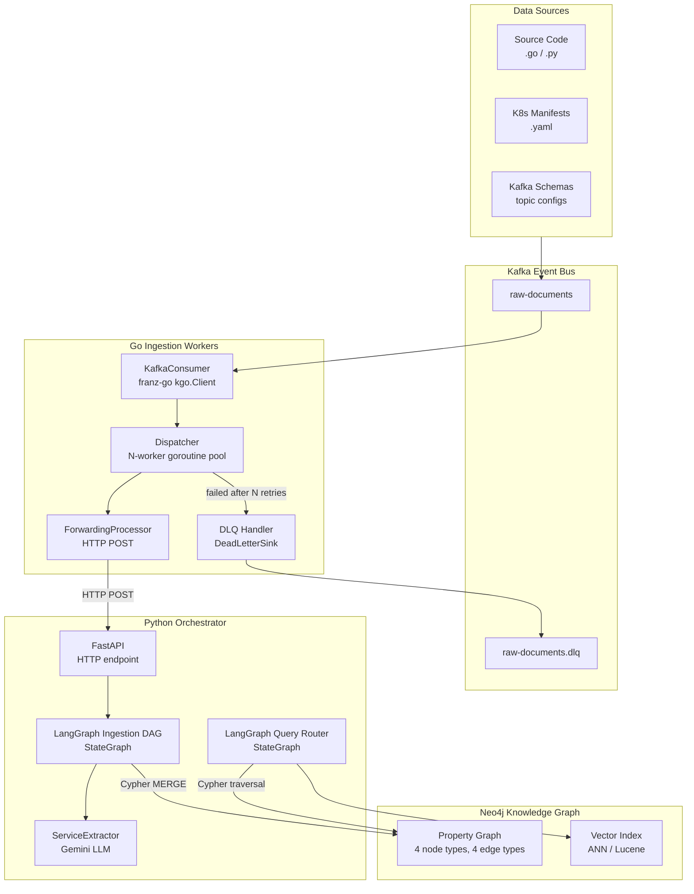
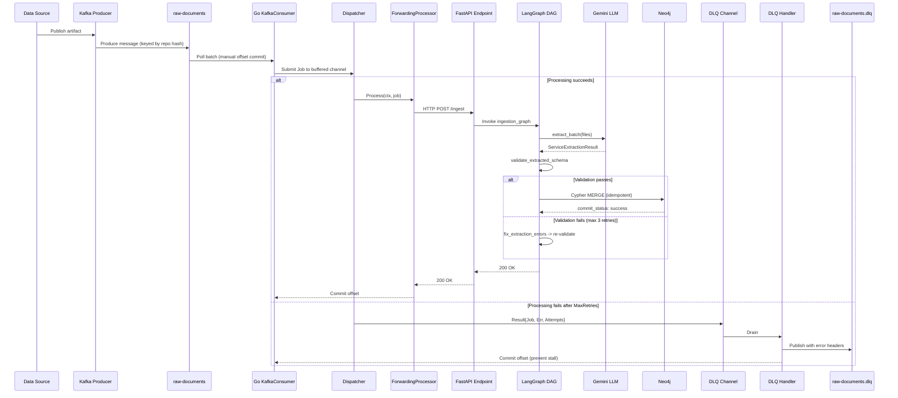
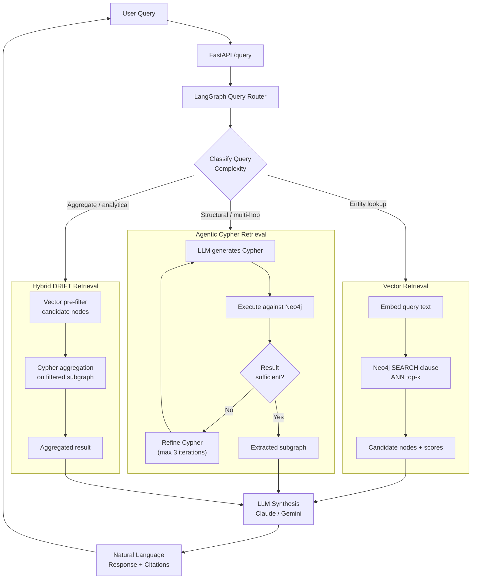
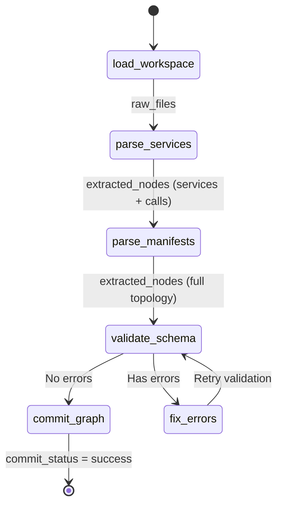

# 01 — System Design

> **Status:** Approved | **Version:** 1.0 | **Last Updated:** 2026-02-22

---

## 1. High-Level Architecture



---

## 2. Component Responsibilities

### 2.1 Kafka Event Bus

**Module:** `infrastructure/docker-compose.yml`

| Property | Dev | Production |
|---|---|---|
| Broker mode | KRaft single-node | KRaft multi-broker (3+) |
| Topics | `raw-documents`, `raw-documents.dlq` | Same, with replication factor 3 |
| Partitions | 1 per topic | Keyed by source repository hash; partition count scaled to match consumer group size |
| Retention | Default (168h) | `raw-documents`: 72h, `raw-documents.dlq`: 720h (30 days) |
| Port | 9092 | Internal cluster DNS |

**Kafka message schema:**

```json
{
  "key": "<repository-hash>",
  "value": {
    "file_path": "services/auth/main.go",
    "content": "<base64-encoded file content>",
    "source_type": "source_code | k8s_manifest | kafka_schema",
    "repository": "github.com/org/repo",
    "commit_sha": "abc123"
  },
  "headers": {
    "traceparent": "00-<trace-id>-<span-id>-01",
    "content-type": "application/json"
  }
}
```

---

### 2.2 Go Ingestion Workers

**Module:** `workers/ingestion/`

```
workers/ingestion/
  cmd/
    main.go                            # Entry point + signal handling
    kafka.go                           # KafkaJobSource + LogDLQSink
  internal/
    consumer/consumer.go               # JobSource interface + Consumer loop
    domain/job.go                      # Job, Result value types
    dispatcher/dispatcher.go           # Worker pool + retry logic
    dlq/handler.go                     # DLQ handler goroutine
    metrics/metrics.go                 # Prometheus metrics
    metrics/observer.go                # PipelineObserver interface
    processor/processor.go             # DocumentProcessor interface
    processor/forwarding.go            # HTTP POST to orchestrator
    telemetry/telemetry.go             # OpenTelemetry TracerProvider + spans
```

**Job type** (`internal/domain/job.go`):

| Field | Type | Description |
|---|---|---|
| `Key` | `[]byte` | Kafka message key (repository hash) |
| `Value` | `[]byte` | Kafka message value (JSON payload) |
| `Topic` | `string` | Source Kafka topic |
| `Partition` | `int32` | Source partition |
| `Offset` | `int64` | Source offset |
| `Headers` | `map[string]string` | Kafka headers including `traceparent` |
| `Timestamp` | `time.Time` | Kafka message timestamp |

**Dispatcher** (`internal/dispatcher/dispatcher.go`):

- Launches `NumWorkers` goroutines reading from a shared buffered `jobs` channel (fan-out pattern)
- Each worker calls `DocumentProcessor.Process(ctx, job)` with retry logic up to `MaxRetries`
- Failed jobs (after max retries) emit a `Result{Job, Err, Attempts}` to a buffered DLQ channel
- Graceful shutdown via `context.Context` cancellation + `sync.WaitGroup` ensuring all in-flight jobs complete before exit

**DLQ Handler** (`internal/dlq/handler.go`):

- Separate goroutine reading from the DLQ `Result` channel
- Forwards each failed result to a `DeadLetterSink` interface (production: `KafkaDLQSink` publishing to `raw-documents.dlq`)
- Exits on context cancellation or closed channel

---

### 2.3 Python Orchestrator

**Module:** `orchestrator/app/`

```
orchestrator/
  app/
    access_control.py        # SecurityPrincipal, CypherPermissionFilter
    circuit_breaker.py       # Three-state async circuit breaker
    config.py                # ExtractionConfig, Neo4jConfig (frozen dataclasses)
    cypher_validator.py      # Read-only Cypher query validation
    extraction_models.py     # Pydantic models: 4 nodes, 4 edges
    graph_builder.py         # LangGraph ingestion DAG (6 nodes)
    ingest_models.py         # IngestRequest/Response Pydantic models
    llm_extraction.py        # ServiceExtractor (Gemini, structured output)
    main.py                  # FastAPI endpoints (/health, /metrics, /ingest, /query)
    manifest_parser.py       # K8s + Kafka YAML parsing
    neo4j_client.py          # Cypher MERGE operations
    observability.py         # OpenTelemetry tracing + Prometheus metrics export
    query_classifier.py      # Keyword-based query complexity classifier
    query_engine.py          # LangGraph query DAG (6 nodes)
    query_models.py          # QueryRequest/Response/State models
    schema_init.cypher       # Neo4j constraints and indexes
    schema_validation.py     # Topology validation + correction loop
    workspace_loader.py      # Filesystem workspace scanner
  tests/                     # 15 test files
  requirements.txt
```

**ExtractionConfig** (`app/config.py`):

| Field | Default | Source |
|---|---|---|
| `google_api_key` | — | `GOOGLE_API_KEY` env var |
| `model_name` | `gemini-2.0-flash` | `EXTRACTION_MODEL` env var |
| `max_concurrency` | 5 | `EXTRACTION_MAX_CONCURRENCY` env var |
| `token_budget_per_batch` | 200000 | `EXTRACTION_TOKEN_BUDGET` env var |
| `max_retries` | 5 | `EXTRACTION_MAX_RETRIES` env var |
| `retry_min_wait` | 1.0 | `EXTRACTION_RETRY_MIN_WAIT` env var |
| `retry_max_wait` | 60.0 | `EXTRACTION_RETRY_MAX_WAIT` env var |

**ServiceExtractor** (`app/llm_extraction.py`):

1. `filter_source_files(files)` — static, keeps only `.go`/`.py` extensions
2. `batch_by_token_budget(files, budget)` — static generator, greedy bin-packing by `len(content) // 4`
3. `extract_batch(batch)` — async, constructs system + human prompt, calls `ChatGoogleGenerativeAI.with_structured_output(ServiceExtractionResult).ainvoke()`
4. `extract_all(files)` — async orchestrator: filter -> batch -> `asyncio.Semaphore`-gated gather -> deduplicate by `ServiceNode.id`

---

### 2.4 Neo4j Knowledge Graph

**Module:** `orchestrator/app/schema_init.cypher`

| Component | Specification |
|---|---|
| Version | Neo4j 5.26 (Community Edition for dev, Enterprise for prod) |
| Ports | 7474 (HTTP/Browser), 7687 (Bolt) |
| Auth | `neo4j/password` (dev), rotated credentials via K8s Secret (prod) |
| Plugins | APOC (for batch operations and path expansion) |
| Constraints | 5 uniqueness constraints on node primary keys |
| Indexes | 2 secondary indexes (`Service.language`, `Service.framework`) |
| Vector Index | Phase 2: ANN index on `Service.embedding` (dimension 768 or 1536) |

**Clustering (Production):**

| Property | Value |
|---|---|
| Primary servers | 3 (Raft quorum: 2/3 for write commits) |
| Secondary servers | 2 (read replicas for query scaling) |
| Fault tolerance | 1 primary failure tolerated (`M = 2F + 1`, F = 1) |
| Replication | Synchronous to primaries, async to secondaries |

---

### 2.5 Query Engine (Phase 2)

The query engine routes natural-language questions to the optimal retrieval strategy via a LangGraph `StateGraph` with conditional edges.

**Routing Logic:**

| Complexity Signal | Route | Mechanism |
|---|---|---|
| Named entity mention, no structural keywords | **Vector** | ANN search on node name embeddings via Neo4j `SEARCH` clause |
| Single relationship keyword ("produces", "calls") | **1-Hop Cypher** | Direct Cypher `MATCH` pattern |
| Structural keywords ("depends on", "blast radius", "downstream") | **Agentic Cypher** | LLM generates Cypher, executes, evaluates result sufficiency, iterates (max 3 loops) |
| Aggregation keywords ("most critical", "top N", "count") | **Hybrid DRIFT** | Vector pre-filter for candidate nodes, then Cypher aggregation on filtered subgraph |

---

## 3. Data Flow Diagrams

### 3.1 Async Ingestion Flow



**Delivery guarantees:**

| Stage | Guarantee |
|---|---|
| Kafka Producer -> Topic | At-least-once (idempotent producer: `enable.idempotence=true`) |
| Topic -> Go Consumer | At-least-once (manual offset commit after processing) |
| Go Worker -> Python | At-least-once (HTTP retry on 5xx) |
| Python -> Neo4j | Idempotent (Cypher `MERGE` on unique constraints) |
| End-to-end | Effectively-once (at-least-once delivery + idempotent writes) |

---

### 3.2 Query Resolution Flow



**LLM provider selection for synthesis:**

| Use Case | Provider | Rationale |
|---|---|---|
| Cypher generation | Gemini 2.0 Flash | Fast structured output; low latency for iterative refinement |
| Complex multi-hop reasoning | Claude | Superior reasoning over large subgraph context windows |
| Massive context synthesis | Gemini 2.5 Pro | 1M+ token context window for full topology summarization |

---

### 3.3 LangGraph Ingestion DAG

This diagram represents the compiled `StateGraph` from `orchestrator/app/graph_builder.py`.



**State schema** (`IngestionState` TypedDict):

| Field | Type | Description |
|---|---|---|
| `directory_path` | `str` | Root directory of the workspace being ingested |
| `raw_files` | `List[Dict[str, str]]` | `[{"path": "...", "content": "..."}]` loaded from workspace |
| `extracted_nodes` | `List[Any]` | Mixed list of Pydantic node and edge model instances |
| `extraction_errors` | `List[str]` | Validation error messages from schema check |
| `commit_status` | `str` | Terminal state: `"success"` or `"failed"` |

**Node implementations:**

| Node | Description |
|---|---|
| `load_workspace` | Recursively reads directory into `raw_files` |
| `parse_services` | Async `ServiceExtractor.extract_all()` via Gemini |
| `parse_manifests` | Extracts `K8sDeploymentNode`, `KafkaTopicNode` from YAML |
| `validate_schema` | Pydantic validation of all extracted models |
| `fix_errors` | LLM re-extraction with error context (max 3 retries) |
| `commit_graph` | Neo4j `MERGE` via async driver session with circuit breaker |

---

## 4. Deployment Topology

### 4.1 Development (Docker Compose)

```
docker-compose.yml
  neo4j:5.26-community  -> localhost:7474, :7687
  kafka:3.9.0           -> localhost:9092 (KRaft single-node)
```

Python orchestrator and Go workers run locally outside Docker for rapid iteration with test suites.

### 4.2 Production (Kubernetes)

| Component | K8s Resource | Replicas | Scaling |
|---|---|---|---|
| Go Ingestion Workers | Deployment | 2-10 | HPA on Kafka consumer lag |
| Python Orchestrator | Deployment | 2-5 | HPA on request queue depth |
| Neo4j | StatefulSet (Helm chart) | 3 primary + 2 secondary | Manual (capacity planning) |
| Kafka | StatefulSet (Strimzi operator) | 3 brokers | Manual (partition rebalancing) |

**Resource requests (per pod):**

| Component | CPU Request | Memory Request | CPU Limit | Memory Limit |
|---|---|---|---|---|
| Go Worker | 250m | 256Mi | 1000m | 512Mi |
| Python Orchestrator | 500m | 512Mi | 2000m | 2Gi |
| Neo4j Primary | 2000m | 4Gi | 4000m | 8Gi |
| Kafka Broker | 1000m | 2Gi | 2000m | 4Gi |
