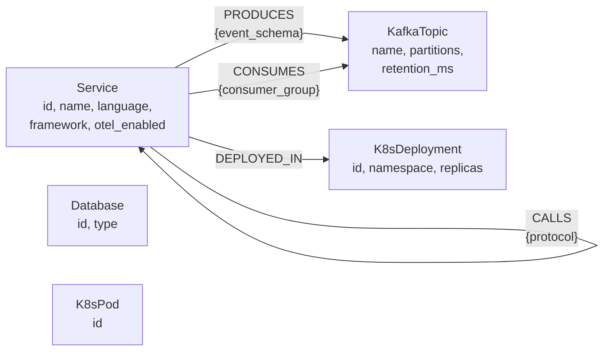

# 02 — Data Dictionary

> **Status:** Approved | **Version:** 1.0 | **Last Updated:** 2026-02-22

---

## 1. Schema Design Principles

| Principle | Rationale |
|---|---|
| **Directed edges** | All relationships carry semantic direction: `(A)-[:CALLS]->(B)` means A depends on B, not the reverse. Traversal direction matters for failure propagation and blast radius analysis. |
| **Idempotent upserts** | Every node label has a `UNIQUE` constraint on its primary key. Cypher `MERGE` on that key ensures repeated ingestion of the same artifact produces identical graph state. |
| **Anti-super-node** | No single node should accumulate > 10,000 edges. If a service or topic reaches this threshold, introduce intermediate "ServiceGroup" or "TopicPartition" nodes to distribute fan-out. |
| **Native property types** | All properties use Neo4j native types (`STRING`, `INTEGER`, `BOOLEAN`). No serialized JSON in properties. Complex structures are modeled as separate nodes with relationships. |
| **Schema-first extraction** | Pydantic models define the canonical schema. LLM extraction targets these models via `with_structured_output()`. The graph schema is derived from code, not the reverse. |

---

## 2. Core Nodes

### 2.1 `:Service`

Represents a discrete microservice, API, or application component identified during LLM extraction from source code.

**Source:** `ServiceNode` in `orchestrator/app/extraction_models.py`

| Property | Neo4j Type | Constraint | Description |
|---|---|---|---|
| `id` | `STRING` | `UNIQUE` | Stable identifier derived from service name + repository. Primary merge key. |
| `name` | `STRING` | — | Human-readable service name (e.g., `auth-service`, `order-api`). |
| `language` | `STRING` | `INDEXED` | Primary programming language (`go`, `python`, `java`, `typescript`). |
| `framework` | `STRING` | `INDEXED` | Web/RPC framework (`fastapi`, `gin`, `spring-boot`, `express`). |
| `opentelemetry_enabled` | `BOOLEAN` | — | Whether the service has OpenTelemetry instrumentation detected in source. |
| `team_owner` | `STRING` | — | Team that owns this service (for ACL filtering). |
| `namespace_acl` | `LIST<STRING>` | — | Namespaces with access to this service. |

**Cypher constraint:**
```cypher
CREATE CONSTRAINT service_id IF NOT EXISTS
  FOR (s:Service) REQUIRE s.id IS UNIQUE;
```

**Cypher indexes:**
```cypher
CREATE INDEX service_lang_idx IF NOT EXISTS
  FOR (s:Service) ON (s.language);
CREATE INDEX service_framework_idx IF NOT EXISTS
  FOR (s:Service) ON (s.framework);
```

**Phase 2 — Vector index:**
```cypher
CREATE VECTOR INDEX service_embedding IF NOT EXISTS
  FOR (s:Service) ON (s.embedding)
  OPTIONS {indexConfig: {
    `vector.dimensions`: 768,
    `vector.similarity_function`: 'cosine'
  }};
```

---

### 2.2 `:Database`

Represents a database instance or cluster that services connect to for persistent storage.

**Source:** `DatabaseNode` in `orchestrator/app/extraction_models.py`

| Property | Neo4j Type | Constraint | Description |
|---|---|---|---|
| `id` | `STRING` | `UNIQUE` | Stable identifier (e.g., `users-db-postgresql`). Primary merge key. |
| `type` | `STRING` | — | Database engine: `postgresql`, `mysql`, `redis`, `mongodb`, `dynamodb`, `cassandra`. |

**Cypher constraint:**
```cypher
CREATE CONSTRAINT database_id IF NOT EXISTS
  FOR (d:Database) REQUIRE d.id IS UNIQUE;
```

---

### 2.3 `:KafkaTopic`

Represents a Kafka topic extracted from broker configurations, producer/consumer annotations in source code, or infrastructure manifests.

**Source:** `KafkaTopicNode` in `orchestrator/app/extraction_models.py`

| Property | Neo4j Type | Constraint | Description |
|---|---|---|---|
| `name` | `STRING` | `UNIQUE` | Fully qualified topic name (e.g., `order-events`, `user-updates.dlq`). Primary merge key. |
| `partitions` | `INTEGER` | — | Number of partitions. Determines maximum consumer parallelism. |
| `retention_ms` | `INTEGER` | — | Message retention period in milliseconds. `604800000` = 7 days. |

**Cypher constraint:**
```cypher
CREATE CONSTRAINT topic_name IF NOT EXISTS
  FOR (t:KafkaTopic) REQUIRE t.name IS UNIQUE;
```

---

### 2.4 `:K8sDeployment`

Represents a Kubernetes Deployment resource extracted from YAML manifests.

**Source:** `K8sDeploymentNode` in `orchestrator/app/extraction_models.py`

| Property | Neo4j Type | Constraint | Description |
|---|---|---|---|
| `id` | `STRING` | `UNIQUE` | `<namespace>/<deployment-name>` (e.g., `payments/order-api`). Primary merge key. |
| `namespace` | `STRING` | — | Kubernetes namespace. Used for blast radius scoping. |
| `replicas` | `INTEGER` | — | Desired replica count from the Deployment spec. |

**Cypher constraint:**
```cypher
CREATE CONSTRAINT k8s_deploy_id IF NOT EXISTS
  FOR (k:K8sDeployment) REQUIRE k.id IS UNIQUE;
```

---

### 2.5 `:K8sPod`

Represents a Kubernetes Pod. Constraint exists in the schema DDL; Pydantic model pending implementation.

| Property | Neo4j Type | Constraint | Description |
|---|---|---|---|
| `id` | `STRING` | `UNIQUE` | `<namespace>/<pod-name>` (e.g., `payments/order-api-7d8f9b-x2k4l`). Primary merge key. |

**Cypher constraint:**
```cypher
CREATE CONSTRAINT k8s_pod_id IF NOT EXISTS
  FOR (p:K8sPod) REQUIRE p.id IS UNIQUE;
```

> **Note:** The `K8sPod` Pydantic model has not yet been implemented in `extraction_models.py`. The constraint is forward-declared in `schema_init.cypher` for schema stability. Expected properties in a future iteration: `namespace`, `node_name`, `status`, `restart_count`.

---

## 3. Core Edges

### 3.1 `-[:CALLS]->`

Represents a synchronous service-to-service dependency (HTTP, gRPC, or other RPC protocol).

**Source:** `CallsEdge` in `orchestrator/app/extraction_models.py`

| Direction | `(Service)-[:CALLS]->(Service)` |
|---|---|
| **Semantics** | Source service initiates a request to target service. Direction encodes dependency: if A calls B, then A depends on B. |
| **Multiplicity** | MULTI — a service pair may have multiple `CALLS` edges with different protocols. |

| Property | Neo4j Type | Description |
|---|---|---|
| `protocol` | `STRING` | Communication protocol: `http`, `grpc`, `graphql`, `thrift`. |

**Pydantic model:**
```python
class CallsEdge(BaseModel):
    source_service_id: str
    target_service_id: str
    protocol: str
```

**Example Cypher:**
```cypher
MATCH (a:Service {id: $source_id}), (b:Service {id: $target_id})
MERGE (a)-[:CALLS {protocol: $protocol}]->(b)
```

---

### 3.2 `-[:PRODUCES]->`

Represents a service publishing messages to a Kafka topic.

**Source:** `ProducesEdge` in `orchestrator/app/extraction_models.py`

| Direction | `(Service)-[:PRODUCES]->(KafkaTopic)` |
|---|---|
| **Semantics** | The service is a Kafka producer for the target topic. |
| **Multiplicity** | SIMPLE — one `PRODUCES` edge per (service, topic) pair. Multiple event schemas on the same topic are modeled as a list in `event_schema`. |

| Property | Neo4j Type | Description |
|---|---|---|
| `event_schema` | `STRING` | Schema identifier or description of the event payload (e.g., `OrderCreatedEvent`, `avro:com.org.UserUpdated`). |

**Pydantic model:**
```python
class ProducesEdge(BaseModel):
    service_id: str
    topic_name: str
    event_schema: str
```

**Example Cypher:**
```cypher
MATCH (s:Service {id: $service_id}), (t:KafkaTopic {name: $topic_name})
MERGE (s)-[:PRODUCES {event_schema: $event_schema}]->(t)
```

---

### 3.3 `-[:CONSUMES]->`

Represents a service consuming messages from a Kafka topic.

**Source:** `ConsumesEdge` in `orchestrator/app/extraction_models.py`

| Direction | `(Service)-[:CONSUMES]->(KafkaTopic)` |
|---|---|
| **Semantics** | The service is a Kafka consumer for the target topic. Direction is `Service -> KafkaTopic` (the service has a dependency on the topic). |
| **Multiplicity** | SIMPLE — one `CONSUMES` edge per (service, topic, consumer_group) triple. |

| Property | Neo4j Type | Description |
|---|---|---|
| `consumer_group` | `STRING` | Kafka consumer group ID. Critical for lag monitoring and scaling analysis. |

**Pydantic model:**
```python
class ConsumesEdge(BaseModel):
    service_id: str
    topic_name: str
    consumer_group: str
```

**Example Cypher:**
```cypher
MATCH (s:Service {id: $service_id}), (t:KafkaTopic {name: $topic_name})
MERGE (s)-[:CONSUMES {consumer_group: $consumer_group}]->(t)
```

---

### 3.4 `-[:DEPLOYED_IN]->`

Represents the deployment relationship between a service and a Kubernetes Deployment resource.

**Source:** `DeployedInEdge` in `orchestrator/app/extraction_models.py`

| Direction | `(Service)-[:DEPLOYED_IN]->(K8sDeployment)` |
|---|---|
| **Semantics** | The service runs inside the target Kubernetes Deployment. |
| **Multiplicity** | SIMPLE — a service is deployed in exactly one Deployment (at a given point in time). |

| Property | Neo4j Type | Description |
|---|---|---|
| (none) | — | This edge carries no properties. The relationship itself is the data. |

**Pydantic model:**
```python
class DeployedInEdge(BaseModel):
    service_id: str
    deployment_id: str
```

**Example Cypher:**
```cypher
MATCH (s:Service {id: $service_id}), (d:K8sDeployment {id: $deployment_id})
MERGE (s)-[:DEPLOYED_IN]->(d)
```

---

## 4. Schema Visualization



---

## 5. Constraints and Indexes (Complete DDL)

Verbatim from `orchestrator/app/schema_init.cypher`:

```cypher
-- Uniqueness constraints (primary keys)
CREATE CONSTRAINT service_id IF NOT EXISTS FOR (s:Service) REQUIRE s.id IS UNIQUE;
CREATE CONSTRAINT database_id IF NOT EXISTS FOR (d:Database) REQUIRE d.id IS UNIQUE;
CREATE CONSTRAINT topic_name IF NOT EXISTS FOR (t:KafkaTopic) REQUIRE t.name IS UNIQUE;
CREATE CONSTRAINT k8s_deploy_id IF NOT EXISTS FOR (k:K8sDeployment) REQUIRE k.id IS UNIQUE;
CREATE CONSTRAINT k8s_pod_id IF NOT EXISTS FOR (p:K8sPod) REQUIRE p.id IS UNIQUE;

-- Secondary indexes (query acceleration)
CREATE INDEX service_lang_idx IF NOT EXISTS FOR (s:Service) ON (s.language);
CREATE INDEX service_framework_idx IF NOT EXISTS FOR (s:Service) ON (s.framework);

-- Fulltext index (vector search path)
CREATE FULLTEXT INDEX service_name_index IF NOT EXISTS FOR (n:Service) ON EACH [n.name];
```

**Index usage guidance:**

| Index | Accelerates |
|---|---|
| `service_id` (unique) | All `MATCH (s:Service {id: ...})` lookups and `MERGE` operations |
| `database_id` (unique) | Database node resolution during ingestion and query |
| `topic_name` (unique) | Kafka topic lookups for PRODUCES/CONSUMES edge creation |
| `k8s_deploy_id` (unique) | Deployment lookups for DEPLOYED_IN edge creation |
| `k8s_pod_id` (unique) | Pod lookups (Phase 2) |
| `service_lang_idx` | Filtering services by language ("show all Go services") |
| `service_framework_idx` | Filtering services by framework ("show all FastAPI services") |

---

## 6. Example Cypher Queries

### 6.1 Failure Propagation (Variable-Length Traversal)

Find all services transitively affected if a given service fails, ordered by hop distance.

```cypher
MATCH path = (root:Service {name: $service_name})-[:CALLS*1..5]->(downstream:Service)
RETURN DISTINCT downstream.name AS affected_service,
       min(length(path)) AS min_hops
ORDER BY min_hops
```

Uses Neo4j's bidirectional breadth-first search for `shortestPath` variant. The `*1..5` bound prevents unbounded traversal in cyclic graphs.

---

### 6.2 Kafka Impact Analysis (Producer-Consumer Fan-Out)

Identify all services affected when a specific Kafka topic experiences consumer lag.

```cypher
MATCH (producer:Service)-[:PRODUCES]->(t:KafkaTopic {name: $topic_name})
MATCH (consumer:Service)-[:CONSUMES]->(t)
OPTIONAL MATCH (consumer)-[:CALLS*1..3]->(transitive:Service)
RETURN producer.name AS producer,
       consumer.name AS consumer,
       collect(DISTINCT transitive.name) AS transitive_dependents
```

---

### 6.3 Blast Radius (Namespace-Scoped)

Determine the full impact of redeploying all services in a Kubernetes namespace.

```cypher
MATCH (d:K8sDeployment {namespace: $namespace})<-[:DEPLOYED_IN]-(s:Service)
OPTIONAL MATCH (s)-[:CALLS*1..3]->(impacted:Service)
WHERE NOT (impacted)-[:DEPLOYED_IN]->(:K8sDeployment {namespace: $namespace})
RETURN s.name AS directly_affected,
       collect(DISTINCT impacted.name) AS external_impact
```

The `WHERE NOT` clause excludes services within the same namespace (they're already in the blast zone).

---

### 6.4 Protocol Audit (Edge Property Filter)

Aggregate service communication by protocol type.

```cypher
MATCH (a:Service)-[c:CALLS]->(b:Service)
RETURN c.protocol AS protocol,
       count(*) AS edge_count,
       collect(DISTINCT [a.name, b.name])[..10] AS sample_pairs
ORDER BY edge_count DESC
```

---

### 6.5 Orphan Detection (Isolated Nodes)

Find services with no inbound or outbound `CALLS` edges — potential dead code or misconfigured services.

```cypher
MATCH (s:Service)
WHERE NOT (s)-[:CALLS]->()
  AND NOT ()-[:CALLS]->(s)
RETURN s.id, s.name, s.language
ORDER BY s.name
```

---

### 6.6 Full Topology Export

Dump the entire graph for external visualization or backup.

```cypher
MATCH (n)
OPTIONAL MATCH (n)-[r]->(m)
RETURN labels(n)[0] AS source_label,
       properties(n) AS source_props,
       type(r) AS edge_type,
       properties(r) AS edge_props,
       labels(m)[0] AS target_label,
       properties(m) AS target_props
```

---

## 7. Aggregate Model

The ingestion DAG operates on a mixed `List[Any]` of Pydantic node and edge models (`extracted_nodes` in `IngestionState`). The following cardinality expectations apply per ingestion batch:

| Entity Type | Expected Range | Notes |
|---|---|---|
| `ServiceNode` | 5–200 | Bounded by repository size |
| `DatabaseNode` | 1–20 | Typically fewer unique database instances |
| `KafkaTopicNode` | 5–100 | Bounded by Kafka cluster configuration |
| `K8sDeploymentNode` | 5–200 | One per service in typical K8s deployments |
| `CallsEdge` | 10–1,000 | Grows quadratically with service count in dense graphs |
| `ProducesEdge` | 5–200 | Bounded by topic count |
| `ConsumesEdge` | 5–200 | Bounded by topic count and consumer group count |
| `DeployedInEdge` | 5–200 | 1:1 with services in typical configurations |
