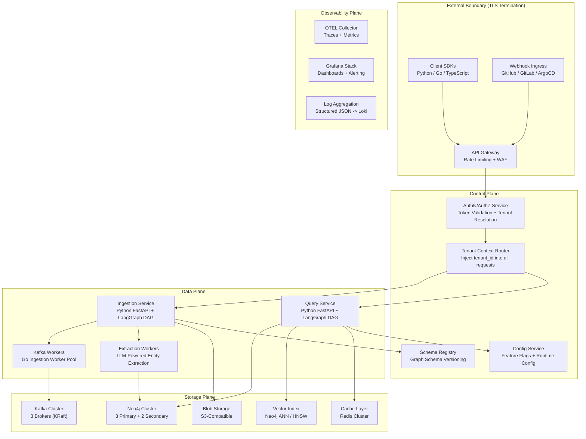
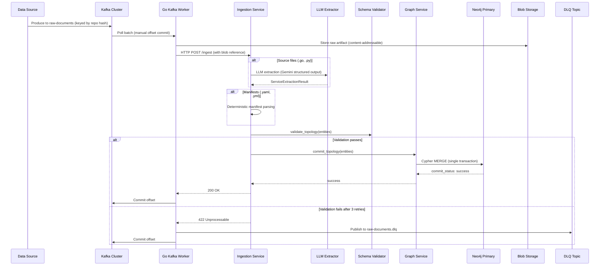
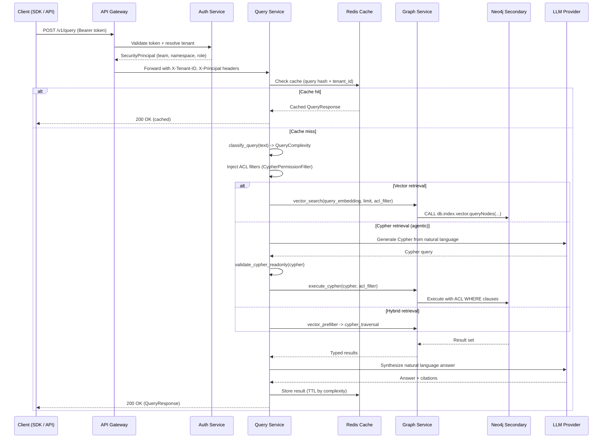
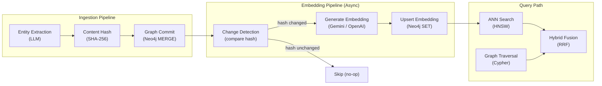
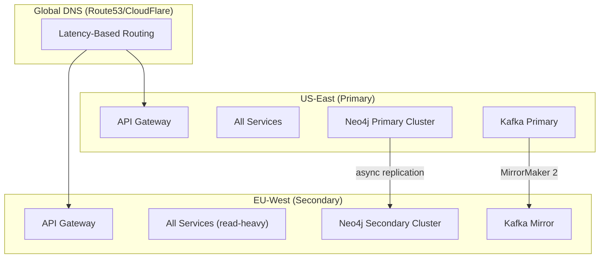

# RFC-002: Technical Architecture

> **Status:** Draft | **Authors:** Architecture Team | **Reviewers:** Distinguished Engineers, SRE Lead
> **Created:** 2026-02-23 | **Last Updated:** 2026-02-23

---

## Abstract

This RFC defines the target-state technical architecture for graphrag-architect, evolving from the current two-service prototype (Python orchestrator + Go ingestion workers) into a production-grade, multi-tenant platform with clear service boundaries, fault isolation, and horizontal scalability. It covers system boundary definitions, component decomposition, data flow architecture, storage strategy, graph schema governance, embedding lifecycle, multi-region deployment, failure isolation, and disaster recovery.

---

## 1. System Boundary Definition

The architecture is organized into four planes, each with distinct responsibilities and trust boundaries.



### Trust Boundaries

| Boundary | From | To | Enforcement |
|---|---|---|---|
| TB-1 | Internet | API Gateway | TLS 1.3 termination, WAF rules, rate limiting (token bucket per IP) |
| TB-2 | API Gateway | Auth Service | mTLS, request signing, CORS enforcement |
| TB-3 | Auth Service | Data Plane | Security principal injection via request header (`X-Tenant-ID`, `X-Principal`) |
| TB-4 | Data Plane | Neo4j | Bolt TLS, connection pooling, Cypher validation (read-only for queries) |
| TB-5 | Data Plane | LLM Provider | HTTPS, prompt sanitization, output schema validation, token budget enforcement |
| TB-6 | Data Plane | Kafka | SASL/SCRAM authentication, TLS encryption, ACL per topic |

---

## 2. Component Decomposition

### 2.1 Current State (2 Services)

The current architecture has two deployable units:

1. **Python Orchestrator** (`orchestrator/`): FastAPI application handling ingestion (`/ingest`), query (`/query`), health, and metrics. Contains both the LangGraph ingestion DAG and query DAG, LLM extraction, Neo4j client, access control, and observability.

2. **Go Ingestion Workers** (`workers/ingestion/`): Kafka consumer with dispatcher, forwarding processor, DLQ handler, and metrics server.

### 2.2 Target State (6 Logical Services)

The monolithic orchestrator splits along natural seams:

| Service | Language | Responsibility | Scaling Axis |
|---|---|---|---|
| **API Gateway** | Envoy / Kong | TLS termination, rate limiting, routing, WAF | Horizontal (stateless) |
| **Auth Service** | Python | Token validation, tenant resolution, principal injection | Horizontal (stateless, cached) |
| **Ingestion Service** | Python | Ingestion DAG orchestration, schema validation, manifest parsing | Horizontal (per Kafka partition) |
| **Query Service** | Python | Query classification, retrieval routing, LLM synthesis | Horizontal (per concurrent query) |
| **Graph Service** | Python | Neo4j operations, Cypher generation, circuit breaker, connection pooling | Vertical (connection pool bound) |
| **Kafka Workers** | Go | Kafka consumption, dispatching, DLQ handling, HTTP forwarding | Horizontal (per Kafka partition) |

### 2.3 Service Decomposition Rationale

The split is motivated by three scaling asymmetries:

1. **Ingestion vs. Query**: Ingestion load is bursty (CI/CD pipelines trigger batch ingestion) while query load is steady (engineers querying throughout the day). Independent scaling prevents ingestion bursts from degrading query latency.

2. **LLM-Bound vs. IO-Bound**: LLM extraction is CPU/network-bound with high latency (1-8s per batch). Neo4j operations are IO-bound with low latency (< 150ms). Separating them allows independent concurrency tuning.

3. **Read vs. Write**: Graph writes (ingestion) must go through Neo4j primaries. Graph reads (queries) can be distributed across secondaries. Separate services can target different Neo4j cluster members.

### 2.4 Migration Strategy

The decomposition is incremental, not big-bang:

1. **Phase 1 (Current):** Monolithic orchestrator. All logic in one process.
2. **Phase 2:** Extract Auth Service as a sidecar (Envoy ext_authz filter). Zero code changes to orchestrator.
3. **Phase 3:** Split Ingestion and Query into separate deployments from the same codebase (feature flags control which endpoints are active per deployment).
4. **Phase 4:** Extract Graph Service when Neo4j connection pooling becomes a bottleneck.

---

## 3. Data Flow Architecture

### 3.1 Ingestion Flow (Write Path)



**Key design decisions in the write path:**

1. **Blob storage decoupling**: Raw artifacts are stored in S3-compatible blob storage (content-addressable by SHA-256) before extraction. This decouples Kafka retention from artifact retention and enables re-extraction without re-ingestion.

2. **Idempotent writes**: Cypher `MERGE` on unique-constrained properties ensures repeated ingestion of the same artifact produces identical graph state. This is critical for at-least-once delivery semantics.

3. **DLQ preservation**: Failed messages retain full error context (source topic, partition, offset, attempts, error message, timestamp) in Kafka headers for operational debugging and selective replay.

### 3.2 Query Flow (Read Path)



**Cache TTL strategy:**

| Query Complexity | Cache TTL | Rationale |
|---|---|---|
| Entity lookup (vector) | 60 seconds | Entity metadata changes infrequently |
| Single-hop relationship | 120 seconds | Relationship changes require new ingestion |
| Multi-hop traversal | 300 seconds | Complex traversals are expensive; topology is relatively stable |
| Aggregate/analytical | 600 seconds | Aggregations are the most expensive and least time-sensitive |

### 3.3 Admin Flow

The admin flow covers schema management, tenant provisioning, and operational tasks:

- **Schema Migrations**: Applied via Kubernetes Job (current `neo4j-schema-job.yaml`), evolving to a versioned migration runner with rollback support.
- **Tenant Provisioning**: Create tenant entry, configure ACL defaults, provision Neo4j composite database (Enterprise tier).
- **Configuration Updates**: Feature flags and runtime config distributed via ConfigMap or Config Service.

---

## 4. Storage Strategy

### 4.1 Neo4j (Primary Graph Store)

| Aspect | Development | Production | Enterprise |
|---|---|---|---|
| **Edition** | Community 5.26 | Enterprise 5.26 | Enterprise 5.26+ (Infinigraph) |
| **Topology** | Single instance | 3 primary + 2 secondary | 3 primary + N secondary per region |
| **Write Path** | Single writer | Raft consensus (2/3 quorum) | Raft consensus + property sharding |
| **Read Path** | Same instance | Route to secondaries | Route to nearest secondary (region-aware) |
| **Storage** | Local volume | EBS gp3 (3000 IOPS baseline) | EBS io2 (tuned IOPS) |
| **Backup** | None | Daily online backup to S3 | Continuous incremental + cross-region replication |
| **Connection Pool** | 10 connections | 50 connections (per orchestrator pod) | 100 connections (per service pod) |

**Schema governance:**

The graph schema is versioned via a `SchemaVersion` meta-node in Neo4j:

```cypher
MERGE (v:SchemaVersion {version: $version})
SET v.applied_at = datetime(),
    v.description = $description,
    v.checksum = $checksum
```

Migration scripts live in `migrations/` with naming convention `V{version}__{description}.cypher`. The migration runner applies scripts in order, records the version, and validates checksums to detect drift.

### 4.2 Kafka (Event Bus)

| Aspect | Development | Production |
|---|---|---|
| **Mode** | KRaft single-node | KRaft 3-broker cluster |
| **Topics** | `raw-documents`, `raw-documents.dlq` | Same + `graph-events` (CDC), `schema-changes` |
| **Partitioning** | 1 partition per topic | Keyed by `tenant_id:repository_hash` (16+ partitions) |
| **Replication** | 1 | 3 (min.insync.replicas=2) |
| **Retention** | Default (168h) | `raw-documents`: 72h, DLQ: 720h, `graph-events`: 168h |
| **Schema Validation** | None | Confluent Schema Registry (Avro) |
| **Authentication** | None | SASL/SCRAM-SHA-512 |
| **Encryption** | None | TLS 1.3 (inter-broker + client) |

**Kafka message schema evolution:**

Current messages use unvalidated JSON. The target state uses Avro schemas registered in Confluent Schema Registry with backward compatibility enforcement:

```json
{
  "type": "record",
  "name": "IngestDocument",
  "namespace": "com.graphrag.ingestion",
  "fields": [
    {"name": "file_path", "type": "string"},
    {"name": "content", "type": "bytes"},
    {"name": "source_type", "type": {"type": "enum", "name": "SourceType", "symbols": ["SOURCE_CODE", "K8S_MANIFEST", "KAFKA_SCHEMA"]}},
    {"name": "repository", "type": ["null", "string"], "default": null},
    {"name": "commit_sha", "type": ["null", "string"], "default": null},
    {"name": "tenant_id", "type": "string"},
    {"name": "ingested_at", "type": {"type": "long", "logicalType": "timestamp-millis"}}
  ]
}
```

### 4.3 Vector Index

| Aspect | Current State | Target State |
|---|---|---|
| **Implementation** | Neo4j fulltext index (Lucene) | Neo4j native vector index (HNSW) |
| **Index Name** | `service_name_index` | `service_embedding_idx`, `topic_embedding_idx` |
| **Dimensions** | N/A (text search) | 768 (for Gemini embeddings) or 1536 (for OpenAI) |
| **Similarity** | BM25 text scoring | Cosine similarity |
| **Indexed Properties** | `Service.name` | `Service.embedding`, `KafkaTopic.embedding`, `Database.embedding` |
| **Update Strategy** | Immediate (on MERGE) | Async pipeline: extract -> embed -> upsert |

### 4.4 Blob Storage (New)

Raw artifacts are stored in S3-compatible blob storage for:

1. **Re-extraction**: When the LLM model improves or extraction prompts change, artifacts can be re-processed without re-ingestion from source.
2. **Audit trail**: Immutable record of every artifact that contributed to the knowledge graph.
3. **Kafka decoupling**: Kafka retention can be short (72h) because artifacts persist in blob storage indefinitely.

Key format: `s3://{bucket}/{tenant_id}/{repository_hash}/{file_path_hash}` with metadata (original path, source type, ingested timestamp, commit SHA).

### 4.5 Cache Layer (New)

Redis cluster for query result caching:

| Aspect | Specification |
|---|---|
| **Topology** | 3-node Redis Cluster (1 primary + 2 replicas) |
| **Key Format** | `query:{tenant_id}:{sha256(query_text + acl_hash)}` |
| **Eviction** | LRU with TTL (varies by query complexity) |
| **Max Memory** | 2 GB per node |
| **Invalidation** | On graph write (ingestion commit triggers cache invalidation for affected tenant) |

---

## 5. Graph Schema Governance

### 5.1 Current Schema

The schema defines 4 node types and 4 relationship types:

**Nodes:**

| Label | Primary Key | Properties | ACL Properties |
|---|---|---|---|
| `Service` | `id` | `name`, `language`, `framework`, `opentelemetry_enabled` | `team_owner`, `namespace_acl` |
| `Database` | `id` | `type` | `team_owner`, `namespace_acl` |
| `KafkaTopic` | `name` | `partitions`, `retention_ms` | `team_owner`, `namespace_acl` |
| `K8sDeployment` | `id` | `namespace`, `replicas` | `team_owner`, `namespace_acl` |

**Relationships:**

| Type | Source | Target | Properties |
|---|---|---|---|
| `CALLS` | `Service` | `Service` | `protocol` |
| `PRODUCES` | `Service` | `KafkaTopic` | `event_schema` |
| `CONSUMES` | `Service` | `KafkaTopic` | `consumer_group` |
| `DEPLOYED_IN` | `Service` | `K8sDeployment` | (none) |

### 5.2 Schema Evolution Strategy

Schema changes are categorized by risk:

| Change Type | Risk | Process | Example |
|---|---|---|---|
| Add optional property | Low | Migration script only | Add `Service.version` |
| Add new node label | Medium | RFC + migration + extractor update | Add `HelmRelease` node |
| Add new relationship type | Medium | RFC + migration + query engine update | Add `WRITES_TO` relationship |
| Modify property type | High | RFC + migration + data backfill | Change `partitions` from int to long |
| Remove property/label | Critical | RFC + 2-version deprecation + migration | Remove `K8sPod` label |

### 5.3 Multi-Tenant Schema Isolation

| Tier | Isolation Model | Implementation |
|---|---|---|
| **Standard** | Logical (shared graph, tenant_id property) | All nodes carry `tenant_id` property. All queries include `WHERE n.tenant_id = $tenant_id`. |
| **Enterprise** | Physical (composite database) | Each tenant gets a dedicated Neo4j database within a composite database. Queries route to tenant-specific database. |

For Standard tier, the `tenant_id` is mandatory on every node and enforced by:
1. Pydantic model validation at ingestion time.
2. Neo4j constraint: `CREATE CONSTRAINT tenant_required FOR (n:Service) REQUIRE n.tenant_id IS NOT NULL`.
3. Query-time injection: All Cypher queries receive `AND n.tenant_id = $tenant_id` via parameterized templates (replacing the current regex-based injection).

---

## 6. Embedding and Re-Index Lifecycle

### 6.1 Current State

Vector embeddings are not implemented. The query engine uses Neo4j fulltext search (`CALL db.index.fulltext.queryNodes('service_name_index', $query)`) as a placeholder.

### 6.2 Target Architecture



**Design principles:**

1. **Decoupled from extraction**: Embedding generation runs as a separate async pipeline after graph commit. This prevents embedding latency from blocking ingestion.

2. **Content-addressable**: Each node stores a `content_hash` (SHA-256 of the serialized entity). The embedding pipeline only regenerates embeddings when the hash changes, achieving 85-90% skip rate on incremental updates (per LiveVectorLake benchmarks).

3. **Multi-property embedding**: Each node type generates embeddings from a concatenation of its key properties:
   - `Service`: `"{name} {language} {framework}"`
   - `KafkaTopic`: `"{name} partitions={partitions} retention={retention_ms}ms"`
   - `Database`: `"{id} type={type}"`
   - `K8sDeployment`: `"{id} namespace={namespace} replicas={replicas}"`

4. **Hybrid fusion**: Query results from vector search and graph traversal are combined via Reciprocal Rank Fusion (RRF), following the approach validated by Practical GraphRAG (arXiv:2507.03226).

### 6.3 Re-Index Triggers

| Trigger | Scope | Strategy |
|---|---|---|
| Entity property change | Single node | Re-embed the changed node |
| Embedding model upgrade | All nodes | Full re-index (batch, off-peak) |
| New entity type added | New type only | Embed all nodes of new type |
| Extraction prompt change | All affected nodes | Re-extract from blob storage, then re-embed |

---

## 7. Multi-Region Architecture

### 7.1 Target Deployment (Phase 4)



### 7.2 Consistency Model

| Operation | Region | Consistency |
|---|---|---|
| Graph write (ingestion) | Primary only | Strong (Raft quorum) |
| Graph read (query) | Any region | Eventual (replication lag < 1s typical, < 5s p99) |
| Cache read | Local region | Local (TTL-based invalidation) |
| Auth token validation | Any region | Strong (stateless HMAC validation) |

### 7.3 Tenant Affinity

Each tenant is assigned a home region based on data residency requirements (GDPR, data sovereignty). Writes always route to the home region. Reads can be served from any region with eventual consistency, or from the home region for strong consistency (configurable per query via `consistency=strong|eventual` parameter).

---

## 8. Failure Isolation

### 8.1 Bulkhead Pattern

Each tenant's workload is isolated to prevent noisy-neighbor effects:

| Resource | Isolation Mechanism |
|---|---|
| LLM API calls | Per-tenant rate limiter (token bucket) |
| Neo4j connections | Per-tenant connection pool partition |
| Kafka throughput | Per-tenant topic partitioning |
| Query concurrency | Per-tenant semaphore (max concurrent queries) |
| Cache memory | Per-tenant key prefix with proportional memory allocation |

### 8.2 Circuit Breaker Matrix

| Dependency | Current State | Target State |
|---|---|---|
| Neo4j | Circuit breaker (3 failures, 30s recovery) | Per-tenant circuit breaker + per-region fallback |
| LLM Provider | Exponential backoff (tenacity, 5 retries) | Circuit breaker + provider failover (Gemini -> Claude -> local model) |
| Kafka | None (franz-go handles reconnection) | Circuit breaker on DLQ sink + dead letter file fallback |
| Blob Storage | N/A (not implemented) | Circuit breaker + local file buffer |
| Redis Cache | N/A (not implemented) | Circuit breaker + bypass (query without cache on failure) |

### 8.3 Timeout Budget

Each request has a total timeout budget distributed across sub-operations:

| Request Type | Total Budget | Auth | Cache Lookup | Retrieval | LLM Synthesis | Neo4j Write |
|---|---|---|---|---|---|---|
| Query (vector) | 2s | 50ms | 50ms | 500ms | 1s | N/A |
| Query (cypher, agentic) | 10s | 50ms | 50ms | 3s (x3 iterations) | 2s | N/A |
| Ingestion | 30s | 50ms | N/A | N/A | 8s (extraction) | 5s |

If any sub-operation exhausts its budget, the request fails fast with a structured error indicating which stage timed out.

---

## 9. Disaster Recovery

### 9.1 Recovery Objectives

| Metric | Target | Mechanism |
|---|---|---|
| **RPO (Recovery Point Objective)** | 0 (zero data loss) | Kafka replication (3x) + Neo4j Raft consensus + blob storage durability |
| **RTO (Recovery Time Objective)** | < 5 minutes | Kubernetes pod auto-restart + Neo4j leader election (< 30s) |
| **RGO (Recovery Granularity Objective)** | Per-tenant | Tenant-scoped backup and restore from blob storage |

### 9.2 Backup Strategy

| Component | Backup Method | Frequency | Retention | Restore Time |
|---|---|---|---|---|
| Neo4j | Online backup (`neo4j-admin database backup`) | Every 6 hours | 30 days | 15-30 min (depending on graph size) |
| Kafka | Topic replication (3x) + MirrorMaker for DR region | Continuous | Per retention policy | Automatic (broker failover) |
| Blob Storage | S3 cross-region replication | Continuous | Indefinite | Automatic (S3 durability: 99.999999999%) |
| Redis Cache | No backup (ephemeral) | N/A | N/A | Cache rebuild on startup (warm-up period) |
| Configuration | Git-versioned (K8s manifests, Helm values) | On change | Indefinite | `kubectl apply` (< 1 min) |

### 9.3 Failure Scenarios and Recovery Procedures

| Scenario | Impact | Detection | Recovery |
|---|---|---|---|
| Single Neo4j primary failure | Write degradation (quorum still holds with 2/3) | Raft heartbeat timeout (< 10s) | Automatic leader election |
| Neo4j quorum loss (2/3 fail) | Writes blocked, reads from secondaries continue | Alert: `Neo4jClusterUnhealthy` | Manual intervention: restore from backup or recover nodes |
| Kafka broker failure | Partition leaders re-elected | Alert: `KafkaBrokerDown` | Automatic (KRaft consensus) |
| LLM provider outage | Ingestion blocked (extraction fails) | Circuit breaker opens | Automatic failover to backup provider; DLQ for retry |
| Full region failure | Service unavailable in affected region | Health check failure + DNS failover | Route traffic to DR region (< 5 min via DNS TTL) |
| Data corruption (bad extraction) | Incorrect graph state | Manual detection or automated validation | Re-extract from blob storage with corrected model/prompts |

---

## 10. Alternatives Considered

### 10.1 GraphQL Instead of REST

**Rejected for Phase 1-2.** GraphQL provides flexible querying but adds complexity (schema stitching, N+1 query problems, caching difficulty). The current REST API with structured query/response models is simpler and sufficient. GraphQL will be evaluated for Phase 3 when client query patterns are better understood.

### 10.2 Event Sourcing for Graph State

**Rejected.** Storing every graph mutation as an event and rebuilding state from the event log provides perfect audit trails but dramatically increases storage and query complexity. The current approach (idempotent MERGE + blob storage for raw artifacts) provides auditability without event sourcing overhead.

### 10.3 Separate Vector Database (Pinecone/Weaviate)

**Rejected.** Co-locating vectors in Neo4j eliminates a network hop on hybrid queries and simplifies consistency (vector and graph state are updated in the same transaction). The tradeoff is Neo4j's vector index is less feature-rich than dedicated vector databases, but the performance characteristics are sufficient for infrastructure topology queries (not high-dimensional similarity search at billion-scale).

### 10.4 gRPC Between Go Workers and Python Orchestrator

**Considered for Phase 3.** HTTP/JSON is simpler to debug and monitor. gRPC provides binary efficiency and streaming. The current HTTP forwarding from Go workers to the orchestrator adds ~2-5ms overhead per request, which is negligible relative to LLM extraction latency (1-8s). gRPC will be evaluated when per-message overhead becomes a meaningful fraction of total latency.

---

## 11. Open Questions

1. **Neo4j Enterprise Licensing Cost:** The target architecture assumes Neo4j Enterprise Edition for clustering, composite databases, and property sharding. What is the licensing cost at our projected scale, and does it change the build-vs-buy calculus?

2. **LLM Provider SLA:** Neither Gemini nor Claude offers a contractual availability SLA. How do we meet our 99.9% ingestion SLO when dependent on providers without SLAs?

3. **Schema Registry Adoption Overhead:** Introducing Avro schemas and Confluent Schema Registry adds operational complexity. Is the schema validation benefit worth the additional infrastructure for the current team size?

4. **Cache Invalidation Granularity:** Tenant-level cache invalidation on every ingestion commit may cause excessive cache misses. Should we implement entity-level cache invalidation (invalidate only queries that touched the changed entities)?

5. **Composite Database Performance:** Neo4j composite databases add a query routing layer. What is the measured latency overhead for cross-database queries in a multi-tenant configuration?
