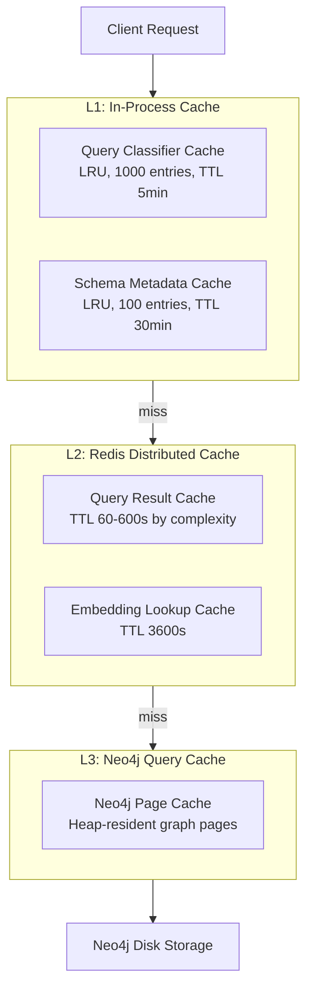

# RFC-003: Scalability and Performance Plan

> **Status:** Draft | **Authors:** Architecture Team | **Reviewers:** SRE Lead, Distinguished Engineers
> **Created:** 2026-02-23 | **Last Updated:** 2026-02-23

---

## Abstract

This RFC defines the scalability strategy, performance targets, and capacity planning model for graphrag-architect. It analyzes system behavior at 1x, 10x, 100x, and 1000x scale, identifies breaking points at each tier, and prescribes specific sharding, caching, query complexity control, and load testing strategies. All recommendations are grounded in the current codebase's actual implementation characteristics and Neo4j/Kafka operational benchmarks.

---

## 1. Stress Test Analysis

### 1.1 Current System Profile

Measured from the codebase's configuration defaults and infrastructure specifications:

| Metric | Current Value | Source |
|---|---|---|
| LLM extraction concurrency | 5 (asyncio.Semaphore) | `orchestrator/app/config.py:ExtractionConfig.max_concurrency` |
| Token budget per batch | 200,000 tokens | `orchestrator/app/config.py:ExtractionConfig.token_budget_per_batch` |
| Neo4j connection pool | Module-level singleton (1 driver) | `orchestrator/app/neo4j_pool.py` |
| Kafka consumer workers | 4 goroutines (default) | `workers/ingestion/internal/dispatcher/dispatcher.go` |
| HPA range (Go workers) | 2-10 pods | `infrastructure/k8s/hpa.yaml` |
| HPA range (orchestrator) | 2-5 pods | `infrastructure/k8s/hpa.yaml` |
| Max query results | 100 | `orchestrator/app/query_models.py:QueryRequest.max_results` |
| Circuit breaker threshold | 3 failures -> open, 30s recovery | `orchestrator/app/circuit_breaker.py` |
| File size limit | 1 MB per file | `orchestrator/app/workspace_loader.py` |
| Pod memory limit (orchestrator) | 2 Gi | `infrastructure/k8s/orchestrator-deployment.yaml` |

### 1.2 Scale Factor Analysis

#### 1x (Current): ~100 Documents, ~10 Users, ~500 Graph Nodes

**Status:** Comfortable. No bottlenecks. All NFRs met within current configuration.

- Ingestion: 5 concurrent LLM calls handle ~100 documents in < 1 minute.
- Query: Single Neo4j instance handles 10 concurrent queries with < 200ms latency.
- Memory: ~500 nodes consume < 50 MB in Neo4j heap.

#### 10x: ~1,000 Documents, ~100 Users, ~5,000 Graph Nodes

**Breaking Points:**

| Component | Bottleneck | Impact | Mitigation |
|---|---|---|---|
| LLM Extraction | 5 concurrent calls * 3-8s each = ~2-3 min for 1,000 docs (batched) | Ingestion latency exceeds NFR-1 p99 target | Increase `max_concurrency` to 15-20; batch optimization |
| Neo4j Writes | Single write transaction per ingestion batch; no write batching across pods | Write contention under parallel ingestion | Implement write batching with configurable batch size (100 entities per transaction) |
| Query Latency | Multi-hop Cypher traversals on 5K nodes with high connectivity | p99 latency approaches 1s for `CALLS*1..5` patterns | Add Cypher depth limits; implement query timeout |

**Required Changes:**
- Scale orchestrator HPA max to 8.
- Increase LLM extraction concurrency to 15.
- Add Neo4j write batching (group entities into 100-entity transactions).

#### 100x: ~10,000 Documents, ~1,000 Users, ~50,000 Graph Nodes

**Breaking Points:**

| Component | Bottleneck | Impact | Mitigation |
|---|---|---|---|
| Orchestrator Memory | `load_directory()` loads all files into `IngestionState` (in-memory list) | Pod OOM at ~3,000 large files (1 MB each = 3 GB) | Stream workspace loading (audit HIGH-002); process in chunks |
| Neo4j Write Throughput | Single-transaction MERGE for entire batch; lock contention on MERGE | Transaction timeouts under parallel writes from multiple pods | Partition writes by node label; use `UNWIND` batch operations |
| Neo4j Read Latency | 50K nodes with variable-length path traversals | `CALLS*1..5` can touch 50K^5 paths in worst case | Query complexity estimation (EXPLAIN); bidirectional BFS; result set limits |
| Kafka Consumer Lag | Go consumer blocks on acks (audit MEDIUM-001) | Rebalances under burst load | Non-blocking ack collection; parallel batch processing |
| LLM API Cost | 10K documents * ~500 tokens/doc * $0.075/1M tokens (Gemini Flash) | ~$375 per full re-index (acceptable) | Content-hash deduplication; skip unchanged files |

**Required Changes:**
- Implement streaming workspace loading (`load_directory_chunked()` is implemented but callers may collect all chunks).
- Add Neo4j write partitioning by entity type (parallelize node and edge writes).
- Implement query complexity estimation via `EXPLAIN` before execution.
- Fix Go consumer thread contention (non-blocking ack pattern).
- Add Redis caching for repeated queries.

#### 1000x: ~1,000,000 Documents, ~10,000 Users, ~5,000,000 Graph Nodes

**Breaking Points:**

| Component | Bottleneck | Impact | Mitigation |
|---|---|---|---|
| Neo4j Single Instance | 5M nodes exceed single-instance memory (requires > 32 GB heap) | Performance degradation; GC pauses | Neo4j composite databases (tenant sharding) or Infinigraph property sharding |
| Graph Traversal Explosion | Variable-length paths in dense graphs (5M nodes, avg degree > 5) | O(d^k) complexity where d=degree, k=depth; queries timeout | Leiden community detection (pre-computed); bidirectional BFS; max-depth=3 for production |
| Kafka Partition Count | 16 partitions may not support 10K concurrent producers | Consumer lag accumulates | Scale to 64+ partitions; partition by `tenant_id` |
| LLM API Cost | 1M docs * 500 tokens * $0.075/1M = $37,500 per full re-index | Cost-prohibitive for frequent re-indexing | Fine-tuned open-source model (Llama/Mistral) for extraction; incremental-only re-index |
| Neo4j Backup Time | Full backup of 5M-node graph: 30-60 min | RTO exceeds 5-min target during restore | Incremental backups; per-tenant backup granularity |
| Embedding Pipeline | 5M embeddings * 768 dims * 4 bytes = ~15 GB vector index | Vector index exceeds memory on standard instances | Dedicated vector index nodes; consider external vector DB at this scale |

**Required Changes:**
- Migrate to Neo4j Enterprise with composite databases or Infinigraph.
- Implement Leiden community detection for pre-computed graph partitioning.
- Deploy fine-tuned extraction model to reduce LLM API costs by 10-50x.
- Scale Kafka to 64+ partitions with tenant-based partitioning.
- Implement incremental embedding pipeline with content-hash deduplication.
- Evaluate external vector database (Qdrant, Weaviate) for vector index at scale.

---

## 2. Sharding Strategy

### 2.1 Neo4j Sharding Tiers

| Scale | Strategy | Implementation |
|---|---|---|
| < 50K nodes | Single database | No sharding required |
| 50K - 500K nodes | Composite databases (per-tenant) | Each tenant gets a dedicated database within a Neo4j composite database. Cross-tenant queries use `USE graph.tenant_123 MATCH ...` syntax. |
| 500K - 5M nodes | Infinigraph property sharding | Graph topology stored on graph shard; properties distributed across N property shards. Resharding during normal operations. |
| > 5M nodes | Federation | Multiple Neo4j clusters per region. Tenant-to-cluster assignment. Cross-cluster queries via API-level fan-out. |

### 2.2 Kafka Partitioning Strategy

**Current:** Single partition per topic (development mode).

**Target:** Composite key partitioning: `hash(tenant_id + repository_hash) % partition_count`

This ensures:
1. **Per-repository ordering:** All files from the same repository are processed in order (important for consistent extraction).
2. **Tenant affinity:** A tenant's messages are co-located on a subset of partitions, enabling tenant-scoped consumer groups.
3. **Even distribution:** Hash-based partitioning prevents hotspots.

**Partition count formula:** `max(16, num_consumer_pods * 3)` — ensures each consumer has at least 3 partitions for balanced load distribution.

### 2.3 Cache Sharding

Redis Cluster with hash-slot-based sharding. Key prefix `{tenant_id}:` ensures all keys for a tenant hash to the same slot, enabling tenant-scoped eviction without cross-slot operations.

---

## 3. Caching Layers

### 3.1 Three-Tier Cache Architecture



### 3.2 Cache Invalidation Strategy

| Event | Invalidation Scope | Mechanism |
|---|---|---|
| Ingestion commit (new entities) | Tenant-level query cache | Publish `cache:invalidate:{tenant_id}` to Redis pub/sub |
| Schema migration | Global query cache | Flush all query cache keys (rare event) |
| ACL change | User-level query cache | Invalidate keys matching `query:{tenant_id}:*` with affected ACL hash |
| Embedding re-index | Embedding cache for changed nodes | Key-level invalidation by node ID |

### 3.3 Cache Hit Rate Targets

| Cache | Expected Hit Rate | Justification |
|---|---|---|
| Query classifier | > 90% | Limited vocabulary of query patterns |
| Query result (vector) | > 60% | Same entity lookups are common across users |
| Query result (graph) | > 40% | Multi-hop queries have more variation |
| Embedding lookup | > 80% | Embeddings change only on ingestion |

---

## 4. Query Complexity Control

### 4.1 Cypher Complexity Limits

| Control | Limit | Enforcement Point |
|---|---|---|
| Max path depth | `*1..5` (configurable per tenant) | `cypher_validator.py` — reject queries with `*1..N` where N > max_depth |
| Max result set | 1,000 nodes | Neo4j query parameter: `LIMIT $max_results` injected into all queries |
| Query timeout | 30 seconds | Neo4j driver session config: `default_access_mode=READ, timeout=30` |
| Max OPTIONAL MATCH | 3 per query | Static analysis in `cypher_validator.py` |
| Max UNION clauses | 2 per query | Static analysis in `cypher_validator.py` |

### 4.2 Query Cost Estimation

Before executing a Cypher query, run `EXPLAIN` to estimate cardinality:

```python
async def estimate_query_cost(session, cypher: str, params: dict) -> int:
    result = await session.run(f"EXPLAIN {cypher}", params)
    summary = await result.consume()
    plan = summary.plan
    return _extract_estimated_rows(plan)
```

If estimated rows exceed a threshold (default: 100,000), reject the query with a 422 response suggesting query refinement.

### 4.3 Graph Traversal Complexity Mitigation

For graphs with > 10K nodes, variable-length path traversals (`*1..N`) risk combinatorial explosion. Mitigations:

1. **Bidirectional BFS:** For "blast radius" queries, traverse outward from the source and inward from potential targets simultaneously. Meet in the middle to reduce search space from O(d^k) to O(2 * d^(k/2)).

2. **Community Pre-Computation:** Apply Leiden community detection algorithm (as used by Microsoft GraphRAG) to pre-partition the graph into hierarchical communities. Store community membership as a property on each node. Route multi-hop queries to community-level traversals first, then drill into specific communities.

3. **Materialized Path Summaries:** For frequently queried patterns (e.g., "all downstream dependencies of service X"), pre-compute and cache transitive closures. Invalidate on graph mutation.

4. **Subgraph Extraction Limits:** Cypher `apoc.path.expandConfig` with `maxLevel` and `limit` parameters to bound traversal scope.

---

## 5. Load Testing Framework

### 5.1 Test Scenarios

| Scenario | Tool | Target | Success Criteria |
|---|---|---|---|
| Ingestion throughput | Custom Kafka producer (Go) | 10,000 docs/min sustained | NFR-3: >= 10,000 docs/min, zero DLQ entries |
| Query latency (vector) | k6 HTTP load test | 100 concurrent users, 60s duration | p50 < 200ms, p99 < 500ms |
| Query latency (graph) | k6 HTTP load test | 50 concurrent users, 60s duration | p50 < 1s, p99 < 3s |
| Mixed workload | k6 + Kafka producer | 50% ingestion + 50% query | Query p99 < 5s during ingestion burst |
| Spike test | k6 ramping VUs | 0 -> 500 users in 30s | Zero 5xx errors, graceful degradation |
| Soak test | k6 constant load | 100 users, 24h duration | No memory leaks, stable latency |
| Neo4j saturation | Custom Cypher benchmark | 1,000 concurrent queries | Connection pool exhaustion behavior; circuit breaker activation |

### 5.2 k6 Test Script Structure

```javascript
// Example: Query latency load test
import http from 'k6/http';
import { check, sleep } from 'k6';
import { Rate, Trend } from 'k6/metrics';

const queryLatency = new Trend('query_latency_ms');
const errorRate = new Rate('query_errors');

export const options = {
  scenarios: {
    vector_queries: {
      executor: 'constant-arrival-rate',
      rate: 100,
      timeUnit: '1s',
      duration: '5m',
      preAllocatedVUs: 50,
      maxVUs: 200,
    },
  },
  thresholds: {
    'query_latency_ms': ['p(50)<200', 'p(99)<500'],
    'query_errors': ['rate<0.01'],
  },
};

export default function () {
  const payload = JSON.stringify({
    query: 'What language is the auth-service written in?',
    max_results: 10,
  });

  const res = http.post(`${__ENV.BASE_URL}/v1/query`, payload, {
    headers: {
      'Content-Type': 'application/json',
      'Authorization': `Bearer ${__ENV.AUTH_TOKEN}`,
    },
  });

  queryLatency.add(res.timings.duration);
  errorRate.add(res.status !== 200);
  check(res, { 'status is 200': (r) => r.status === 200 });
}
```

### 5.3 Benchmarking Methodology

1. **Baseline:** Run all scenarios against a clean deployment with known graph size (1K, 10K, 50K nodes).
2. **Regression:** Run on every release candidate. Fail the release if any latency percentile regresses by > 10%.
3. **Capacity:** Run increasing load until saturation. Record the breaking point for capacity planning.
4. **Comparison:** Run against previous release to detect performance regressions.

All results stored in a time-series database (Prometheus/Grafana) with dashboards for historical trend analysis.

---

## 6. Capacity Planning Model

### 6.1 Resource Estimation Formulas

**Neo4j Memory:**
```
heap_gb = (num_nodes * 500 bytes + num_relationships * 300 bytes) / 1e9 * 3
         (3x multiplier for indexes, caches, and overhead)
```

| Graph Size | Nodes | Relationships | Estimated Heap |
|---|---|---|---|
| Small | 5,000 | 10,000 | ~0.03 GB (4 GB minimum) |
| Medium | 50,000 | 100,000 | ~0.15 GB (4 GB minimum) |
| Large | 500,000 | 1,000,000 | ~1.2 GB (4-8 GB recommended) |
| XL | 5,000,000 | 10,000,000 | ~12 GB (16-32 GB recommended) |

**Orchestrator Pods:**
```
num_pods = ceil(concurrent_queries / queries_per_pod)
queries_per_pod = extraction_concurrency * (1 / avg_query_latency_s)
```

At 100 concurrent queries with 1s average latency and 5 queries/s per pod:
`num_pods = ceil(100 / 5) = 20` (production would tune concurrency higher).

**Kafka Partitions:**
```
num_partitions = max(16, num_consumer_pods * 3)
```

**Go Worker Pods:**
```
num_pods = ceil(messages_per_second / (worker_goroutines * process_rate_per_goroutine))
```

At 10,000 msgs/min = ~167 msgs/s, with 4 goroutines per pod processing at 10 msgs/s each:
`num_pods = ceil(167 / 40) = 5`

### 6.2 Cost Model

| Component | Unit | Cost/Unit/Month | 1x (500 nodes) | 10x (5K nodes) | 100x (50K nodes) | 1000x (5M nodes) |
|---|---|---|---|---|---|---|
| Neo4j | Instance (4 vCPU, 16 GB) | $500 | $1,500 (3 nodes) | $1,500 | $2,500 (5 nodes) | $10,000 (Infinigraph) |
| Kafka | Broker (managed) | $300 | $900 (3 brokers) | $900 | $1,500 (5 brokers) | $3,000 (10 brokers) |
| Orchestrator | Pod (2 vCPU, 2 GB) | $80 | $400 (5 pods) | $640 (8 pods) | $1,600 (20 pods) | $4,000 (50 pods) |
| Go Workers | Pod (1 vCPU, 512 MB) | $40 | $80 (2 pods) | $200 (5 pods) | $400 (10 pods) | $1,200 (30 pods) |
| Redis | Cluster (3 nodes) | $200 | $200 | $200 | $400 | $600 |
| LLM API | Per 1M tokens | $0.075 | $50 | $200 | $1,000 | $37,500 |
| Blob Storage | Per TB | $23 | $5 | $10 | $50 | $500 |
| **Total** | | | **$3,135** | **$3,650** | **$7,450** | **$56,800** |

The dominant cost driver at 1000x is LLM API usage. Deploying a fine-tuned open-source model reduces this by 10-50x (to $750-$3,750/month), making the total $19,300-$22,300/month.

---

## 7. Performance Optimization Roadmap

| Priority | Optimization | Impact | Effort | Phase |
|---|---|---|---|---|
| P0 | Fix Go consumer thread contention (audit MEDIUM-001) | Prevents rebalances under load | Small | Immediate |
| P0 | Implement streaming workspace loading (audit HIGH-002) | Prevents OOM at 100x | Medium | Immediate |
| P1 | Add Redis query caching | 40-90% reduction in Neo4j query load | Medium | Phase 2 |
| P1 | Implement Neo4j write batching (UNWIND) | 5-10x write throughput improvement | Medium | Phase 2 |
| P1 | Add query timeout enforcement | Prevents runaway queries | Small | Phase 2 |
| P2 | Implement content-hash deduplication for re-indexing | 85-90% reduction in LLM API calls | Medium | Phase 2 |
| P2 | Add query complexity estimation (EXPLAIN) | Reject expensive queries before execution | Medium | Phase 2 |
| P2 | Deploy Leiden community detection | Enable efficient multi-hop queries at scale | Large | Phase 3 |
| P3 | Migrate to Neo4j composite databases | Tenant-level isolation and scaling | Large | Phase 3 |
| P3 | Fine-tune extraction model (Llama/Mistral) | 10-50x LLM cost reduction | Large | Phase 4 |
| P3 | Implement Infinigraph property sharding | Handle > 1M nodes per tenant | Large | Phase 4 |

---

## 8. Open Questions

1. **Neo4j Page Cache vs. Heap Tuning:** What is the optimal ratio of page cache to heap memory for infrastructure topology graphs (high-connectivity, moderate property size)?

2. **Embedding Dimension Tradeoff:** 768-dim (Gemini) vs. 1536-dim (OpenAI) embeddings. Lower dimensions reduce storage and search cost but may reduce retrieval quality. What is the measured impact on infrastructure topology queries?

3. **Query Result Caching with ACLs:** Cached results must respect ACL changes. Should we include the ACL hash in the cache key (per-user caching, lower hit rate) or invalidate tenant-wide on ACL changes (higher hit rate, slower ACL propagation)?

4. **Kafka Consumer Scaling vs. Pod Count:** Is it more cost-effective to run fewer pods with more goroutines per pod, or more pods with fewer goroutines? What is the crossover point?

5. **Graph Materialized Views:** Should we pre-compute common query patterns (e.g., "all downstream dependencies") as materialized views in Neo4j? What is the storage cost and staleness tradeoff?
