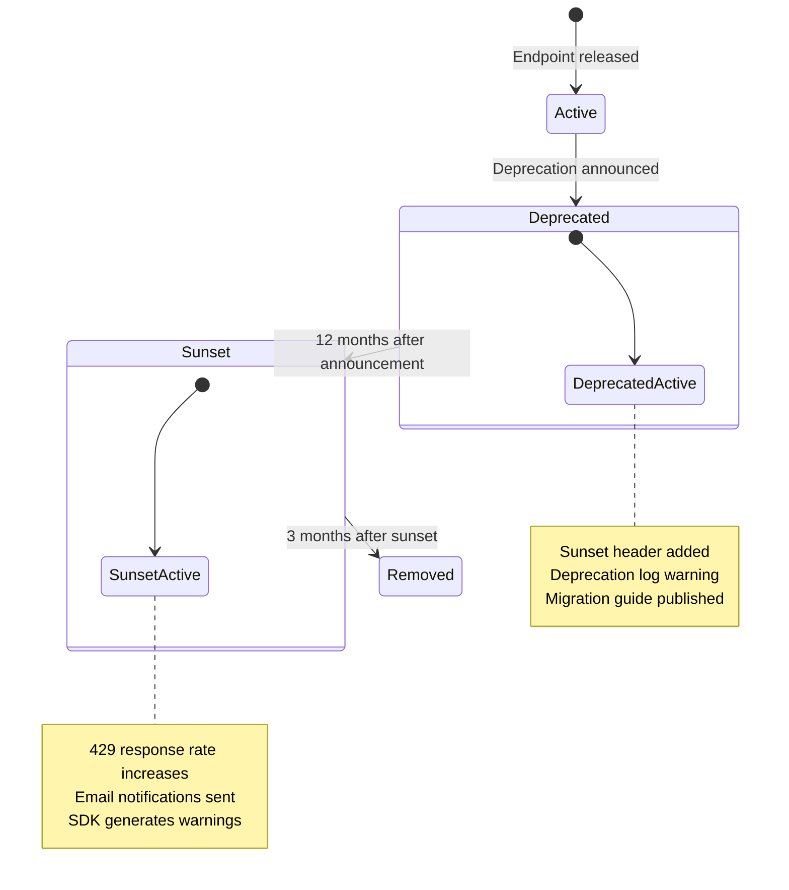
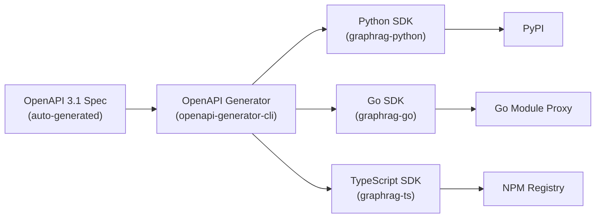
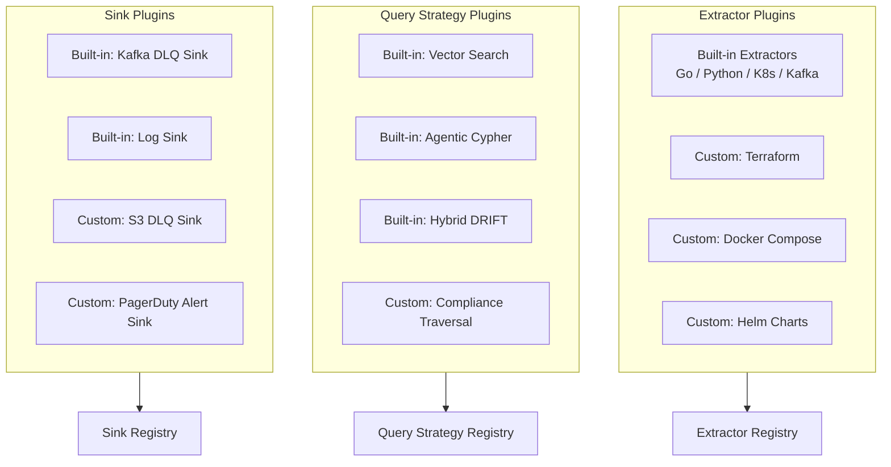

# RFC-005: API and Extensibility Model

> **Status:** Draft | **Authors:** Architecture Team | **Reviewers:** API Design Lead, SDK Team, Partner Engineering
> **Created:** 2026-02-23 | **Last Updated:** 2026-02-23

---

## Abstract

This RFC defines the API surface philosophy, versioning guarantees, backward compatibility model, SDK strategy, plugin architecture, and integration standards for graphrag-architect. It evolves the current four-endpoint REST API into a versioned, extensible API surface with auto-generated SDKs, a plugin system for custom extractors and query strategies, and webhook-based integration for CI/CD pipelines.

---

## 1. API Surface Philosophy

### 1.1 Design Principles

1. **Resources, Not Operations.** The API models graph entities and ingestion pipelines as resources, not RPC-style operations. `POST /v1/query` is the sole exception — queries are treated as ephemeral computations, not persisted resources.

2. **Envelope Responses.** Every API response wraps the payload in a standard envelope for consistency, pagination, and metadata:
   ```json
   {
     "data": { ... },
     "meta": {
       "request_id": "req-abc123",
       "api_version": "v1",
       "processing_time_ms": 142,
       "trace_id": "trace-def456"
     },
     "pagination": {
       "cursor": "eyJvZmZzZXQiOjIwfQ==",
       "has_more": true,
       "total_count": 1523
     }
   }
   ```

3. **Errors as First-Class Citizens.** Error responses follow RFC 7807 (Problem Details for HTTP APIs):
   ```json
   {
     "type": "https://api.graphrag.io/errors/query-timeout",
     "title": "Query Timeout",
     "status": 408,
     "detail": "Multi-hop traversal exceeded 30s budget. Reduce max_depth or narrow the query scope.",
     "instance": "/v1/query",
     "trace_id": "trace-def456",
     "extensions": {
       "query_complexity": "multi_hop",
       "timeout_ms": 30000,
       "estimated_cost": 150000
     }
   }
   ```

4. **Idempotency by Default.** All write operations accept an `Idempotency-Key` header. Repeated requests with the same key return the cached result without re-execution.

5. **Cursor-Based Pagination.** List endpoints use opaque cursor-based pagination (not offset-based) for consistent results under concurrent writes.

### 1.2 Current API Surface

| Endpoint | Method | Auth | Current Implementation |
|---|---|---|---|
| `/health` | GET | None | Health check (returns `{"status": "healthy"}`) |
| `/metrics` | GET | None | Prometheus metrics scraping endpoint |
| `/ingest` | POST | Optional (Bearer token) | Document ingestion via LangGraph DAG |
| `/query` | POST | Optional (Bearer token) | Query via LangGraph query DAG |

### 1.3 Target API Surface

| Endpoint | Method | Auth | Description |
|---|---|---|---|
| `/v1/health` | GET | None | Health check with component status |
| `/v1/health/ready` | GET | None | Readiness probe (Neo4j + Kafka connected) |
| `/v1/health/live` | GET | None | Liveness probe (process alive) |
| `/v1/ingest` | POST | Required | Submit documents for ingestion |
| `/v1/ingest/{job_id}` | GET | Required | Check ingestion job status |
| `/v1/query` | POST | Required | Execute a natural-language query |
| `/v1/graph/entities` | GET | Required | List graph entities (paginated, filtered) |
| `/v1/graph/entities/{id}` | GET | Required | Get a specific entity and its relationships |
| `/v1/graph/entities/{id}/neighbors` | GET | Required | Get N-hop neighbors of an entity |
| `/v1/graph/schema` | GET | Required | Get current graph schema (node types, relationship types, properties) |
| `/v1/graph/stats` | GET | Required | Graph statistics (node count, edge count, per-type counts) |
| `/v1/graph/cypher` | POST | Required (admin) | Execute raw Cypher (read-only, admin only, audit-logged) |
| `/v1/tenants/{tenant_id}` | GET | Required (admin) | Tenant metadata |
| `/v1/tenants/{tenant_id}/repositories` | GET | Required | List ingested repositories for a tenant |
| `/v1/admin/schema/versions` | GET | Required (admin) | List applied schema versions |
| `/v1/admin/schema/migrate` | POST | Required (admin) | Apply a schema migration |

---

## 2. Versioning Guarantees

### 2.1 Versioning Scheme

URL-path-based versioning: `/v1/`, `/v2/`, etc.

| Version Change | When to Increment |
|---|---|
| **Patch** (no URL change) | Bug fixes, performance improvements, new optional response fields |
| **Minor** (no URL change) | New endpoints, new optional request parameters, new enum values |
| **Major** (URL change: `/v1/` -> `/v2/`) | Breaking changes: removed fields, changed field types, changed endpoint semantics |

### 2.2 Compatibility Guarantees

| Guarantee | Duration |
|---|---|
| No breaking changes within a major version | Indefinite (until major version is sunset) |
| Deprecation notice before removal | 12 months minimum |
| Sunset header on deprecated endpoints | Added immediately upon deprecation |
| Two major versions supported simultaneously | Always (e.g., `/v1/` and `/v2/` both active during migration) |
| Migration guide published | At least 3 months before sunset |

### 2.3 Backward Compatibility Rules

**Allowed within a major version:**
- Add new optional request parameters (with defaults preserving existing behavior).
- Add new fields to response objects.
- Add new endpoints.
- Add new enum values (clients must handle unknown values gracefully).
- Increase numeric limits (e.g., raise `max_results` upper bound from 100 to 1000).

**Prohibited within a major version:**
- Remove or rename existing fields.
- Change field types (e.g., `string` to `integer`).
- Change endpoint URL paths.
- Change the semantics of existing parameters.
- Add new required request parameters.
- Reduce numeric limits.

### 2.4 Deprecation Lifecycle



---

## 3. OpenAPI Specification

### 3.1 Generation Strategy

FastAPI auto-generates OpenAPI 3.1 specifications from Pydantic models and route decorators. The current codebase does not publish this specification.

**Target:** Serve the OpenAPI spec at `/v1/openapi.json` and `/v1/docs` (Swagger UI).

### 3.2 Required Annotations

Every endpoint must include:
- `summary`: One-line description.
- `description`: Detailed behavior, including error conditions.
- `tags`: API group (e.g., `ingestion`, `query`, `graph`, `admin`).
- `responses`: All possible HTTP status codes with response models.
- `security`: Authentication requirements.

Example:

```python
@app.post(
    "/v1/query",
    response_model=APIEnvelope[QueryResponse],
    responses={
        401: {"model": ProblemDetail, "description": "Invalid or missing auth token"},
        408: {"model": ProblemDetail, "description": "Query timeout"},
        422: {"model": ProblemDetail, "description": "Invalid query parameters"},
        429: {"model": ProblemDetail, "description": "Rate limit exceeded"},
        503: {"model": ProblemDetail, "description": "Neo4j unavailable (circuit breaker open)"},
    },
    tags=["query"],
    summary="Execute a natural-language topology query",
)
async def query_endpoint(request: QueryRequest, principal: SecurityPrincipal = Depends(get_principal)):
    ...
```

### 3.3 Schema Publishing

The OpenAPI specification is:
1. Auto-generated on application startup.
2. Validated in CI against a snapshot (breaking change detection).
3. Published to a developer portal (e.g., Redocly, Stoplight).
4. Used as input for SDK generation (see Section 4).

---

## 4. SDK Strategy

### 4.1 SDK Generation Pipeline



### 4.2 SDK Design Principles

1. **Thin Clients.** SDKs handle HTTP transport, auth, retries, and serialization. Business logic stays in the server.

2. **Type-Safe.** Every request and response is represented as a typed model in the target language. No `dict[str, Any]` or `interface{}`.

3. **Async-First.** Python SDK uses `asyncio` (with sync wrappers). Go SDK uses goroutines. TypeScript SDK uses `async/await`.

4. **Configurable Retries.** Exponential backoff with jitter on 429 (rate limit) and 503 (circuit breaker). Configurable max retries and timeout.

5. **Observability.** SDKs inject `traceparent` headers for distributed tracing. User-Agent header includes SDK version for debugging.

### 4.3 SDK Usage Examples

**Python:**
```python
from graphrag import GraphRAGClient

client = GraphRAGClient(
    base_url="https://api.graphrag.io",
    token="your-auth-token",
    tenant_id="tenant-456",
)

response = await client.query("What is the blast radius of auth-service failure?")
print(response.answer)
print(response.sources)

job = await client.ingest(
    documents=[
        IngestDocument(file_path="services/auth/main.go", content=code, source_type="source_code")
    ]
)
status = await client.get_ingestion_status(job.job_id)
```

**Go:**
```go
client := graphrag.NewClient(
    graphrag.WithBaseURL("https://api.graphrag.io"),
    graphrag.WithToken("your-auth-token"),
    graphrag.WithTenantID("tenant-456"),
)

resp, err := client.Query(ctx, &graphrag.QueryRequest{
    Query:      "What services depend on users-db?",
    MaxResults: 20,
})
```

### 4.4 SDK Versioning

SDK versions follow SemVer independently of the API version:

| SDK Version | API Compatibility |
|---|---|
| `1.x.x` | Targets API `v1` |
| `2.x.x` | Targets API `v2` (when released) |
| `1.x.x` (maintained) | Continues to work with API `v1` during deprecation period |

---

## 5. Plugin Architecture

### 5.1 Extension Points

The platform exposes three extension axes, each with a stable typed interface:



### 5.2 Extractor Plugin Interface

Custom extractors process domain-specific artifact types and produce typed entities. The interfaces below are target-state designs; `BaseNode` and `BaseEdge` abstract classes would be introduced as parent types for the existing concrete models (`ServiceNode`, `CallsEdge`, etc.):

```python
from abc import ABC, abstractmethod
from typing import Sequence, Union
from orchestrator.app.extraction_models import (
    ServiceNode, DatabaseNode, KafkaTopicNode, K8sDeploymentNode,
    CallsEdge, ProducesEdge, ConsumesEdge, DeployedInEdge,
)

EntityType = Union[
    ServiceNode, DatabaseNode, KafkaTopicNode, K8sDeploymentNode,
    CallsEdge, ProducesEdge, ConsumesEdge, DeployedInEdge,
]

class EntityExtractor(ABC):
    @property
    @abstractmethod
    def supported_extensions(self) -> frozenset[str]:
        """File extensions this extractor handles (e.g., {'.tf', '.tfvars'})."""

    @property
    @abstractmethod
    def entity_types(self) -> frozenset[type]:
        """Node and edge types this extractor produces."""

    @abstractmethod
    async def extract(self, files: Sequence[dict[str, str]]) -> list[EntityType]:
        """Extract entities from a batch of files.

        Args:
            files: List of {"path": str, "content": str} dicts.

        Returns:
            List of typed entity instances.
        """

    @abstractmethod
    async def validate(self, entities: Sequence[EntityType]) -> list[str]:
        """Validate extracted entities. Return list of error messages (empty = valid)."""
```

**Registration (target-state — plugin registry to be implemented):**

```python
class TerraformExtractor(EntityExtractor):
    supported_extensions = frozenset({".tf", ".tfvars"})
    entity_types = frozenset()  # custom types registered at plugin load time

    async def extract(self, files):
        ...  # custom extraction logic

    async def validate(self, entities):
        ...  # custom validation logic
```

### 5.3 Query Strategy Plugin Interface

Custom query strategies add new routing paths to the LangGraph query DAG:

```python
from abc import ABC, abstractmethod
from orchestrator.app.query_models import QueryState

class QueryStrategy(ABC):
    @property
    @abstractmethod
    def name(self) -> str:
        """Strategy name (e.g., 'compliance_traversal')."""

    @property
    @abstractmethod
    def classification_patterns(self) -> list[str]:
        """Regex patterns that route queries to this strategy."""

    @abstractmethod
    async def retrieve(self, state: QueryState) -> QueryState:
        """Execute the retrieval strategy and update state with results."""
```

### 5.4 Sink Plugin Interface (Go)

Custom sinks handle failed messages in the Go ingestion pipeline:

```go
type DeadLetterSink interface {
    Send(ctx context.Context, result domain.Result) error
    Close() error
}
```

This interface already exists in the codebase (`workers/ingestion/internal/dlq/handler.go`). Plugins implement `DeadLetterSink` and register via the Go entry point configuration.

### 5.5 Plugin Discovery and Loading

**Phase 1 (Current):** Plugins are compiled into the application binary (Go) or imported as Python modules (Python). Registration via decorators or configuration.

**Phase 2:** Plugin discovery via a marketplace API. Plugins distributed as:
- Python: PyPI packages with entry points (`[graphrag.extractors]`).
- Go: Go modules with a standard interface.

**Phase 3:** Plugin sandboxing via WASM (WebAssembly). Untrusted plugins run in a sandboxed WASM runtime with limited system access.

---

## 6. Integration Standards

### 6.1 Webhook Callbacks

External systems can register webhooks to receive notifications on ingestion events:

```json
POST /v1/webhooks
{
  "url": "https://ci.example.com/graphrag-callback",
  "events": ["ingestion.completed", "ingestion.failed", "schema.migrated"],
  "secret": "webhook-signing-secret"
}
```

Webhook payloads are signed with HMAC-SHA256 using the registered secret:

```json
POST https://ci.example.com/graphrag-callback
X-GraphRAG-Signature: sha256=abc123...
Content-Type: application/json

{
  "event": "ingestion.completed",
  "timestamp": "2026-02-23T10:30:00Z",
  "data": {
    "job_id": "job-789",
    "tenant_id": "tenant-456",
    "entities_extracted": 42,
    "duration_ms": 3500
  }
}
```

### 6.2 CI/CD Integration Patterns

| Integration | Trigger | Endpoint | Use Case |
|---|---|---|---|
| GitHub Actions | `push` to main | `POST /v1/ingest` | Auto-ingest on code changes |
| ArgoCD Sync | Post-sync hook | `POST /v1/ingest` | Ingest K8s manifests after deployment |
| GitLab CI | Pipeline completion | `POST /v1/ingest` | Ingest after build/deploy |
| Terraform Cloud | Run completion | `POST /v1/ingest` | Ingest Terraform state (via plugin) |

### 6.3 Event Streaming (Phase 3)

For real-time topology updates, the platform publishes graph change events to a `graph-events` Kafka topic:

```json
{
  "event_type": "entity.created",
  "entity_type": "Service",
  "entity_id": "auth-service",
  "tenant_id": "tenant-456",
  "timestamp": "2026-02-23T10:30:00Z",
  "properties": {
    "name": "auth-service",
    "language": "go",
    "framework": "gin"
  }
}
```

Consumers can subscribe to this topic for real-time dashboard updates, downstream system synchronization, or audit trail ingestion.

---

## 7. Rate Limiting

### 7.1 Rate Limit Tiers

| Tier | Queries/min | Ingestion docs/min | Concurrent connections |
|---|---|---|---|
| **Community** | 60 | 100 | 5 |
| **Team** | 600 | 1,000 | 50 |
| **Enterprise** | 6,000 | 10,000 | 500 |
| **Platform** | Custom | Custom | Custom |

### 7.2 Implementation

Token bucket algorithm per tenant, enforced at the API Gateway:

- Each tenant has a bucket with capacity equal to their tier's per-minute limit.
- Tokens refill at a constant rate (limit / 60 per second).
- Exceeding the limit returns `429 Too Many Requests` with `Retry-After` header.
- Rate limit headers on every response: `X-RateLimit-Limit`, `X-RateLimit-Remaining`, `X-RateLimit-Reset`.

### 7.3 Burst Handling

Allow short bursts up to 2x the per-minute limit for ingestion (to accommodate CI/CD batch pushes), with a 10-second burst window. Sustained load above the limit triggers throttling.

---

## 8. Open Questions

1. **GraphQL vs. REST for Graph Queries:** The `GET /v1/graph/entities/{id}/neighbors` endpoint approximates graph traversal via REST. Should we expose a GraphQL endpoint for flexible graph queries, or is the REST API sufficient for the foreseeable use cases?

2. **Plugin Security Model:** How do we validate that third-party extractor plugins do not inject malicious entities or exfiltrate data? Schema validation catches structural issues, but semantic poisoning (e.g., injecting fake dependencies) requires domain-specific validation.

3. **SDK Maintenance Burden:** Auto-generated SDKs reduce initial effort but require ongoing maintenance (custom logic, retry policies, auth flows). Should we invest in hand-crafted SDKs for the primary language (Python) and auto-generate for secondary languages?

4. **API Gateway Selection:** Envoy (high performance, complex config) vs. Kong (plugin ecosystem, simpler) vs. AWS API Gateway (managed, vendor lock-in). What is the right tradeoff for our current team size?

5. **Webhook Reliability:** Webhooks are fire-and-forget with no guaranteed delivery. Should we implement a webhook retry queue, or recommend that consumers poll the ingestion status endpoint for reliable delivery?
