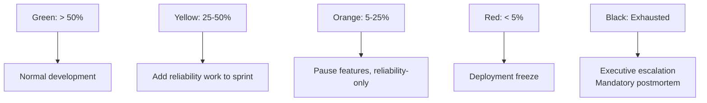
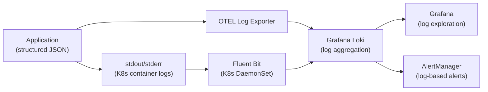
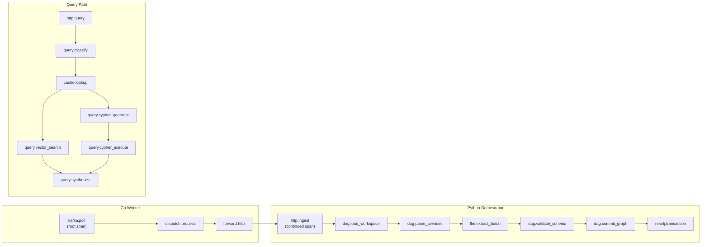
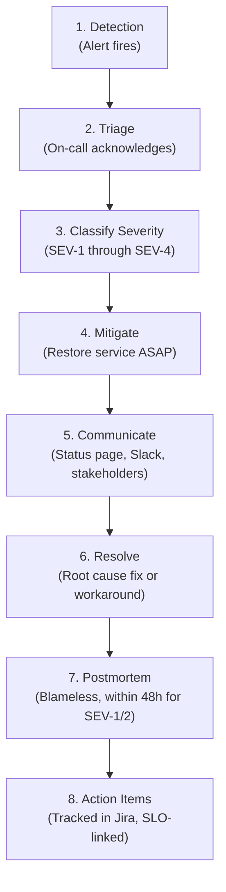

# RFC-006: Observability and Reliability

> **Status:** Draft | **Authors:** SRE Team, Architecture Team | **Reviewers:** SRE Lead, On-Call Engineers
> **Created:** 2026-02-23 | **Last Updated:** 2026-02-23

---

## Abstract

This RFC defines the observability strategy, SLO/SLI framework, error budget policy, logging taxonomy, metrics framework, tracing design, alerting strategy, incident response structure, and Grafana dashboard specifications for graphrag-architect. It is modeled on Google SRE best practices and the OpenTelemetry standard, extending the current observability foundation (4 histograms, 9 alert rules, distributed tracing) into a comprehensive production-grade reliability framework.

---

## 1. SLO/SLI Framework

### 1.1 SLI Definitions

Following Google SRE's standard SLI equation: `SLI = good events / valid events * 100%`

| SLI Name | Good Event | Valid Event | Measurement Point |
|---|---|---|---|
| **Ingestion Availability** | HTTP 2xx response to Go worker `/ingest` call | Any HTTP response (excluding client errors 4xx) | FastAPI middleware (response interceptor) |
| **Query Availability** | HTTP 2xx response to `/query` call | Any HTTP response (excluding 4xx) | FastAPI middleware |
| **Query Latency (Vector)** | Response delivered in < 500ms | Any successful vector query | OpenTelemetry span duration on `query.vector_retrieve` |
| **Query Latency (Graph)** | Response delivered in < 3s | Any successful graph/hybrid query | OpenTelemetry span duration on `query.cypher_retrieve` |
| **Ingestion Freshness** | Time from Kafka produce to Neo4j commit < 10s | Any successfully ingested document | End-to-end trace duration (Go consumer poll to Neo4j commit) |
| **DLQ Rate** | Messages NOT routed to DLQ | All messages consumed from `raw-documents` | Prometheus counter ratio: `1 - (dlq_routed / total_consumed)` |

### 1.2 SLO Targets

| SLI | SLO | Error Budget (30 days) | Error Budget (quarterly) |
|---|---|---|---|
| Ingestion Availability | 99.9% | 43.2 minutes | 2.16 hours |
| Query Availability | 99.95% | 21.6 minutes | 1.08 hours |
| Query Latency (Vector) p99 < 500ms | 99.5% of requests | 0.5% of queries may exceed | 0.5% |
| Query Latency (Graph) p99 < 3s | 99.0% of requests | 1% of queries may exceed | 1% |
| Ingestion Freshness p99 < 10s | 99.0% of documents | 1% may exceed | 1% |
| DLQ Rate | 99.99% (< 0.01% DLQ) | ~4.3 messages per 43,200 | ~13 per quarter |

### 1.3 SLO Burn Rate Alerting

Multi-window burn rate alerts detect SLO violations early without triggering on transient spikes:

| Alert | Burn Rate | Long Window | Short Window | Severity |
|---|---|---|---|---|
| Fast burn (immediate impact) | 14.4x | 1 hour | 5 minutes | P1 (PagerDuty) |
| Slow burn (degradation) | 6x | 6 hours | 30 minutes | P1 (PagerDuty) |
| Moderate burn (trend) | 3x | 1 day | 2 hours | P2 (Slack) |
| Low burn (chronic) | 1x | 3 days | 6 hours | P3 (Ticket) |

Prometheus recording rules for burn rate calculation:

```yaml
groups:
  - name: slo-burn-rate
    rules:
      - record: graphrag:query_availability:burn_rate_1h
        expr: |
          1 - (
            sum(rate(http_requests_total{endpoint="/v1/query", status=~"2.."}[1h]))
            /
            sum(rate(http_requests_total{endpoint="/v1/query", status!~"4.."}[1h]))
          ) / (1 - 0.9995)

      - record: graphrag:query_availability:burn_rate_5m
        expr: |
          1 - (
            sum(rate(http_requests_total{endpoint="/v1/query", status=~"2.."}[5m]))
            /
            sum(rate(http_requests_total{endpoint="/v1/query", status!~"4.."}[5m]))
          ) / (1 - 0.9995)
```

---

## 2. Error Budget Policy

### 2.1 Budget States

| Budget Remaining | State | Actions |
|---|---|---|
| > 50% | **Green** | Normal development velocity. Feature work prioritized. |
| 25% - 50% | **Yellow** | Reliability improvements added to sprint. No risky deployments. |
| 5% - 25% | **Orange** | Feature development paused. All engineering effort on reliability. No deployments without SRE approval. |
| < 5% | **Red** | Deployment freeze. Incident-level response. Postmortem required for every error. |
| Exhausted | **Black** | Extended deployment freeze until budget replenishes. Executive escalation. |

### 2.2 Budget Replenishment

Error budgets are calculated on a rolling 30-day window. Budget replenishes as older errors age out of the window. An exhausted budget takes approximately 4 days to return to Red state (assuming zero new errors).

### 2.3 Escalation Path



---

## 3. Logging Taxonomy

### 3.1 Log Format

All services emit structured JSON logs with a consistent schema:

```json
{
  "timestamp": "2026-02-23T10:30:00.123Z",
  "level": "ERROR",
  "logger": "orchestrator.query_engine",
  "service": "query-service",
  "instance": "query-service-abc12-xyz34",
  "tenant_id": "tenant-456",
  "trace_id": "4bf92f3577b34da6a3ce929d0e0e4736",
  "span_id": "00f067aa0ba902b7",
  "message": "Neo4j query timeout after 30s",
  "error": {
    "type": "neo4j.exceptions.ClientError",
    "message": "Query execution timed out",
    "stack_trace": "..."
  },
  "context": {
    "query_complexity": "multi_hop",
    "cypher_hash": "sha256:abc123",
    "estimated_cost": 150000,
    "duration_ms": 30000
  }
}
```

### 3.2 Log Levels

| Level | Usage | Example | Rate Target |
|---|---|---|---|
| `ERROR` | Operation failed, requires investigation | Neo4j timeout, LLM extraction failure, DLQ routing | < 0.1% of requests |
| `WARN` | Unexpected but handled condition | Circuit breaker half-open, retry triggered, ACL filter applied | < 1% of requests |
| `INFO` | Significant business event | Ingestion completed, query executed, schema migrated | Per-request (sampled in production) |
| `DEBUG` | Detailed diagnostic information | Cypher query text, LLM prompt/response, entity list | Disabled in production |

### 3.3 Sensitive Data Handling

| Data Type | Log Policy |
|---|---|
| Auth tokens | Never logged. Use token hash (first 8 chars of SHA-256). |
| Source code content | Never logged in full. Log file path and size only. |
| Cypher queries | Log hash only in production. Full query in debug mode. |
| LLM prompts/responses | Never logged in production. Sampled in staging. |
| User IP addresses | Log in audit events only. Hash in application logs. |
| Neo4j credentials | Never logged. |
| API keys | Never logged. |

### 3.4 Log Pipeline



---

## 4. Metrics Framework

### 4.1 Current Metrics

The codebase currently exports 4 histograms via `orchestrator/app/observability.py`:

| Metric | Type | Labels |
|---|---|---|
| `ingestion.duration_ms` | Histogram | (none) |
| `llm.extraction_duration_ms` | Histogram | (none) |
| `neo4j.transaction_duration_ms` | Histogram | (none) |
| `query.duration_ms` | Histogram | (none) |

Go worker metrics via `workers/ingestion/internal/metrics/`:

| Metric | Type | Labels |
|---|---|---|
| `ingestion_consumer_lag` | Gauge | `topic`, `partition` |
| `ingestion_batch_duration_seconds` | Histogram | (none) |
| `ingestion_dlq_routed_total` | Counter | (none) |
| `ingestion_dlq_sink_error_total` | Counter | (none) |
| `ingestion_jobs_processed_total` | Counter | `outcome` |

### 4.2 Target Metrics (RED + USE + Business)

**RED Metrics (Rate, Errors, Duration) — per endpoint:**

| Metric | Type | Labels |
|---|---|---|
| `http_requests_total` | Counter | `method`, `endpoint`, `status`, `tenant_id` |
| `http_request_duration_seconds` | Histogram | `method`, `endpoint`, `tenant_id` |
| `http_request_size_bytes` | Histogram | `method`, `endpoint` |
| `http_response_size_bytes` | Histogram | `method`, `endpoint` |

**USE Metrics (Utilization, Saturation, Errors) — per resource:**

| Metric | Type | Labels |
|---|---|---|
| `neo4j_connection_pool_active` | Gauge | `pool_name` |
| `neo4j_connection_pool_idle` | Gauge | `pool_name` |
| `neo4j_connection_pool_pending` | Gauge | `pool_name` |
| `neo4j_transaction_duration_seconds` | Histogram | `operation` (`read`, `write`) |
| `kafka_consumer_lag_messages` | Gauge | `topic`, `partition`, `consumer_group` |
| `kafka_consumer_poll_duration_seconds` | Histogram | `topic` |
| `llm_request_duration_seconds` | Histogram | `provider`, `model`, `operation` |
| `llm_request_tokens_total` | Counter | `provider`, `model`, `direction` (`input`, `output`) |
| `llm_request_errors_total` | Counter | `provider`, `model`, `error_type` |
| `circuit_breaker_state` | Gauge | `dependency` (0=closed, 1=half-open, 2=open) |
| `circuit_breaker_trips_total` | Counter | `dependency` |
| `cache_hits_total` | Counter | `cache_layer`, `tenant_id` |
| `cache_misses_total` | Counter | `cache_layer`, `tenant_id` |

**Business Metrics:**

| Metric | Type | Labels |
|---|---|---|
| `documents_ingested_total` | Counter | `source_type`, `tenant_id` |
| `entities_extracted_total` | Counter | `entity_type`, `tenant_id` |
| `graph_nodes_total` | Gauge | `label`, `tenant_id` |
| `graph_relationships_total` | Gauge | `type`, `tenant_id` |
| `queries_executed_total` | Counter | `complexity`, `retrieval_path`, `tenant_id` |
| `dlq_messages_total` | Counter | `topic`, `error_type`, `tenant_id` |
| `query_result_count` | Histogram | `complexity` |
| `embedding_generation_duration_seconds` | Histogram | `entity_type` |

### 4.3 Metric Cardinality Control

High-cardinality labels (e.g., `tenant_id`) can cause metric explosion. Controls:

- **Label allowlist:** Only predefined labels are accepted. Dynamic labels are rejected.
- **Tenant aggregation:** Dashboards default to tenant-aggregated views. Per-tenant drilldown available.
- **Cardinality limit:** Prometheus `metric_relabel_configs` to drop series exceeding cardinality threshold (10,000 series per metric).
- **Recording rules:** Pre-aggregate high-cardinality metrics into low-cardinality summaries.

---

## 5. Tracing Design

### 5.1 Current State

The codebase implements distributed tracing across Go and Python components:

- **Go:** Manual span creation via `go.opentelemetry.io/otel/trace`. Spans on Kafka consume, dispatch, process, and DLQ routing.
- **Python:** Manual spans on LangGraph node transitions and Neo4j transactions.
- **Cross-Service:** `traceparent` header propagated from Kafka message headers through HTTP to Python.
- **Sampling:** `RecordAllSampler` with `ErrorForceExportProcessor` for 100% error trace capture.
- **Export:** OTLP exporter to configurable backend (port 4317).

### 5.2 Target Tracing Architecture



### 5.3 Span Naming Convention

`{component}.{operation}` where:
- `component`: Service or module name (e.g., `kafka`, `dag`, `llm`, `neo4j`, `query`, `cache`)
- `operation`: Specific action (e.g., `poll`, `extract_batch`, `transaction`, `classify`)

### 5.4 Span Attributes

Every span includes:

| Attribute | Type | Example |
|---|---|---|
| `service.name` | string | `orchestrator`, `ingestion-worker` |
| `tenant.id` | string | `tenant-456` |
| `graphrag.query.complexity` | string | `multi_hop` |
| `graphrag.query.retrieval_path` | string | `cypher` |
| `graphrag.entities.count` | int | `42` |
| `graphrag.neo4j.operation` | string | `read`, `write` |
| `graphrag.llm.model` | string | `gemini-2.0-flash` |
| `graphrag.llm.tokens.input` | int | `1500` |
| `graphrag.llm.tokens.output` | int | `800` |

### 5.5 Sampling Strategy

| Environment | Head-Based Sample Rate | Tail-Based Override |
|---|---|---|
| Development | 100% | N/A |
| Staging | 100% | N/A |
| Production | 10% | 100% for errors, 100% for latency > SLO threshold |

Implemented via the existing `ErrorForceExportProcessor` (already in the codebase) extended with a latency-based override.

### 5.6 Baggage Propagation

Tenant context propagated via W3C Baggage header across all service boundaries:

```
baggage: tenant_id=tenant-456,plan_tier=enterprise,region=us-east-1
```

This enables downstream services to make tenant-aware decisions (rate limiting, routing, feature flags) without re-resolving the tenant from the auth token.

---

## 6. Alerting Strategy

### 6.1 Current Alerts

8 PrometheusRule alerts in `infrastructure/k8s/alerting.yaml`:

| Alert | Severity | Trigger |
|---|---|---|
| `HighDLQRate` | Critical | DLQ routing rate > 10/min for 1 min |
| `DLQSinkFailure` | Critical | DLQ sink error rate > 0 for 1 min |
| `HighConsumerLag` | Warning | Consumer lag > 1000 for 60s |
| `SlowBatchProcessing` | Warning | p99 batch duration > 2s for 5 min |
| `SlowQueryResponse` | Warning | p99 query duration > 3000ms for 5 min |
| `Neo4jDown` | Critical | Neo4j health check fails for 1 min |
| `KafkaBrokerDown` | Critical | Fewer than 2 Kafka brokers healthy for 2 min |
| `OrchestratorHighErrorRate` | Warning | HTTP 5xx rate > 5% for 5 min |

### 6.2 Target Alert Taxonomy

| Priority | Response Time | Channel | Examples |
|---|---|---|---|
| **P1 (Critical)** | 5 minutes | PagerDuty (phone + SMS) | Data loss risk, security breach, complete service outage |
| **P2 (High)** | 30 minutes | Slack (#alerts-high) | SLO burn rate > 6x, single component failure, degraded performance |
| **P3 (Medium)** | 4 hours | Slack (#alerts-medium) | Elevated error rate, consumer lag growing, disk usage > 80% |
| **P4 (Low)** | 24 hours | Jira ticket | Dependency CVE, certificate expiry < 30d, non-critical config drift |

### 6.3 Additional Alerts (Target State)

| Alert | Priority | Condition | Rationale |
|---|---|---|---|
| `SLOFastBurn` | P1 | Query availability burn rate > 14.4x (1h window) | Immediate SLO violation risk |
| `SLOSlowBurn` | P2 | Query availability burn rate > 6x (6h window) | Gradual degradation detection |
| `LLMProviderDown` | P2 | LLM request error rate > 50% for 5 min | Ingestion pipeline blocked |
| `CacheHitRateLow` | P3 | Cache hit rate < 20% for 30 min | Performance degradation signal |
| `CircuitBreakerOpen` | P2 | Any circuit breaker in OPEN state for > 2 min | Dependency failure not recovering |
| `TenantRateLimitExceeded` | P4 | Rate limit 429 responses > 100/min for a tenant | Tenant may need tier upgrade |
| `GraphSizeAnomaly` | P3 | Node count increases > 50% in 1 hour | Possible ingestion runaway |
| `EmbeddingPipelineLag` | P3 | Embedding backlog > 1000 entities for 30 min | Vector index staleness |
| `CertificateExpiry` | P4 | TLS certificate expires within 30 days | Prevent outage from cert expiry |
| `DiskUsageHigh` | P3 | Neo4j/Kafka disk usage > 80% | Capacity planning trigger |

### 6.4 Alert Fatigue Prevention

- **Inhibition rules:** Child alerts suppressed when parent fires (e.g., suppress `ConsumerLagHigh` when `KafkaBrokerDown` is active).
- **Grouping:** Related alerts grouped into a single notification (e.g., all Neo4j alerts grouped as "Neo4j cluster degradation").
- **Silence windows:** Scheduled maintenance windows suppress non-critical alerts.
- **Rate limiting:** Max 1 notification per alert per 15-minute window (re-fire on state change).

---

## 7. Incident Response Structure

### 7.1 Severity Levels

| Severity | Definition | Example | Response Time | Communication |
|---|---|---|---|---|
| **SEV-1** | Complete service outage or data loss | Neo4j cluster quorum loss, DLQ messages lost | 5 min | Page on-call, bridge call, status page update |
| **SEV-2** | Major feature degradation | Query latency > 10x normal, ingestion pipeline stopped | 15 min | Slack alert, status page update |
| **SEV-3** | Minor feature degradation | Single retrieval path failing, elevated error rate | 1 hour | Slack alert, Jira ticket |
| **SEV-4** | Cosmetic or edge case issue | Incorrect query classification for rare pattern | 24 hours | Jira ticket |

### 7.2 Incident Response Process



### 7.3 On-Call Rotation

- **Primary on-call:** Responds to all P1/P2 alerts. Rotates weekly.
- **Secondary on-call:** Backup for primary. Responds if primary doesn't acknowledge within 5 minutes.
- **Escalation:** If neither responds within 10 minutes, escalate to engineering manager.
- **Follow-the-sun:** With multi-region deployment, on-call rotates across time zones for 24/7 coverage.

### 7.4 Postmortem Template

```markdown
# Incident Postmortem: [Title]

**Date:** YYYY-MM-DD
**Duration:** X hours Y minutes
**Severity:** SEV-N
**Incident Commander:** [Name]
**Status:** [Complete / In Progress]

## Summary
[1-2 sentence description of what happened]

## Impact
- Users affected: [count / percentage]
- Duration of impact: [time]
- SLO budget consumed: [X minutes of Y budget]

## Timeline
| Time (UTC) | Event |
|---|---|
| HH:MM | [Event description] |

## Root Cause
[Detailed technical explanation]

## Contributing Factors
- [Factor 1]
- [Factor 2]

## Resolution
[What was done to resolve the incident]

## Action Items
| Action | Owner | Due Date | Status |
|---|---|---|---|
| [Action] | [Name] | YYYY-MM-DD | Open |

## Lessons Learned
- What went well:
- What could be improved:

## Detection Gap
- How long before the issue was detected?
- Could monitoring have caught it earlier?
```

---

## 8. Grafana Dashboard Specifications

### 8.1 Dashboard Inventory

| Dashboard | Audience | Refresh Rate | Key Panels |
|---|---|---|---|
| **Service Overview** | Engineering, Management | 30s | Request rate, error rate, latency percentiles, SLO burn rate |
| **Ingestion Pipeline** | SRE, Backend | 10s | Kafka consumer lag, batch duration, DLQ rate, entities extracted |
| **Query Performance** | SRE, Backend | 10s | Query latency by complexity, cache hit rate, Neo4j query time |
| **Neo4j Health** | SRE, DBA | 30s | Connection pool, transaction duration, page cache hits, disk usage |
| **Kafka Health** | SRE | 30s | Broker status, partition count, consumer group lag, throughput |
| **LLM Provider** | Backend | 60s | Request rate, latency, error rate, token usage, cost estimate |
| **Tenant Overview** | Product, Support | 60s | Per-tenant query volume, ingestion volume, error rate, graph size |
| **SLO Status** | Management, SRE | 5min | SLO compliance, error budget remaining, burn rate trend |

### 8.2 Service Overview Dashboard Panels

| Panel | Visualization | Query |
|---|---|---|
| Request Rate | Time series | `sum(rate(http_requests_total[5m])) by (endpoint)` |
| Error Rate | Time series | `sum(rate(http_requests_total{status=~"5.."}[5m])) / sum(rate(http_requests_total[5m]))` |
| Latency (p50/p95/p99) | Time series | `histogram_quantile(0.99, rate(http_request_duration_seconds_bucket[5m]))` |
| SLO Burn Rate | Gauge | `graphrag:query_availability:burn_rate_1h` |
| Error Budget Remaining | Gauge | `1 - (graphrag:query_errors:ratio_30d / (1 - 0.9995))` |
| Active Alerts | Table | AlertManager API |
| Component Health | Status map | Health check endpoints |

---

## 9. Open Questions

1. **Trace Storage Cost:** At 10% sampling in production with 10K queries/day, trace storage grows at ~1 GB/day. What is the cost-effective retention period for traces (7 days? 30 days?) and should we use Tempo (OSS) or Grafana Cloud Traces (managed)?

2. **Log Aggregation Scale:** At 1000x scale, log volume could reach 100 GB/day. Should we implement log sampling (1% of INFO logs in production) or is the operational visibility loss unacceptable?

3. **Metrics Cardinality with Multi-Tenancy:** Adding `tenant_id` as a label to all metrics multiplies cardinality by the number of tenants. At 1000 tenants, this could exceed Prometheus capacity. Should we use a separate metrics pipeline for per-tenant metrics (e.g., Grafana Mimir with long-term storage)?

4. **SLO Attribution:** When an SLO is breached, how do we attribute the breach to a specific component (Neo4j, LLM provider, Kafka, application code)? Should we implement per-dependency SLIs to enable attribution?

5. **Synthetic Monitoring:** Should we implement synthetic monitoring (canary queries running every 60s) to detect issues before real users are affected? What queries are representative of real usage?
