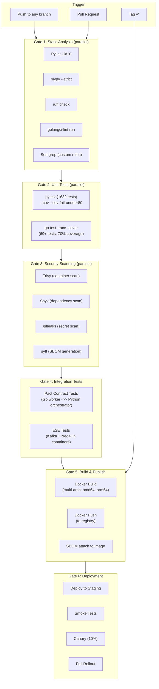
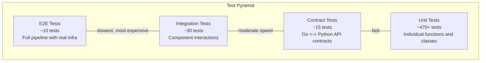

# RFC-007: Developer Experience and Platform Engineering

> **Status:** Draft | **Authors:** Platform Engineering Team | **Reviewers:** Engineering Manager, Tech Leads
> **Created:** 2026-02-23 | **Last Updated:** 2026-02-23

---

## Abstract

This RFC defines the local development workflow, CI/CD architecture, test strategy, code coverage targets, static analysis standards, release governance, and documentation maturity model for graphrag-architect. It evolves the current development workflow (Docker Compose + local processes, single GitHub Actions pipeline, Pylint-only static analysis) into a fully automated, multi-gate CI/CD pipeline with comprehensive testing, security scanning, and staged release governance.

---

## 1. Local Development Workflow

### 1.1 Current State

| Aspect | Current | Pain Points |
|---|---|---|
| Infrastructure | `docker-compose up` (Neo4j + Kafka) | Manual startup, no health check waiting |
| Python | `source .venv/bin/activate && uvicorn ...` | Manual venv management |
| Go | `go run cmd/main.go` | Manual configuration via env vars |
| Tests | `pytest orchestrator/tests/` / `go test ./...` | Separate commands, no watch mode |
| Config | Environment variables | Easy to misconfigure; no validation |

### 1.2 Target State: One-Command Development

**`make dev` — Full development environment in one command:**

```makefile
.PHONY: dev
dev: dev-infra dev-python dev-go

.PHONY: dev-infra
dev-infra:
	docker compose -f infrastructure/docker-compose.yml up -d
	@echo "Waiting for Neo4j..."
	@until docker compose exec neo4j cypher-shell -u neo4j -p password "RETURN 1" 2>/dev/null; do sleep 1; done
	@echo "Waiting for Kafka..."
	@until docker compose exec kafka kafka-topics.sh --bootstrap-server localhost:9092 --list 2>/dev/null; do sleep 1; done
	@echo "Infrastructure ready."

.PHONY: dev-python
dev-python:
	cd orchestrator && python -m venv .venv && source .venv/bin/activate && pip install -r requirements.txt -q
	cd orchestrator && uvicorn app.main:app --reload --port 8000

.PHONY: dev-go
dev-go:
	cd workers/ingestion && go run ./cmd/main.go

.PHONY: test
test: test-lint test-python test-go

.PHONY: test-lint
test-lint:
	cd orchestrator && source .venv/bin/activate && pylint orchestrator/

.PHONY: test-python
test-python:
	cd orchestrator && source .venv/bin/activate && python -m pytest tests/ -v

.PHONY: test-go
test-go:
	cd workers/ingestion && go test ./... -v -count=1 -race -timeout 30s
```

### 1.3 Dev Containers / Codespaces

For zero-setup onboarding, provide a `.devcontainer/devcontainer.json`:

```json
{
  "name": "graphrag-architect",
  "dockerComposeFile": ["../infrastructure/docker-compose.yml", "docker-compose.dev.yml"],
  "service": "devcontainer",
  "features": {
    "ghcr.io/devcontainers/features/python:1": {"version": "3.12"},
    "ghcr.io/devcontainers/features/go:1": {"version": "1.24"},
    "ghcr.io/devcontainers/features/docker-in-docker:2": {}
  },
  "postCreateCommand": "make setup",
  "forwardPorts": [8000, 7474, 7687, 9092]
}
```

### 1.4 Configuration Validation

Replace raw environment variables with a validated configuration loader:

```python
@dataclass(frozen=True)
class DevConfig:
    neo4j: Neo4jConfig
    extraction: ExtractionConfig
    auth: AuthConfig

    @classmethod
    def from_env(cls) -> "DevConfig":
        config = cls(
            neo4j=Neo4jConfig.from_env(),
            extraction=ExtractionConfig.from_env(),
            auth=AuthConfig.from_env(),
        )
        config.validate()
        return config

    def validate(self) -> None:
        if self.auth.require_tokens and not self.auth.token_secret:
            raise ConfigurationError("AUTH_TOKEN_SECRET required when REQUIRE_TOKENS=true")
```

---

## 2. CI/CD Architecture

### 2.1 Current Pipeline

Single GitHub Actions workflow (`.github/workflows/ci.yml`):
1. Python lint (Pylint)
2. Python tests (pytest)
3. Go tests (`go test`)
4. Docker build (both images, no push)

### 2.2 Target Pipeline Architecture



### 2.3 Gate Definitions

| Gate | Blocking | Timeout | Retry |
|---|---|---|---|
| **Gate 1: Static Analysis** | Yes (all must pass) | 5 min | No |
| **Gate 2: Unit Tests** | Yes (all must pass, coverage thresholds met) | 10 min | Once (for flaky tests) |
| **Gate 3: Security Scanning** | Yes for critical/high CVEs; warning for medium/low | 10 min | No |
| **Gate 4: Integration Tests** | Yes (on PRs to main) | 15 min | Once |
| **Gate 5: Build & Publish** | Yes (build must succeed) | 10 min | No |
| **Gate 6: Deployment** | Yes (smoke tests must pass before full rollout) | 20 min | Automatic rollback on failure |

### 2.4 Branch Strategy

| Branch | Purpose | CI Gates | Deploy Target |
|---|---|---|---|
| `main` | Production-ready code | All gates | Staging (auto), Production (manual) |
| `feature/*` | Feature development | Gates 1-3 | None |
| `release/v*` | Release candidate | All gates | Staging (auto), Production (approval) |
| `hotfix/*` | Production hotfixes | All gates (expedited) | Production (expedited approval) |

---

## 3. Test Strategy

### 3.1 Test Pyramid



### 3.2 Test Categories

#### Unit Tests (Current: 1,632 Python + 177 Go)

**Coverage targets:**
- Python: 80% line coverage, 100% on security-critical paths (`access_control.py`, `cypher_validator.py`, `circuit_breaker.py`)
- Go: 70% line coverage, 100% on DLQ handler and dispatcher

**Improvements needed:**
- Add `go test -race` to detect data races in concurrent code (currently not enabled).
- Replace `time.Sleep()` in Go tests with synchronization primitives (channel receives, WaitGroups).
- Add mypy strict mode to catch type errors not caught by Pylint.
- Add property-based tests (Hypothesis for Python) for Cypher validation and ACL filtering.

#### Contract Tests (New)

Pact-based consumer-driven contract tests ensure the Go workers and Python orchestrator agree on the HTTP API contract:

**Consumer (Go worker):**
```go
func TestForwardingProcessorContract(t *testing.T) {
    pact := dsl.Pact{Consumer: "ingestion-worker", Provider: "orchestrator"}
    pact.AddInteraction().
        UponReceiving("a valid ingest request").
        WithRequest(dsl.Request{
            Method: "POST",
            Path:   dsl.String("/ingest"),
            Body:   dsl.Like(validIngestPayload),
        }).
        WillRespondWith(dsl.Response{
            Status: 200,
            Body:   dsl.Like(successResponse),
        })
}
```

**Provider (Python orchestrator):**
```python
def test_pact_provider_ingest():
    verifier = Verifier(provider="orchestrator", provider_base_url="http://localhost:8000")
    verifier.verify_with_broker(broker_url="...", publish_version="...")
```

#### Integration Tests (Expand from current)

**Current:** `test_integration.py` tests HTTP -> DAG flow with mocked Neo4j.

**Target:** Integration tests with real infrastructure (containerized):

| Test | Infrastructure | Validates |
|---|---|---|
| Kafka -> Go worker -> Orchestrator | Testcontainers (Kafka + Neo4j) | Full ingestion pipeline, offset commits, DLQ routing |
| Query -> Neo4j (real) | Testcontainers (Neo4j) | Cypher execution, ACL filtering, vector search |
| Schema migration | Testcontainers (Neo4j) | Migration runner, constraint creation, idempotency |
| Circuit breaker | Mock Neo4j (controlled failures) | State transitions, recovery behavior |

#### E2E Tests (New)

Full pipeline tests with real Kafka, Neo4j, and LLM (stubbed):

| Test | Scenario | Assertion |
|---|---|---|
| Happy path ingestion | Produce to Kafka -> consume -> extract -> commit | Graph contains expected entities |
| DLQ routing | Produce malformed message -> consume -> fail -> DLQ | DLQ topic contains message with error metadata |
| Query after ingestion | Ingest -> query "What services exist?" | Response contains ingested services |
| ACL enforcement | Ingest with team_owner -> query as different team | Response excludes restricted entities |

#### Performance Tests (New)

| Test | Tool | Runs In CI | Threshold |
|---|---|---|---|
| Go benchmarks | `go test -bench` | Yes (Gate 2) | No regression > 10% |
| Neo4j query benchmarks | Custom Python script | Weekly scheduled | No regression > 20% |
| k6 load tests | k6 | Pre-release (Gate 6) | SLO thresholds met |

#### Security Tests (New)

| Test | Tool | Runs In CI | Gate |
|---|---|---|---|
| SAST | Semgrep (custom rules for Cypher injection) | Yes | Gate 1 |
| Dependency scan | Snyk / Trivy | Yes | Gate 3 |
| Container scan | Trivy | Yes | Gate 3 |
| Secret detection | gitleaks | Yes | Gate 3 |
| DAST | OWASP ZAP (against staging) | Pre-release | Gate 6 |

---

## 4. Static Analysis Standards

### 4.1 Python

| Tool | Configuration | Enforcement |
|---|---|---|
| **Pylint** | `pyproject.toml` (current: 10/10 score required) | Gate 1 (blocking) |
| **mypy** | `--strict` mode, `pyproject.toml` config | Gate 1 (blocking) |
| **ruff** | Replace Pylint for speed where overlap exists; complement with rules Pylint misses | Gate 1 (blocking) |
| **Semgrep** | Custom rules for Cypher string interpolation, secret patterns | Gate 1 (blocking) |

**mypy configuration (to add to `pyproject.toml`):**

```toml
[tool.mypy]
python_version = "3.12"
strict = true
warn_return_any = true
warn_unused_configs = true
disallow_untyped_defs = true
disallow_any_generics = true
check_untyped_defs = true
no_implicit_optional = true

[[tool.mypy.overrides]]
module = "tests.*"
disallow_untyped_defs = false
```

### 4.2 Go

| Tool | Configuration | Enforcement |
|---|---|---|
| **go vet** | Standard (already run by `go test`) | Gate 2 |
| **golangci-lint** | `.golangci.yml` with curated linter set | Gate 1 (blocking) |
| **go test -race** | Race detector on all test runs | Gate 2 (blocking) |

**golangci-lint configuration (`.golangci.yml`):**

```yaml
linters:
  enable:
    - errcheck
    - govet
    - staticcheck
    - unused
    - gosimple
    - ineffassign
    - typecheck
    - gocritic
    - gofmt
    - goimports
    - misspell
    - prealloc
    - unconvert
    - unparam
    - bodyclose
    - contextcheck
    - nilerr
    - wastedassign

linters-settings:
  errcheck:
    check-type-assertions: true
  gocritic:
    enabled-tags:
      - diagnostic
      - performance
      - style

run:
  timeout: 5m
  tests: true
```

### 4.3 Infrastructure

| Tool | Target | Enforcement |
|---|---|---|
| **kubeval** | K8s manifests | Gate 1 |
| **conftest** | OPA policies on K8s YAML (security contexts, resource limits) | Gate 1 |
| **hadolint** | Dockerfiles | Gate 1 |

---

## 5. Release Governance

### 5.1 Versioning

| Component | Scheme | Example |
|---|---|---|
| API | URL-path versioning | `/v1/`, `/v2/` |
| Platform (Python + Go) | SemVer | `1.2.3` |
| Docker images | SemVer + git SHA | `1.2.3`, `1.2.3-abc1234` |
| Graph schema | Sequential integer | `V001`, `V002` |
| SDKs | SemVer (independent) | `1.0.0` (may differ from platform version) |
| Infrastructure configs | CalVer | `2026.02.23` |

### 5.2 Release Process

```mermaid
flowchart LR
    Feature["Feature Branch<br/>Development"] --> PR["Pull Request<br/>Code Review"]
    PR --> Main["Merge to main<br/>Gates 1-4 pass"]
    Main --> RC["Release Candidate<br/>Tag: v1.2.3-rc.1"]
    RC --> Staging["Deploy to Staging<br/>Smoke + Load Tests"]
    Staging --> Approval["Release Approval<br/>(Tech Lead + SRE)"]
    Approval --> Canary["Canary (10%)<br/>Monitor for 1 hour"]
    Canary --> Gradual["Gradual Rollout<br/>10% -> 50% -> 100%"]
    Gradual --> GA["General Availability<br/>Tag: v1.2.3"]
```



### 5.3 Rollback Procedure

| Trigger | Detection | Action | RTO |
|---|---|---|---|
| P99 latency > 2x baseline | Automatic (Prometheus alert) | Automatic rollback to previous version | < 5 min |
| Error rate > 5% | Automatic (Prometheus alert) | Automatic rollback | < 5 min |
| Data corruption | Manual (investigation) | Manual rollback + data restore from backup | < 30 min |
| Security vulnerability | Manual (CVE advisory) | Expedited hotfix release | < 4 hours |

### 5.4 Changelog Generation

Automated from conventional commit messages:

| Prefix | Section | Example |
|---|---|---|
| `feat:` | Features | `feat: add vector embedding pipeline` |
| `fix:` | Bug Fixes | `fix: resolve ACL injection bypass` |
| `perf:` | Performance | `perf: add Redis query caching` |
| `security:` | Security | `security: implement fail-closed auth` |
| `breaking:` | Breaking Changes | `breaking: rename /ingest to /v1/ingest` |

---

## 6. Documentation Maturity Model

### 6.1 Documentation Categories

| Category | Current State | Target State | Owner |
|---|---|---|---|
| **API Reference** | Not generated | Auto-generated from OpenAPI spec (Redocly) | Backend team |
| **Architecture Docs** | 2 docs in `docs/architecture/` | Complete system design + ADRs | Architecture team |
| **PRD/RFC** | 2 docs in `docs/prd/` | Full RFC suite (this document series) | Product + Architecture |
| **Operational Runbooks** | None | Per-component runbooks for incident response | SRE team |
| **Developer Guide** | README.md | Comprehensive setup guide, contribution guide, coding standards | Platform team |
| **User Documentation** | None | API usage guide, SDK tutorials, example queries | DevRel |

### 6.2 Architecture Decision Records (ADRs)

Every significant technical decision is recorded as an ADR in `docs/adr/`:

```markdown
# ADR-001: Use HMAC-SHA256 for Token Verification

**Status:** Accepted
**Date:** 2026-02-22
**Deciders:** Architecture Team

## Context
We need to verify auth tokens for API endpoints. Options: JWT, HMAC, OAuth2.

## Decision
Use HMAC-SHA256 with custom claims format.

## Consequences
- Pro: Zero additional dependencies.
- Pro: Simple implementation, constant-time comparison.
- Con: No standard library support for claims parsing.
- Con: Cannot be verified by third parties (symmetric key).
```

### 6.3 Runbook Template

```markdown
# Runbook: [Component] [Scenario]

## Overview
- **Service:** [service name]
- **Severity:** [typical severity]
- **On-call team:** [team]

## Symptoms
- [Observable symptom 1]
- [Observable symptom 2]

## Diagnosis
1. Check [dashboard link]
2. Run `kubectl logs -l app=[service] -n graphrag --tail=100`
3. Check [specific metric or log pattern]

## Resolution
1. [Step-by-step resolution]
2. [Escalation if resolution fails]

## Prevention
- [Monitoring improvement]
- [Configuration change]
```

### 6.4 Documentation Freshness

- **API reference:** Auto-generated on every release (always fresh).
- **Architecture docs:** Reviewed quarterly. Staleness detected by doc-sync skill.
- **Runbooks:** Validated during incident response. Updated after every postmortem.
- **ADRs:** Append-only (never stale by design; superseded decisions reference the new ADR).

---

## 7. Developer Productivity Metrics

| Metric | Current | Target | Measurement |
|---|---|---|---|
| **Time to first commit** (new developer) | Unknown | < 2 hours | Onboarding survey |
| **CI pipeline duration** | ~5 min (estimated) | < 10 min (all gates) | GitHub Actions duration |
| **PR review turnaround** | Unknown | < 4 hours (P50) | GitHub PR metrics |
| **Test suite runtime (Python)** | ~30s (estimated) | < 60s (with integration tests) | `pytest --durations=10` |
| **Test suite runtime (Go)** | ~10s (estimated) | < 30s (with race detector) | `go test` output |
| **Deploy to staging** | Manual | < 5 min (automated) | CI/CD pipeline timing |
| **Deploy to production** | Manual | < 30 min (canary + gradual) | Deployment pipeline timing |
| **MTTR (Mean Time to Recovery)** | Unknown | < 15 min (SEV-1/2) | Incident tracking |

---

## 8. Open Questions

1. **Monorepo Tooling:** The current repository is a monorepo (Python + Go + infrastructure). Should we adopt a monorepo build tool (Bazel, Nx, Turborepo) for better caching and dependency management, or is Make + CI sufficient?

2. **Test Data Management:** Integration and E2E tests need representative graph data. Should we generate synthetic data programmatically, or maintain a curated test dataset in the repository?

3. **CI Caching:** Docker layer caching, Go module caching, and pip caching significantly reduce CI times. What is the optimal caching strategy for GitHub Actions with a monorepo?

4. **Feature Flags:** Should we adopt a feature flag system (LaunchDarkly, Unleash, or custom) for gradual rollout of new features, or is the current branch-based deployment sufficient?

5. **Documentation Hosting:** Should documentation be hosted on a dedicated site (GitBook, Docusaurus, ReadTheDocs) or served from the repository (GitHub Pages)?
