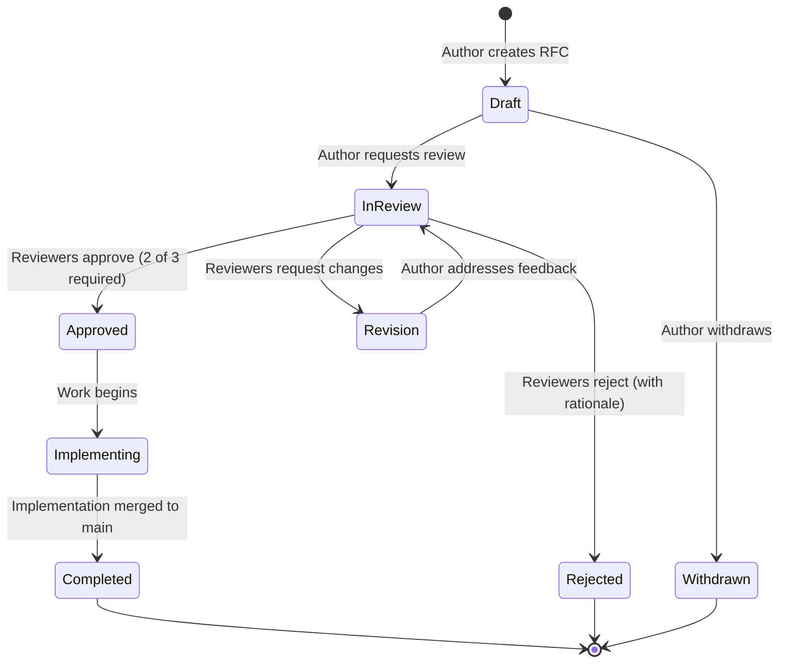
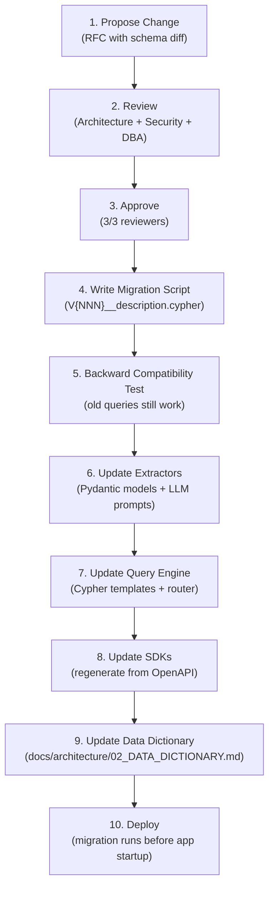

# RFC-008: Governance Model

> **Status:** Draft | **Authors:** Architecture Team, Engineering Leadership | **Reviewers:** CTO, Engineering Managers
> **Created:** 2026-02-23 | **Last Updated:** 2026-02-23

---

## Abstract

This RFC defines the governance model for graphrag-architect: the RFC process for proposing changes, versioning strategy across all components, deprecation policy, contribution guidelines, graph schema change management, and the long-term open-source governance evolution plan. It establishes the decision-making framework that ensures architectural coherence as the project scales from a small team to a broader engineering organization.

---

## 1. RFC Process

### 1.1 When an RFC is Required

An RFC is required for any change that:

- Introduces a new service or component.
- Modifies the graph schema (new node types, relationship types, or property changes).
- Changes the API contract (new endpoints, breaking changes, deprecations).
- Introduces a new external dependency (database, message broker, LLM provider).
- Modifies security boundaries or access control logic.
- Changes data flow patterns (ingestion pipeline, query routing).
- Affects more than 3 services or components.
- Has production cost implications > $1,000/month.

An RFC is NOT required for:

- Bug fixes.
- Performance optimizations within existing architecture.
- Adding tests.
- Documentation updates.
- Dependency version bumps (unless major version with breaking changes).
- Configuration changes within existing parameters.

### 1.2 RFC Lifecycle



### 1.3 RFC Template

All RFCs live in `docs/rfc/` and follow this template:

```markdown
# RFC-NNN: [Title]

> **Status:** Draft | In Review | Approved | Implementing | Completed | Rejected | Withdrawn
> **Authors:** [Names]
> **Reviewers:** [Names] (minimum 3, at least 1 from each affected team)
> **Created:** YYYY-MM-DD
> **Last Updated:** YYYY-MM-DD
> **Supersedes:** [RFC-NNN, if applicable]

## Abstract
[2-3 sentence summary of the proposal]

## Motivation
[Why is this change needed? What problem does it solve?]

## Design
[Detailed technical design. Diagrams encouraged.]

## Alternatives Considered
[At least 2 alternatives with explicit tradeoff analysis]

## Security Implications
[How does this change affect trust boundaries, data classification, or access control?]

## Performance Implications
[Expected impact on latency, throughput, and resource usage]

## Migration Plan
[How will existing systems transition to the new design?]

## Open Questions
[Unresolved decisions that need input from reviewers]

## Implementation Plan
[Ordered list of tasks with estimated effort]
```

### 1.4 Review Requirements

| RFC Scope | Required Reviewers | Approval Threshold |
|---|---|---|
| Single component | 2 reviewers (1 from owning team, 1 from adjacent team) | 2/2 approve |
| Cross-component | 3 reviewers (1 per affected team) | 2/3 approve |
| Architecture (new service, schema change) | 3 reviewers + Architecture Lead sign-off | 3/3 approve |
| Security | 3 reviewers + Security Engineer sign-off | 3/3 approve |

### 1.5 RFC Numbering

Sequential integers: RFC-001, RFC-002, etc. The current RFC suite occupies RFC-001 through RFC-009. New RFCs start at RFC-010.

---

## 2. Versioning Strategy

### 2.1 Component Versioning Matrix

| Component | Scheme | Format | Release Cadence | Examples |
|---|---|---|---|---|
| **REST API** | URL-path | `/v1/`, `/v2/` | Major: annual (at most) | `v1` (current), `v2` (future) |
| **Platform Release** | SemVer | `MAJOR.MINOR.PATCH` | Minor: monthly, Patch: as-needed | `1.0.0`, `1.1.0`, `1.1.1` |
| **Docker Images** | SemVer + SHA | `MAJOR.MINOR.PATCH`, `MAJOR.MINOR.PATCH-SHA` | On every release | `1.2.3`, `1.2.3-abc1234` |
| **Graph Schema** | Sequential | `V{NNN}` | On schema change | `V001`, `V002`, `V003` |
| **Python SDK** | SemVer (independent) | `MAJOR.MINOR.PATCH` | Minor: monthly | `1.0.0`, `1.1.0` |
| **Go SDK** | SemVer (independent) | `vMAJOR.MINOR.PATCH` | Minor: monthly | `v1.0.0`, `v1.1.0` |
| **TypeScript SDK** | SemVer (independent) | `MAJOR.MINOR.PATCH` | Minor: monthly | `1.0.0`, `1.1.0` |
| **Infrastructure Configs** | CalVer | `YYYY.MM.DD` | On change | `2026.02.23` |
| **Helm Chart** | SemVer | `MAJOR.MINOR.PATCH` | On infrastructure change | `1.0.0` |

### 2.2 SemVer Rules

**MAJOR** version increment:
- Removing an API endpoint or response field.
- Changing an existing field type.
- Changing endpoint semantics.
- Incompatible graph schema change.

**MINOR** version increment:
- Adding a new API endpoint.
- Adding optional request parameters.
- Adding response fields.
- New graph node or relationship type.
- New plugin interface.

**PATCH** version increment:
- Bug fixes.
- Performance improvements.
- Documentation corrections.
- Security patches (non-breaking).

### 2.3 Version Compatibility Matrix

| Platform Version | API Version | Min SDK Version (Python) | Min SDK Version (Go) | Schema Version |
|---|---|---|---|---|
| 1.0.x | v1 | 1.0.0 | v1.0.0 | V001-V005 |
| 1.1.x | v1 | 1.0.0 | v1.0.0 | V001-V008 |
| 2.0.x | v1, v2 | 1.0.0 (v1), 2.0.0 (v2) | v1.0.0 (v1), v2.0.0 (v2) | V001-V012 |

---

## 3. Deprecation Policy

### 3.1 Deprecation Timeline

| Component | Notice Period | Sunset Period | Total Lifecycle |
|---|---|---|---|
| API version (`/v1/`) | 12 months | 3 months | 15 months |
| API endpoint within a version | 6 months | 3 months | 9 months |
| SDK method | 6 months | 3 months | 9 months |
| Graph schema property | 2 schema versions | 1 schema version | 3 schema versions |
| Plugin interface | 6 months | 3 months | 9 months |
| Configuration parameter | 3 months | 1 month | 4 months |

### 3.2 Deprecation Communication

When a component is deprecated:

1. **API responses** include `Sunset` and `Deprecation` headers:
   ```
   Deprecation: true
   Sunset: Sat, 23 Feb 2027 00:00:00 GMT
   Link: <https://docs.graphrag.io/migration/v1-to-v2>; rel="successor-version"
   ```

2. **SDK methods** emit deprecation warnings:
   ```python
   @deprecated("Use client.query_v2() instead. Removal: 2027-02-23")
   def query(self, text: str) -> QueryResponse:
       ...
   ```

3. **Changelog** includes a "Deprecations" section.

4. **Documentation** marks deprecated features with a banner and links to the migration guide.

5. **Email notification** sent to all API key holders 12, 6, and 1 month before sunset.

### 3.3 Migration Guides

Every deprecation includes a migration guide with:

- Side-by-side comparison of old and new API/method.
- Code examples in each supported language.
- Automated migration script (where possible).
- Known breaking changes and workarounds.
- Support contact for migration assistance.

---

## 4. Contribution Guidelines

### 4.1 Code Style

**Python:**
- Follow existing codebase conventions (no inline comments, self-documenting names).
- All functions must have type hints (enforced by mypy strict mode).
- Pylint score must remain 10/10.
- No `# pylint: disable` comments without RFC approval.
- Pydantic models for all data contracts.
- Frozen dataclasses for configuration.

**Go:**
- Idiomatic Go (gofmt, govet, golangci-lint).
- Interfaces for all external dependencies (testability).
- Functional options for constructors (`WithXxx` pattern).
- Error wrapping with `fmt.Errorf("context: %w", err)`.
- Context propagation on all external calls.
- No global mutable state.

**Infrastructure:**
- All Kubernetes manifests validated by kubeval.
- Security contexts required (non-root, read-only filesystem).
- Resource requests and limits on every container.

### 4.2 Commit Message Format

Follow Conventional Commits:

```
<type>(<scope>): <subject>

[optional body]

[optional footer(s)]
```

| Type | Scope | Example |
|---|---|---|
| `feat` | Component | `feat(query-engine): add hybrid DRIFT retrieval path` |
| `fix` | Component | `fix(access-control): resolve ACL injection bypass` |
| `perf` | Component | `perf(neo4j-client): add write batching with UNWIND` |
| `test` | Component | `test(dispatcher): add race condition tests` |
| `docs` | Area | `docs(rfc): add scalability plan` |
| `ci` | Pipeline | `ci: add mypy strict mode to Gate 1` |
| `refactor` | Component | `refactor(config): consolidate environment variable loading` |
| `security` | Component | `security(auth): implement fail-closed token verification` |

### 4.3 Pull Request Requirements

Every PR must:

1. Pass all CI gates (lint, test, security scan).
2. Include tests for new functionality (TDD: tests written first).
3. Update documentation if behavior changes.
4. Have at least 1 approval from a code owner.
5. Have no unresolved review comments.
6. Squash commits into a single conventional commit on merge.

### 4.4 Code Ownership

`CODEOWNERS` file:

```
# Default: Architecture team
* @graphrag/architecture

# Python orchestrator
orchestrator/ @graphrag/backend-python

# Go workers
workers/ @graphrag/backend-go

# Infrastructure
infrastructure/ @graphrag/sre

# Security-critical paths
orchestrator/app/access_control.py @graphrag/security @graphrag/backend-python
orchestrator/app/cypher_validator.py @graphrag/security @graphrag/backend-python

# Documentation
docs/ @graphrag/architecture @graphrag/product

# CI/CD
.github/ @graphrag/sre @graphrag/architecture
```

---

## 5. Graph Schema Change Process

Graph schema changes carry high risk because they affect:
- Entity extraction (LLM prompts and Pydantic models).
- Neo4j constraints and indexes.
- Query engine (Cypher templates, routing logic).
- Access control (ACL properties).
- SDKs (entity types exposed to clients).
- Documentation (data dictionary).

### 5.1 Schema Change Workflow



### 5.2 Migration Script Format

Migration scripts live in `migrations/` with naming convention:

```
migrations/
  V001__initial_schema.cypher
  V002__add_service_embedding.cypher
  V003__add_tenant_id_constraints.cypher
```

Each script is idempotent (uses `IF NOT EXISTS`):

```cypher
-- V003: Add tenant_id constraints
-- Backward compatible: adds NOT NULL constraint (requires backfill first)

-- Step 1: Backfill missing tenant_id with default
MATCH (s:Service) WHERE s.tenant_id IS NULL
SET s.tenant_id = 'default';

-- Step 2: Add constraint
CREATE CONSTRAINT service_tenant_required IF NOT EXISTS
FOR (s:Service) REQUIRE s.tenant_id IS NOT NULL;
```

### 5.3 Backward Compatibility Rules

| Change | Backward Compatible | Requires |
|---|---|---|
| Add optional property to existing node | Yes | Migration script only |
| Add NOT NULL constraint | No | Backfill + 2-phase deploy (backfill first, constraint second) |
| Add new node label | Yes | Migration + extractor update |
| Add new relationship type | Yes | Migration + query engine update |
| Remove property | No | 2-version deprecation + migration + extractor/query update |
| Rename property | No | 2-version deprecation (add new, deprecate old, remove old) |
| Change property type | No | 2-version migration (add new, backfill, deprecate old, remove old) |

---

## 6. Open-Source Governance Evolution

### 6.1 Current State: Closed Source

The repository is currently a private development project with automated agent-driven development (TDD cycle, audit, PR review via cursor skills).

### 6.2 Phase 1: Internal Open Source (Month 3-6)

- Open the repository to the broader engineering organization.
- Establish `CODEOWNERS` for review routing.
- Enable branch protection rules (require reviews, status checks).
- Publish internal contribution guide.

### 6.3 Phase 2: Public Open Source (Month 9-12)

| Decision | Choice | Rationale |
|---|---|---|
| **License** | Apache 2.0 | Permissive, enterprise-friendly, patent protection. Preferred by CNCF. |
| **CLA** | Developer Certificate of Origin (DCO) | Lightweight, sign-off-based (no legal paperwork). Used by Linux kernel, Kubernetes. |
| **Governance** | Benevolent Dictator For Life (BDFL) transitioning to Technical Steering Committee (TSC) | BDFL for early decisions; TSC when contributor base > 10 active. |

### 6.4 Phase 3: Foundation Submission (Year 2-3)

- Submit to CNCF as a sandbox project.
- Establish Technical Steering Committee (TSC) with 5 members.
- Create Special Interest Groups (SIGs): SIG-Security, SIG-Scaling, SIG-Plugins.
- Annual contributor summit.
- Quarterly release cadence.

### 6.5 Security Disclosure Policy

```markdown
# Security Policy

## Supported Versions
| Version | Supported |
|---|---|
| 1.x.x | Yes |
| < 1.0.0 | No |

## Reporting a Vulnerability
Email: security@graphrag.io
PGP Key: [link to public key]

We will:
- Acknowledge receipt within 24 hours.
- Provide an initial assessment within 72 hours.
- Issue a patch within 30 days (90 days for complex issues).
- Credit the reporter in the security advisory (unless they prefer anonymity).

DO NOT open a public GitHub issue for security vulnerabilities.
```

---

## 7. Decision-Making Framework

### 7.1 Decision Authority Matrix

| Decision Type | Authority | Process |
|---|---|---|
| Bug fix | Individual engineer | PR review (1 approval) |
| Feature within existing architecture | Team lead | PR review (1 approval from CODEOWNER) |
| New component or service | Architecture Lead | RFC (2/3 approval) |
| Graph schema change | Architecture Lead + DBA | RFC (3/3 approval) |
| Security boundary change | Security Engineer + Architecture Lead | RFC (3/3 approval + security sign-off) |
| API breaking change | CTO | RFC (3/3 approval + CTO sign-off) |
| Technology choice (new dependency) | Architecture Lead | RFC (2/3 approval) |
| Open-source licensing | CTO + Legal | RFC + Legal review |

### 7.2 Conflict Resolution

1. Technical disagreements resolved by RFC discussion (documented tradeoffs).
2. If no consensus after 2 review rounds, Architecture Lead makes the final call.
3. Architecture Lead decisions can be escalated to CTO (rare, reserved for fundamental disagreements).
4. All decisions recorded as ADRs for future reference.

---

## 8. Open Questions

1. **RFC Tooling:** Should we use a dedicated RFC management tool (e.g., GitHub Discussions, a custom bot that tracks RFC status) or is the current `docs/rfc/` directory sufficient?

2. **Schema Change Automation:** Can schema migrations be fully automated (run on pod startup via init container), or should they require manual approval for production deployments?

3. **Open-Source Timing:** Is Month 9-12 the right timing for public open-source release, or should we wait until after SOC2 certification to avoid exposing pre-hardening code to public scrutiny?

4. **Contributor Incentives:** For open-source contributors, should we offer a bounty program for security vulnerabilities and high-impact features?

5. **Trademark Policy:** If graphrag-architect becomes a CNCF project, how do we protect the trademark while allowing community use?
