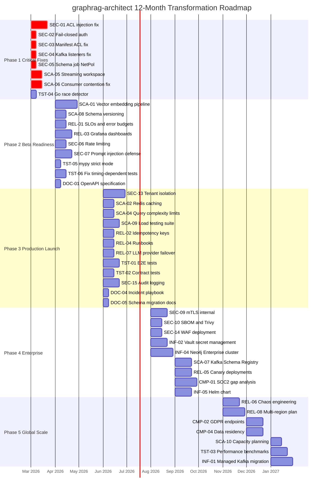

# RFC-009: Production Readiness Checklist and Transformation Roadmap

> **Status:** Draft | **Authors:** Architecture Team, SRE Team | **Reviewers:** CTO, Engineering Leadership, Security
> **Created:** 2026-02-23 | **Last Updated:** 2026-02-23

---

## Abstract

This RFC provides the definitive production readiness checklist, 12-month transformation roadmap, maturity stage definitions, risk register, staffing model, cost projections, and build-vs-buy decisions for transforming graphrag-architect from a Phase 1 prototype into a globally deployable enterprise SaaS platform. Every checklist item is traceable to a specific RFC in this suite, an audit finding, or an industry standard.

---

## 1. Production Readiness Checklist

### 1.1 Security (17 items)

| ID | Item | Priority | Source | Status | RFC Reference |
|---|---|---|---|---|---|
| SEC-01 | Replace regex-based ACL injection with parameterized Cypher templates | P0 | Audit CRITICAL-001 | Not Started | RFC-004 S5.2 |
| SEC-02 | Implement fail-closed token verification (reject when AUTH_TOKEN_SECRET missing) | P0 | Audit HIGH-003 | Not Started | RFC-004 S5.5 |
| SEC-03 | Fix manifest parser to extract team_owner and namespace_acl from K8s metadata | P0 | Audit HIGH-001 | Not Started | RFC-004 S5.1 |
| SEC-04 | Fix Kafka StatefulSet KAFKA_ADVERTISED_LISTENERS | P0 | Audit CRITICAL-002 | Not Started | RFC-002 S4.2 |
| SEC-05 | Add NetworkPolicy for neo4j-schema-init Job | P0 | Audit CRITICAL-003 | Not Started | RFC-002 S4.1 |
| SEC-06 | Add per-tenant rate limiting (token bucket) to all API endpoints | P1 | OWASP LLM10:2025 | Not Started | RFC-005 S7 |
| SEC-07 | Add prompt injection defense for LLM extraction pipeline | P1 | OWASP LLM01:2025 | Not Started | RFC-004 S1.2 |
| SEC-08 | Add secret scanning in extraction pipeline (pre-LLM filter) | P1 | OWASP LLM02:2025 | Not Started | RFC-004 S1.2 |
| SEC-09 | Implement TLS 1.3 for all internal service communication (mTLS) | P1 | SOC2 CC6.6 | Not Started | RFC-004 S4.1 |
| SEC-10 | Implement SBOM generation (CycloneDX) and vulnerability scanning (Trivy) | P2 | OWASP LLM03:2025 | Not Started | RFC-007 S2.2 |
| SEC-11 | Implement key rotation for AUTH_TOKEN_SECRET | P2 | SOC2 CC6.2 | Not Started | RFC-004 S4.2 |
| SEC-12 | Add request signing for Go worker -> orchestrator communication | P2 | Defense in depth | Not Started | RFC-002 S1 |
| SEC-13 | Implement tenant isolation at graph level (tenant_id on all nodes) | P1 | RFC-004 S6 | Not Started | RFC-004 S6.2 |
| SEC-14 | Deploy WAF in front of API gateway | P2 | SOC2 CC6.6 | Not Started | RFC-004 S2 |
| SEC-15 | Implement audit logging for all security-relevant operations | P1 | SOC2 CC7.2 | Not Started | RFC-004 S8 |
| SEC-16 | Implement secret scanning in CI pipeline (gitleaks) | P2 | Best practice | Not Started | RFC-007 S3.2 |
| SEC-17 | Add input validation size limits on /ingest endpoint | P1 | OWASP LLM10:2025 | Not Started | RFC-005 S1.1 |

### 1.2 Scalability (10 items)

| ID | Item | Priority | Source | Status | RFC Reference |
|---|---|---|---|---|---|
| SCA-01 | Implement vector embedding pipeline (generate + store in Neo4j HNSW index) | P1 | Phase 2 requirement | Not Started | RFC-002 S6 |
| SCA-02 | Add Redis query result caching with TTL by query complexity | P1 | Performance target | Not Started | RFC-003 S3 |
| SCA-03 | Tune Neo4j connection pooling (per-service pool, max connections) | P1 | 10x readiness | Not Started | RFC-003 S1.2 |
| SCA-04 | Implement query complexity estimation (EXPLAIN-based) and rejection | P1 | DoS prevention | Not Started | RFC-003 S4.2 |
| SCA-05 | Fix streaming workspace loading (use load_directory_chunked, don't collect all) | P0 | Audit HIGH-002 | Not Started | RFC-003 S1.2 |
| SCA-06 | Fix Go consumer thread contention (non-blocking ack pattern) | P0 | Audit MEDIUM-001 | Not Started | RFC-003 S1.2 |
| SCA-07 | Add Kafka Schema Registry (Avro schemas for raw-documents topic) | P2 | Data governance | Not Started | RFC-002 S4.2 |
| SCA-08 | Implement graph schema versioning (migration scripts + SchemaVersion node) | P1 | Schema governance | Not Started | RFC-002 S5 |
| SCA-09 | Create load testing suite (k6 scripts for query + ingestion) | P1 | NFR validation | Not Started | RFC-003 S5 |
| SCA-10 | Document capacity planning model (node count -> resource -> cost formula) | P2 | Operational readiness | Not Started | RFC-003 S6 |

### 1.3 Reliability (8 items)

| ID | Item | Priority | Source | Status | RFC Reference |
|---|---|---|---|---|---|
| REL-01 | Define and implement SLOs with error budgets (Prometheus recording rules) | P1 | Google SRE | Not Started | RFC-006 S1 |
| REL-02 | Implement consumer-side idempotency keys (dedup by message ID) | P1 | Exactly-once semantics | Not Started | RFC-002 S3.1 |
| REL-03 | Create Grafana dashboards (8 dashboards per RFC-006) | P1 | Operational visibility | Not Started | RFC-006 S8 |
| REL-04 | Write incident response runbooks (per-component) | P1 | Operational readiness | Not Started | RFC-006 S7 |
| REL-05 | Implement automated canary deployments (10% -> 50% -> 100%) | P2 | Release safety | Not Started | RFC-007 S5.2 |
| REL-06 | Add chaos engineering tests (Litmus/Chaos Mesh) | P2 | Resilience validation | Not Started | RFC-007 S3.2 |
| REL-07 | Implement graceful degradation for LLM provider outages (provider failover) | P1 | Availability target | Not Started | RFC-002 S8.2 |
| REL-08 | Document cross-region replication plan (active-passive) | P3 | DR readiness | Not Started | RFC-002 S7 |

### 1.4 Testing (6 items)

| ID | Item | Priority | Source | Status | RFC Reference |
|---|---|---|---|---|---|
| TST-01 | Add E2E tests with real Kafka + Neo4j (Testcontainers) | P1 | Test pyramid | Not Started | RFC-007 S3.2 |
| TST-02 | Add Pact contract tests (Go worker <-> Python orchestrator) | P1 | Cross-service contracts | Not Started | RFC-007 S3.2 |
| TST-03 | Add performance benchmark suite (Go benchmarks + k6) | P2 | Regression detection | Not Started | RFC-003 S5 |
| TST-04 | Add `go test -race` to CI pipeline | P0 | Concurrency safety | Not Started | RFC-007 S4.2 |
| TST-05 | Add mypy strict mode to CI pipeline | P1 | Type safety | Not Started | RFC-007 S4.1 |
| TST-06 | Replace timing-dependent Go tests (time.Sleep) with synchronization primitives | P1 | Test determinism | Not Started | RFC-007 S3.2 |

### 1.5 Documentation (5 items)

| ID | Item | Priority | Source | Status | RFC Reference |
|---|---|---|---|---|---|
| DOC-01 | Generate and publish OpenAPI specification | P1 | API discoverability | Not Started | RFC-005 S3 |
| DOC-02 | Create operational runbooks (Neo4j, Kafka, LLM provider, orchestrator) | P1 | Operational readiness | Not Started | RFC-006 S7.4 |
| DOC-03 | Add Architecture Decision Records (ADRs) for past decisions | P2 | Decision traceability | Not Started | RFC-007 S6.2 |
| DOC-04 | Create incident response playbook (severity levels, escalation, postmortem) | P1 | Incident readiness | Not Started | RFC-006 S7 |
| DOC-05 | Document schema migration procedures | P1 | Operational readiness | Not Started | RFC-008 S5 |

### 1.6 Infrastructure (5 items)

| ID | Item | Priority | Source | Status | RFC Reference |
|---|---|---|---|---|---|
| INF-01 | Migrate to managed Kafka (MSK or Confluent) for production | P2 | Operational cost | Not Started | RFC-001 S6 |
| INF-02 | Implement secret management (Vault or AWS Secrets Manager) | P1 | SOC2 C1.1 | Not Started | RFC-004 S4.2 |
| INF-03 | Add golangci-lint configuration and CI gate | P1 | Code quality | Not Started | RFC-007 S4.2 |
| INF-04 | Configure Neo4j Enterprise for production clustering | P2 | Availability target | Not Started | RFC-002 S4.1 |
| INF-05 | Add Helm chart for simplified deployment | P2 | Deployment UX | Not Started | RFC-008 S2.1 |

### 1.7 Compliance (4 items)

| ID | Item | Priority | Source | Status | RFC Reference |
|---|---|---|---|---|---|
| CMP-01 | Complete SOC2 Type II control mapping and gap analysis | P2 | Enterprise readiness | Not Started | RFC-004 S7.1 |
| CMP-02 | Implement GDPR data subject access and erasure endpoints | P2 | Legal requirement | Not Started | RFC-004 S7.2 |
| CMP-03 | Create Data Processing Agreement (DPA) template | P3 | Enterprise sales | Not Started | RFC-004 S7.2 |
| CMP-04 | Implement data residency controls (tenant region assignment) | P3 | GDPR/sovereignty | Not Started | RFC-004 S7.3 |

---

## 2. Transformation Roadmap

### 2.1 12-Month Gantt Chart

### 2.2 Phase Definitions

#### Phase 1: Critical Fixes (Month 1-2)

**Objective:** Remediate all audit findings. Establish minimum safety for internal beta.

**Entry criteria:** Current state (7 audit findings unresolved).
**Exit criteria:** All P0 items resolved. Pylint 10/10, Python tests green, Go tests green with `-race`.

**Deliverables:**
- 7 audit findings fixed and verified.
- Go race detector enabled in CI.
- Streaming workspace loading prevents OOM.
- Consumer thread contention eliminated.

#### Phase 2: Beta Readiness (Month 2-4)

**Objective:** Vector embeddings working. Basic observability in place. Internal beta users onboarded.

**Entry criteria:** Phase 1 complete.
**Exit criteria:** Vector search functional. SLOs defined and measured. Grafana dashboards operational. 3+ internal beta users querying.

**Deliverables:**
- Vector embedding pipeline generating and indexing embeddings.
- Graph schema versioning with migration runner.
- SLO dashboards showing error budget status.
- Rate limiting preventing abuse.
- Prompt injection defense for extraction pipeline.
- OpenAPI specification published.
- mypy strict mode passing.

#### Phase 3: Production Launch (Month 4-6)

**Objective:** Multi-tenant logical isolation. Load tested to 10x. SLOs measured for 30+ days.

**Entry criteria:** Phase 2 complete. 30 days of SLO measurement data.
**Exit criteria:** Tenant isolation enforced at graph level. Load tests pass at 10x. E2E tests and contract tests in CI. Runbooks written. Incident playbook established.

**Deliverables:**
- `tenant_id` on all graph nodes with constraint enforcement.
- Redis query caching reducing Neo4j load by 40%+.
- Query complexity estimation rejecting expensive queries.
- E2E and contract tests in CI pipeline.
- Idempotency keys preventing duplicate processing.
- LLM provider failover (Gemini -> Claude).
- Complete audit logging.

#### Phase 4: Enterprise Hardening (Month 6-9)

**Objective:** Physical tenant isolation option. SOC2 controls in place. Enterprise customers onboardable.

**Entry criteria:** Phase 3 complete. 60+ days of production operation.
**Exit criteria:** SOC2 gap analysis complete. Enterprise tier with dedicated Neo4j databases. Secret management via Vault. Canary deployments operational.

**Deliverables:**
- mTLS for all internal communication.
- SBOM generation and vulnerability scanning in CI.
- WAF deployed in front of API gateway.
- Vault or AWS Secrets Manager integration.
- Neo4j Enterprise cluster (3 primary + 2 secondary).
- Kafka Schema Registry operational.
- Helm chart for simplified deployment.
- SOC2 control mapping complete.

#### Phase 5: Global Scale (Month 9-12)

**Objective:** Multi-region readiness. GDPR compliance. Chaos-tested resilience. Production at 100x.

**Entry criteria:** Phase 4 complete. SOC2 Type I audit initiated.
**Exit criteria:** Multi-region architecture documented and tested. GDPR data subject endpoints operational. Chaos tests passing. Capacity planning model validated.

**Deliverables:**
- Chaos engineering tests (component failure, network partition, resource exhaustion).
- Multi-region deployment plan with cross-region replication.
- GDPR data export and erasure endpoints.
- Data residency controls for regulated tenants.
- Capacity planning model with cost projections.
- Performance benchmark suite with regression detection.
- Migration to managed Kafka (production).

---

## 3. Maturity Stages

| Stage | Timeline | Characteristics | Key Metrics |
|---|---|---|---|
| **Prototype** | Current | Feature-complete Phase 1. 7 audit findings. Single-tenant. No production deployment. | Pylint 10/10, 398 Python tests, 69 Go tests |
| **Beta** | Month 1-4 | Audit findings resolved. Vector embeddings. Basic observability. Internal users. | SLOs defined, 0 CRITICAL/HIGH findings |
| **Production** | Month 4-6 | Multi-tenant (logical). Load tested to 10x. SLOs measured 30+ days. E2E + contract tests. | 99.9% availability, < 3s query p99 |
| **Enterprise** | Month 6-9 | Physical tenant isolation. SOC2 controls. Secret management. Enterprise customers. | SOC2 Type I initiated, < 0.01% DLQ rate |
| **Global Standard** | Month 9-12 | Multi-region. GDPR compliant. Chaos tested. 100x scale validated. | 99.95% availability, multi-region DR tested |

---

## 4. Risk Register

| ID | Risk | Probability | Impact | Current Mitigation | Additional Mitigation Required |
|---|---|---|---|---|---|
| RISK-01 | **Neo4j vendor lock-in**: Proprietary clustering (Enterprise Edition), non-standard query language (Cypher) | Medium | High | Graph operations abstracted behind `GraphRepository` interface | Evaluate GQL (ISO standard) compatibility; maintain thin abstraction layer |
| RISK-02 | **LLM provider dependency**: Single-provider failure blocks ingestion pipeline | High | High | Exponential backoff retry (tenacity) | Multi-provider failover (Gemini -> Claude -> local); circuit breaker per provider |
| RISK-03 | **Graph complexity explosion**: Variable-length path queries (CALLS*1..5) on dense graphs cause O(d^k) traversal | High | High | Max path depth in Cypher patterns | Query cost estimation; Leiden community pre-computation; bidirectional BFS |
| RISK-04 | **Kafka operational complexity**: KRaft consensus, partition rebalancing, consumer group management | Medium | Medium | KRaft mode (no ZooKeeper) | Migrate to managed Kafka (MSK/Confluent) for production |
| RISK-05 | **Security exposure in LLM extraction**: Malicious code comments could inject extraction prompts or exfiltrate data via LLM responses | High | Critical | None (identified gap) | Input sanitization; output schema validation; extraction sandboxing |
| RISK-06 | **LLM cost explosion at scale**: 1M documents * $0.075/1M tokens = $37,500 per full re-index | Medium | High | Content-hash deduplication (planned) | Fine-tuned open-source model for extraction; incremental-only re-indexing |
| RISK-07 | **Schema drift**: Graph schema evolves without proper migration, causing query failures or data inconsistency | Medium | High | Cypher IF NOT EXISTS (idempotent) | Schema versioning system; migration runner; backward compatibility tests |
| RISK-08 | **Key person dependency**: System knowledge concentrated in automated agents, no human operational experience | High | Medium | claude-progress.txt, audit reports, documentation | Operational runbooks; on-call rotation; knowledge transfer sessions |
| RISK-09 | **Regulatory compliance gap**: Enterprise customers require SOC2/GDPR before procurement | Medium | High | None (not yet required) | SOC2 gap analysis (Phase 4); GDPR endpoints (Phase 5); DPA template |
| RISK-10 | **Embedding model drift**: Changing the embedding model invalidates all existing vectors, requiring full re-index | Low | High | None (embeddings not yet implemented) | Model versioning; side-by-side index migration; dual-read during transition |

---

## 5. Staffing Model

### 5.1 Minimum Viable Team (Phase 1-3)

| Role | Count | Responsibilities | Key Skills |
|---|---|---|---|
| **Backend Engineer (Python)** | 1 | Orchestrator, query engine, LLM extraction, access control | Python, FastAPI, LangGraph, Neo4j, async/await |
| **Backend Engineer (Go)** | 1 | Kafka workers, ingestion pipeline, DLQ handling | Go, Kafka, concurrency patterns, gRPC |
| **Infrastructure/SRE Engineer** | 1 | K8s, CI/CD, observability, Terraform, Helm | Kubernetes, Prometheus, Grafana, GitHub Actions |
| **Security Engineer** (50%) | 0.5 | Threat modeling, audit remediation, compliance | OWASP, SOC2, penetration testing, Cypher security |
| **Technical PM** (50%) | 0.5 | Roadmap, prioritization, customer feedback, RFC process | Product management, technical communication |
| **Total** | 4 FTE | | |

### 5.2 Growth Team (Phase 4-5)

| Role | Count | Added In | Responsibilities |
|---|---|---|---|
| **Backend Engineer (Python)** | +1 | Phase 4 | SDK development, plugin architecture |
| **Frontend/DevRel Engineer** | +1 | Phase 4 | Documentation portal, developer experience |
| **DBA** (50%) | 0.5 | Phase 4 | Neo4j Enterprise tuning, schema governance |
| **Security Engineer** | +0.5 (to full-time) | Phase 4 | SOC2 audit, penetration testing cadence |
| **Total** | 7 FTE | | |

### 5.3 Hiring Timeline

| Month | Hire | Rationale |
|---|---|---|
| Month 1 | None (existing team) | Critical fixes don't require additional headcount |
| Month 3 | Infrastructure/SRE Engineer | CI/CD pipeline expansion, Grafana dashboards, production deployment |
| Month 5 | Security Engineer (full-time) | SOC2 preparation, penetration testing, compliance documentation |
| Month 7 | Backend Engineer (Python) + Frontend/DevRel | SDK development, documentation portal, customer-facing work |
| Month 9 | DBA (part-time) | Neo4j Enterprise tuning, multi-region planning |

---

## 6. Cost Projections

### 6.1 Infrastructure Cost by Phase

| Component | Phase 1-2 (Dev/Beta) | Phase 3 (Production) | Phase 4 (Enterprise) | Phase 5 (Global) |
|---|---|---|---|---|
| **Neo4j** | $0 (Community, self-hosted) | $1,500/mo (3-node Enterprise) | $3,000/mo (3+2 cluster) | $8,000/mo (multi-region) |
| **Kafka** | $0 (self-hosted, dev) | $900/mo (MSK 3-broker) | $1,500/mo (5-broker) | $3,000/mo (multi-region) |
| **Kubernetes** | $500/mo (small EKS cluster) | $2,000/mo (production EKS) | $3,500/mo (larger cluster) | $7,000/mo (multi-region) |
| **LLM API** | $200/mo (dev usage) | $2,000/mo (production ingestion) | $5,000/mo (higher volume) | $10,000/mo (or fine-tuned model) |
| **Redis** | $0 (local) | $200/mo (ElastiCache) | $400/mo (cluster) | $800/mo (multi-region) |
| **Blob Storage (S3)** | $5/mo | $50/mo | $200/mo | $500/mo |
| **Observability** | $0 (self-hosted Grafana) | $500/mo (Grafana Cloud) | $1,000/mo | $2,000/mo |
| **CI/CD** | $0 (GitHub Actions free tier) | $100/mo (paid runners) | $200/mo | $500/mo |
| **Security Tools** | $0 | $200/mo (Snyk) | $500/mo (Snyk + ZAP) | $1,000/mo |
| **Total Infrastructure** | **$705/mo** | **$7,450/mo** | **$15,300/mo** | **$32,800/mo** |

### 6.2 Personnel Cost by Phase

| Phase | Team Size (FTE) | Avg Cost/FTE/Year | Annual Cost |
|---|---|---|---|
| Phase 1-2 | 4 | $200,000 | $800,000 |
| Phase 3 | 4.5 | $200,000 | $900,000 |
| Phase 4 | 6 | $200,000 | $1,200,000 |
| Phase 5 | 7 | $200,000 | $1,400,000 |

### 6.3 Total Cost of Ownership (Year 1)

| Category | Annual Cost |
|---|---|
| Infrastructure (weighted average across phases) | $168,660 |
| Personnel (weighted average) | $1,075,000 |
| Neo4j Enterprise License | $50,000 (estimated) |
| SOC2 Audit | $50,000 |
| Penetration Testing | $25,000 |
| **Total Year 1** | **$1,368,660** |

### 6.4 Revenue Targets for Break-Even

At the proposed pricing model (RFC-001 Section 7.3):

| Tier | Price/mo | Customers Needed for Break-Even |
|---|---|---|
| Team ($500/mo) | $500 | 228 customers |
| Enterprise ($5,000/mo est.) | $5,000 | 23 customers |
| Mixed (80% Team, 20% Enterprise) | Weighted $1,400 | 81 customers |

Break-even at **~80 customers** with a mixed tier distribution by end of Year 1.

---

## 7. Build vs. Buy Decision Matrix

| Component | Build | Buy | Decision | Phase |
|---|---|---|---|---|
| **Graph Database** | Neo4j self-managed | Neo4j AuraDB, Amazon Neptune | Build (Phase 1-3), Evaluate Buy (Phase 4) | Ongoing |
| **Kafka** | Self-managed KRaft | Amazon MSK, Confluent Cloud | Build (Phase 1-2), Buy (Phase 3+) | Phase 3 |
| **LLM Extraction** | Fine-tuned open-source model | Gemini/Claude API | Buy (Phase 1-3), Build (Phase 4) for cost reduction | Phase 4 |
| **Vector Search** | Neo4j native vector index | Pinecone, Weaviate, Qdrant | Build (co-located with graph) | Phase 2 |
| **API Gateway** | Custom FastAPI middleware | Kong, Envoy, AWS API Gateway | Build (Phase 1-2), Buy (Phase 3+) | Phase 3 |
| **Secret Management** | K8s Secrets | HashiCorp Vault, AWS Secrets Manager | Buy | Phase 4 |
| **Observability** | OpenTelemetry + self-hosted Grafana | Grafana Cloud, Datadog | Build (instrumentation) + Buy (storage/dashboards) | Phase 3 |
| **CI/CD** | GitHub Actions | CircleCI, GitLab CI | Build (on GitHub Actions) | Current |
| **Container Registry** | GitHub Container Registry | ECR, Docker Hub | Buy (GitHub or ECR) | Phase 3 |
| **CDN** | None | CloudFront, CloudFlare | Buy (for API docs and static assets) | Phase 4 |
| **Auth Service** | Custom HMAC implementation | Auth0, Clerk, Keycloak | Build (Phase 1-3), Evaluate Buy (Phase 4) for SSO/SAML | Phase 4 |
| **Chaos Engineering** | Custom scripts | Litmus, Chaos Mesh, Gremlin | Buy (Litmus/Chaos Mesh — open-source) | Phase 5 |

---

## 8. Success Criteria by Phase

| Phase | Success Criterion | Measurement Method |
|---|---|---|
| **Phase 1** | All 7 audit findings resolved. Zero CRITICAL/HIGH findings. | Re-run system audit skill; verify RED -> GREEN verdict. |
| **Phase 2** | Vector search returning relevant results for entity queries. SLOs measured for 14+ days. | Manual query evaluation (accuracy > 80%); Grafana SLO dashboard. |
| **Phase 3** | 10x load test passes all NFR targets. Tenant isolation prevents cross-tenant data access. | k6 load test results; security test confirming isolation. |
| **Phase 4** | SOC2 Type I audit initiated. Enterprise customer demo with dedicated database. | Auditor engagement letter; successful demo. |
| **Phase 5** | Multi-region failover tested with < 5 min RTO. GDPR erasure endpoint confirmed functional. | DR drill with measured RTO; data export + erasure verification. |

---

## 9. Dependencies and Assumptions

### 9.1 External Dependencies

| Dependency | Risk | Mitigation |
|---|---|---|
| Google Gemini API availability | Medium (no contractual SLA) | Multi-provider failover to Claude |
| Neo4j Enterprise license procurement | Low (commercial relationship) | Negotiate early; Community Edition for development |
| SOC2 auditor availability | Medium (long lead times) | Engage auditor at Phase 4 start |
| Managed Kafka provisioning | Low (standard cloud service) | MSK or Confluent; evaluate both |

### 9.2 Assumptions

1. Team can hire according to the staffing timeline (Month 3, 5, 7, 9).
2. Neo4j Enterprise license cost is within budget ($50K/year estimated).
3. LLM API pricing remains stable (no > 2x increase within 12 months).
4. No regulatory changes mandate faster compliance timeline.
5. Existing test suite remains stable (no regression from infrastructure changes).

---

## 10. Open Questions

1. **Phase Overlap:** Can Phase 2 and Phase 3 work items be parallelized if the team grows faster than planned? What are the dependencies that enforce sequential execution?

2. **SOC2 Timeline:** SOC2 Type II requires 6+ months of operating evidence. Should we start the observation window in Phase 3 (production launch) to complete Type II by end of Year 1?

3. **Customer Pilots:** Should we engage 1-2 design partner customers during Phase 2 (beta) to validate product-market fit before investing in Phase 3-5 enterprise features?

4. **Fine-Tuned Model ROI:** At what LLM API spend does investing in a fine-tuned open-source model become cost-effective? Estimated fine-tuning cost: $10-50K + $2-5K/month hosting vs. API cost savings of $5-30K/month at scale.

5. **Open-Source Impact on Sales:** Will open-sourcing the core platform (Phase 4-5) cannibalize enterprise revenue, or will it drive adoption that converts to paid tiers?
